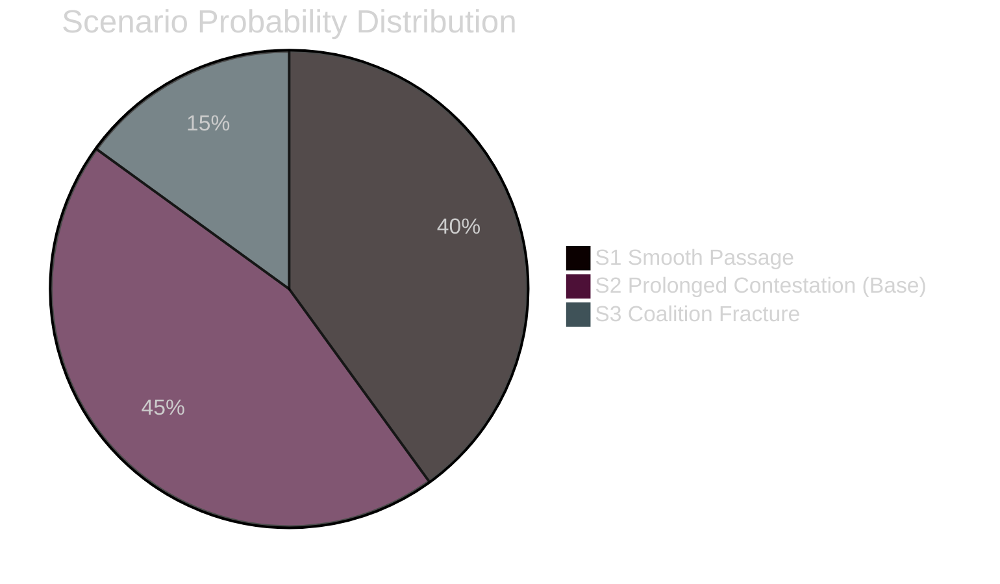

# Scenario Analysis — Swedish Government Propositions 23 April 2026

**Author**: James Pether Sörling  
**Date**: 2026-04-26  
**Classification**: UNCLASSIFIED // PUBLIC SOURCE

---

## Scenario Framework

Three distinct scenarios for the legislative outcomes of the April 2026 proposition batch, with primary focus on HD03253 (EU bank package) as the highest-impact item.

---

## Scenario 1: Smooth EU Compliance Passage (Probability: 40%)

**Description**: FiU fast-tracks HD03253; Riksdag approves HD03252 and HD03256 by June 2026. Sweden achieves partial CRD6 compliance before EU Commission escalates infringement.

**Conditions required**:
- FiU reaches cross-party consensus on CRR3 output floor transition provisions
- Small-bank lobby limited to minor proportionality amendments within CRD6 Art. 65 flexibility
- Lagrådet approves HD03252 without substantive proportionality critique
- No external shocks (financial crisis, EU infringement notice escalation)

**Evidence base**: S traditionally supports EU banking regulation; government majority with SD/KD/L [A1]; CRD6 deadline already passed creating urgency [B2].

**Leading indicator**: FiU chair (M) announces accelerated hearing schedule by 5 May 2026.

**Electoral impact**: Neutral — EU compliance is expected; no electoral upside except with financial sector donors.

---

## Scenario 2: Prolonged FiU Contestation (Probability: 45%) ← **Base case**

**Description**: FiU holds extended hearings on HD03253 through May–June 2026. Small-bank proportionality amendments proposed. HD03252 receives Lagrådet minor critique, government makes narrow scope adjustment. All four pass by September 2026 but not before election campaign starts.

**Conditions required**:
- S uses FiU to extract small-bank protection amendments (within their stated policy interest)
- Lagrådet issues advisory opinion on HD03252 — not blocking, but requires government response
- HD03104 approved without controversy but FiU notes green bond ambition gap
- Election campaign (August 2026 onwards) uses HD03252 as a campaign flashpoint

**Evidence base**: S minority FiU reports standard practice [A1]; Lagrådet reviews all major social legislation [A1]; Prior pattern on HC03202 (electronic monitoring) — contentious but passed [B2].

**Leading indicator**: S FiU spokesperson announces minority committee position by 12 May 2026.

**Electoral impact**: HD03252 becomes S/V attack vector on SD welfare politics; M defends as proportionate crime deterrent.

---

## Scenario 3: Coalition Fracture on Banking Regulation (Probability: 15%)

**Description**: Small-bank lobby successfully fractures M/KD internal consensus; significant proportionality carve-out proposed that delays full CRR3 implementation; EU Commission issues formal infringement notice to Sweden.

**Conditions required**:
- Sparbankerna lobbying reaches M party council level (municipal savings banks in M strongholds)
- KD joins small-bank protection coalition (KD historically protective of municipal economy)
- EU Commission accelerates infringement procedure (political decision, not automatic)
- CRD6 fit-and-proper provisions modified in Swedish legislation → EBA compliance concern

**Evidence base**: KD historically protective of municipal economy [C3]; Sparbankerna 2023 report on CRD6 impact [C2]; EU Commission accelerated procedures post-2025 banking stress [C3].

**Leading indicator**: KD spokesperson issues public statement supporting small-bank carve-out by 15 May 2026.

**Electoral impact**: HIGH — government split on EU banking regulation is election-cycle narrative; S frames as government failing both EU credibility and Swedish banking sector simultaneously.

---

## Probability Summary

| Scenario | Probability | Key trigger |
|----------|-------------|-------------|
| S1: Smooth passage | 40% | FiU accelerated schedule |
| S2: Prolonged contestation (base) | 45% | S minority report + Lagrådet review |
| S3: Coalition fracture | 15% | KD small-bank protection coalition |
| **Total** | **100%** | — |

