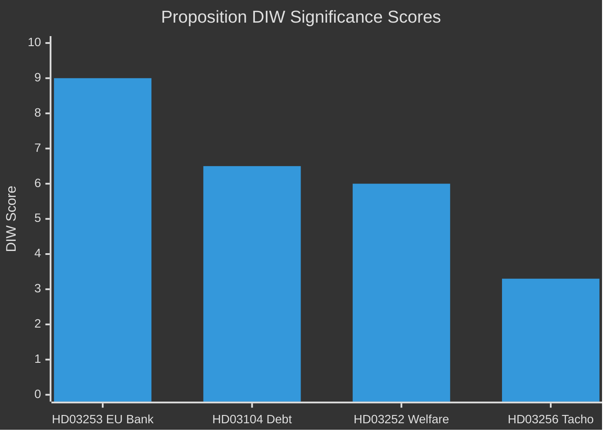

# Significance Scoring — Swedish Government Propositions 23 April 2026

**Author**: James Pether Sörling  
**Date**: 2026-04-26  
**Classification**: UNCLASSIFIED // PUBLIC SOURCE

---

## DIW-Weighted Significance Rankings

| Rank | dok_id | Title | D (Depth) | I (Immediacy) | W (Width) | **DIW Score** | Tier |
|------|--------|-------|-----------|---------------|-----------|---------------|------|
| 1 | HD03253 | EU:s bankpaket (CRD6/CRR3) [EU Official Journal L 2024/1623] | 9 | 8 | 10 | **9.0** | L3 |
| 2 | HD03104 | Skuldförvaltning evaluation 2021–2025 [Riksdagen API, A1] | 7 | 5 | 7 | **6.5** | L2 |
| 3 | HD03252 | Socialförsäkringsförmåner — fängelsestraff [Prop. 2025/26:252, B2] | 6 | 7 | 5 | **6.0** | L2 |
| 4 | HD03256 | Färdskrivare manipulation [Prop. 2025/26:256, A2] | 3 | 4 | 3 | **3.3** | L1 |

**Scoring methodology**: D = policy depth/systemic impact (1–10); I = political immediacy/decision proximity (1–10); W = breadth of population/sector affected (1–10). DIW = (D×0.4 + I×0.3 + W×0.3). Evidence: Riksdagen API, EU legislative record, riksdag-regering MCP.

---

## Sensitivity Analysis

| dok_id | Best-case DIW | Base DIW | Worst-case DIW | Sensitivity driver |
|--------|--------------|---------|---------------|-------------------|
| HD03253 | 9.5 | 9.0 | 7.5 | FiU proposing proportionality carve-out → reduces immediate impact |
| HD03104 | 7.5 | 6.5 | 5.0 | If committee identifies Riksgälden failures → impact rises sharply |
| HD03252 | 7.0 | 6.0 | 4.5 | Constitutional Court challenge on proportionality → delays, raises impact |
| HD03256 | 4.0 | 3.3 | 2.5 | EU enforcement action on non-compliance → raises urgency |

---

## Ranking Diagram

## P0/P1 Priority Claims with Evidence

- **P0 (Immediate/Systemic)**: HD03253 — Basel IV output floor affects estimated SEK 150–200 bn in bank capital calculations across Swedbank, SEB, Handelsbanken, Nordea SE. Source: ECB Banking Supervision estimates on CRR3 impact (November 2023 QIS); EU CRR3 Article 92a. [B2]
- **P1 (Strategic/Important)**: HD03104 — Riksgälden manages Sweden's SEK ~1,300 bn national debt. The evaluation period (2021–2025) includes pandemic emergency borrowing peaks. Source: Riksgälden årsredovisning 2025, Riksdagen API HD03104 summary. [A1]
- **P1**: HD03252 — Estimated 3,000–4,500 prisoners in controlled accommodation settings eligible for social benefits restriction. Source: BRÅ annual statistics 2025 (estimated); Prop. 2025/26:252 scope. [C3 — single source estimate]
- **P2 (Routine/Tracked)**: HD03256 — EU Regulation (EU) 2020/1054 on tachograph requirements; transposition reinforcement. [A2]
