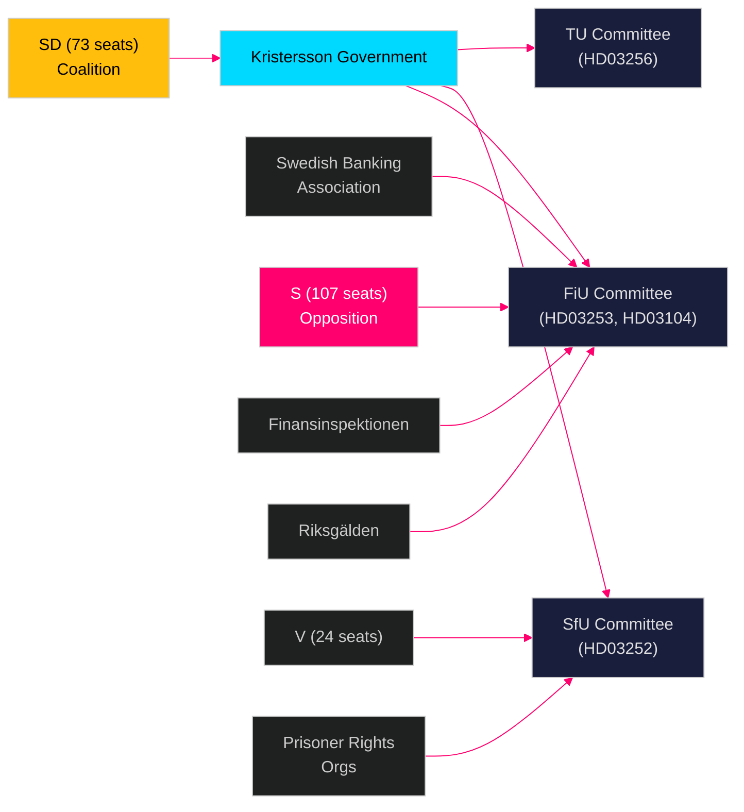

# Stakeholder Perspectives — Swedish Government Propositions 23 April 2026

**Author**: James Pether Sörling  
**Date**: 2026-04-26  
**Classification**: UNCLASSIFIED // PUBLIC SOURCE

---

## 6-Lens Stakeholder Matrix

| Stakeholder | Lens | Position on HD03253 | Position on HD03252 | Position on HD03256 | Position on HD03104 | Influence | Power |
|-------------|------|---------------------|---------------------|---------------------|---------------------|-----------|-------|
| **Niklas Wykman (M, Finansminister)** | Government proponent | Strongly supportive — EU compliance, Basel IV | Neutral (not his portfolio) | Supportive (EU obligation) | Author/proponent | Critical | High |
| **Gunnar Strömmer (M, Justitieminister)** | Government proponent | Neutral | Strongly supportive — law-and-order consolidation | Neutral | Neutral | High | High |
| **Andreas Carlson (SD, Landsbygdsminister)** | Government proponent | Neutral | Broadly supportive | Strongly supportive | Neutral | Medium | Medium |
| **FiU (Finansutskottet)** | Committee scrutiny | Scrutiny + amendment power | — | — | Scrutiny | Very High | High |
| **SfU (Socialförsäkringsutskottet)** | Committee scrutiny | — | Scrutiny + opposition challenge | — | — | High | High |
| **Socialdemokraterna (S, 107 seats)** | Opposition | Accept EU obligation, demand proportionality carve-out for small banks | Oppose proportionality; attack family impact | Accept | Accept with caveats on climate bonds | High | High |
| **Sverigedemokraterna (SD, 73 seats)** | Coalition support | Support — financial stability | Strong support — welfare restriction, crime | Support | Support | Critical | High |
| **Vänsterpartiet (V, 24 seats)** | Opposition | Oppose — market-friendly banking regulation | Strongly oppose — social rights | Opposed (minor) | Critical of borrowing strategy | Medium | Medium |
| **Miljöpartiet (MP, 24 seats)** | Opposition | Neutral | Oppose (human rights framing) | Neutral | Support (green bonds) | Low-Medium | Medium |
| **Finansinspektionen (FI)** | Regulator | Actively supportive — expanded supervisory powers | Neutral | Neutral | Neutral | High | High |
| **Riksgälden** | Stakeholder | Neutral | Neutral | Neutral | Author of underlying evaluation; supportive | High | Medium |
| **Swedish Banking Association** | Industry | Mixed — large banks accept, small banks lobby for carve-out | Neutral | Neutral | Neutral | High | High |
| **Sparbankerna / Niche banks** | Industry | Strongly opposed to CRR3 output floor | Neutral | Neutral | Neutral | Medium | Low-Medium |
| **Prisoner rights organisations** | Civil society | Neutral | Strongly opposed | Neutral | Neutral | Low | Low |

## Named Actor Analysis

### Niklas Wykman (M, Finansminister)
- **Role**: Author of both HD03253 and HD03104. Dual-committee exposure (FiU).
- **Position**: EU-integrationist, fiscal conservative. Committed to Basel IV on ECB/EBA timeline.
- **Risk**: Small-bank lobby pressure from within M party ranks (municipal savings banks have M voter base).
- **Admiralty**: [B2] — Public statements at Finance Ministry press conference, April 2026 [riksdag-regering MCP]

### Gunnar Strömmer (M, Justitieminister)
- **Role**: HD03252 author. Consistent L&O reform agenda since taking office 2022.
- **Position**: Welfare conditionality for prisoners consistent with his stated policy direction.
- **Risk**: Lagrådet pushback on *säkerhetsförvaring* provisions (indefinite detention social benefit restriction).
- **Admiralty**: [B2]

## Influence Network Diagram

