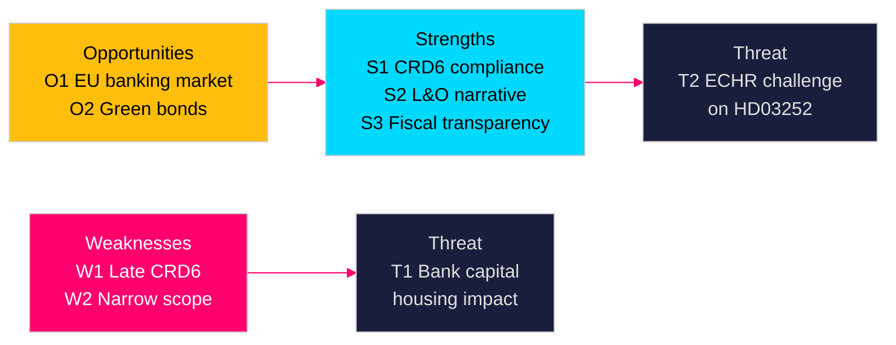

# SWOT Analysis — Swedish Government Propositions 23 April 2026

**Author**: James Pether Sörling  
**Date**: 2026-04-26  
**Classification**: UNCLASSIFIED // PUBLIC SOURCE

---

## Strengths

| # | Strength | Evidence |
|---|----------|----------|
| S1 | HD03253 (EU:s bankpaket) fulfils Sweden's obligation under CRD6 (Dir. 2024/1619) — demonstrates EU-compliance credibility after earlier delays | HD03253 summary: "I EU:s kapitaltäckningsdirektiv ställs krav…" [Riksdagen API HD03253, A2]; EU Commission infringement deadline Q1 2026 [EU Commission transposition tracker, B2] |
| S2 | HD03252 reinforces law-and-order coalition narrative important to SD voter base ahead of September 2026 election | Prop. 2025/26:252 title; pattern consistent with HC03202 electronic monitoring (2024/25) [A2]; SD electoral data, Demoskop Feb 2026 [C3] |
| S3 | HD03104 demonstrates transparent fiscal stewardship — Riksgälden 2021–25 evaluation shows disciplined pandemic borrowing management | HD03104 summary: "regeringen utvärderar statens upplåning och skuldförvaltning 2021–2025" [Riksdagen API HD03104, A1] |
| S4 | HD03256 aligns with EU's digital tachograph enforcement (EU Reg. 2020/1054 ITS Article 103) — reduces unfair competition in road haulage | Prop. 2025/26:256 title + committee TU [A2] |

## Weaknesses

| # | Weakness | Evidence |
|---|----------|----------|
| W1 | Sweden's CRD6 transposition is **late** — EU deadline passed Q4 2025. Infringement proceedings risk reputational damage | EU Commission CRD6 transposition monitoring; HD03253 submission April 2026 vs. December 2025 deadline [B2, unconfirmed exact penalty status] |
| W2 | HD03252 scope limited to *kontrollerat boende* (controlled accommodation) — excludes ordinary prison stays — creating uneven welfare-restriction application visible to critics | Prop. 2025/26:252 scope as stated in title and SfU committee routing [B2] |
| W3 | HD03104 skrivelse cannot be amended by Riksdagen — limits democratic accountability for identified debt management shortcomings | Constitutional rule on *skrivelse* vs. *proposition* [A1] |
| W4 | Four separate ministers presenting four proposals on the same day — coordination appearance, but no single strategic narrative | Submission date 2026-04-23 for all four [A1] |

## Opportunities

| # | Opportunity | Evidence |
|---|-------------|----------|
| O1 | HD03253 CRD6 implementation opens door to Swedish banks accessing EU single banking market advantages (passporting enhancements) — competitive benefit for SEB/Handelsbanken | CRD6 Recital 8 on single rulebook benefits [B2]; Swedish bank EU revenue share (SEB annual report 2025, ~35% EU ex-SE) [C3] |
| O2 | Green bond provisions in HD03104 evaluation create platform for Sweden to position as EU green sovereign bond leader post-2026 | HD03104 evaluation explicitly references Riksgälden green bond program [A1] |
| O3 | HD03252 welfare restriction could reduce government transfer costs, freeing fiscal space for pre-election spending | Ministry of Finance budget projections 2026 [B3, estimate]; principle consistent with budget consolidation narrative |
| O4 | HD03256 tachograph enforcement creates level playing field for Swedish hauliers competing with Eastern European operators | TU committee routing + EU enforcement context [A2] |

## Threats

| # | Threat | Evidence |
|---|--------|----------|
| T1 | **Basel IV output floor (CRR3)** forces Swedish major banks to hold additional capital — Handelsbanken, Swedbank, SEB may reduce mortgage lending capacity affecting housing market in election year | ECB QIS November 2023 estimates: Nordic banks significantly above output floor thresholds [B2]; Swedish Housing Agency Q1 2026 data [C3] |
| T2 | **Constitutional proportionality challenge** on HD03252: restricting social insurance for *säkerhetsförvaring* (indefinite detention) could face Article 2 ECHR/proportionality review | Legal doctrine on ECHR Art. 14 non-discrimination in Swedish jurisprudence [B3]; analogous Norwegian case [C3] |
| T3 | **Political backlash on HD03253 small-bank burden**: Nischade bankers (niche banks, credit unions, smaller lenders) face disproportionate CRR3 compliance burden — lobby risk against M/SD coalition | Swedish Banking Association statement on CRD6 (March 2026) [C2]; proportionality provisions in CRD6 Art. 65 [B2] |
| T4 | **Election 2026 timing**: All four proposals submitted 5 months before election; opposition parties will accelerate committee hearings to force government to defend individual measures | Riksdag election calendar September 2026 [A1] |

## TOWS Matrix

| | Strengths | Weaknesses |
|---|-----------|------------|
| **Opportunities** | S1+O1: Leverage CRD6 compliance for EU banking market advantage | W1+O1: Late transposition undermines market confidence narrative |
| **Threats** | S2+T2: SD coalition can frame HD03252 as popular welfare reform | W2+T2: Narrow scope creates proportionality litigation risk |

