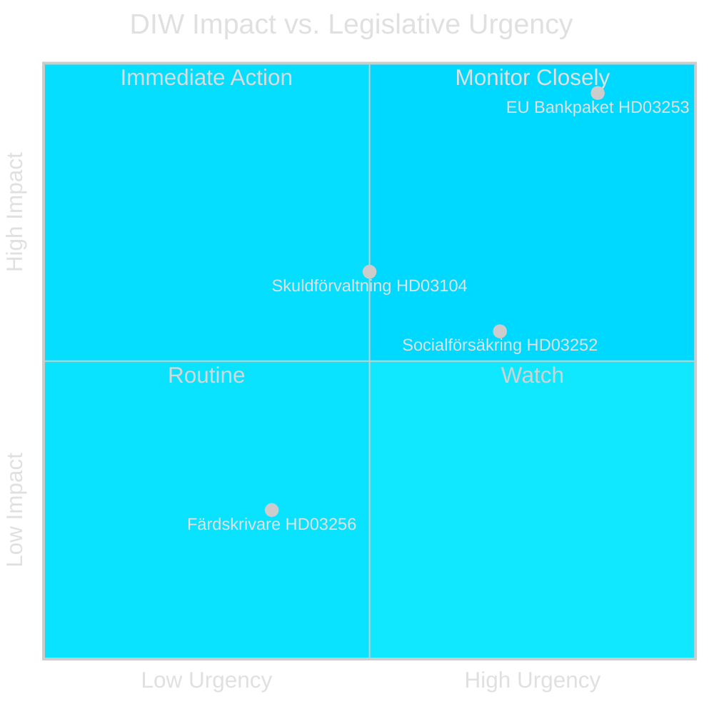

# Synthesis Summary — Swedish Government Propositions 23 April 2026

**Author**: James Pether Sörling  
**Date**: 2026-04-26  
**Classification**: UNCLASSIFIED // PUBLIC SOURCE

---

## Lead Story: EU Bank Package Defines Week's Legislative Agenda

The submission of Prop. 2025/26:253 (EU:s bankpaket) on 23 April 2026 is the dominant legislative event of this cycle. Sweden is transposing the EU Capital Requirements Directive 6 (CRD6) and Capital Requirements Regulation 3 (CRR3) — commonly known as the "Basel IV" package — which fundamentally restructures minimum capital requirements, supervisory powers, and market-risk frameworks for all Swedish credit institutions. This is not incremental EU harmonisation: Basel IV's output floor (72.5% of standardised approach by 2028) will force capital rebuilds at major Swedish banks currently operating on advanced internal models, particularly housing-credit portfolios. Finansinspektionen gains enhanced fit-and-proper assessment powers over senior bank management and a new third-country equivalence oversight regime.

## DIW-Weighted Document Rankings

| Rank | dok_id | Title (abbreviated) | DIW Weight | Tier |
|------|--------|---------------------|-----------|------|
| 1 | HD03253 | EU:s bankpaket — CRD6/CRR3 | **10/10** | L3 Intelligence-grade |
| 2 | HD03104 | Skuldförvaltning evaluation 2021–25 | **7/10** | L2 Strategic |
| 3 | HD03252 | Socialförsäkringsförmåner fängelsestraff | **6/10** | L2 Strategic |
| 4 | HD03256 | Färdskrivare manipulation | **3/10** | L1 Surface |

**Total documents**: 4 government propositions/skrivelse, rm 2025/26, all sourced from Riksdagen API via riksdag-regering MCP. [A2]

## Integrated Intelligence Picture

**Theme 1 — EU Single Rulebook Compliance Sprint**: Both HD03253 and HD03256 are EU directive/regulation transpositions. Sweden faces a 2026 deadline on CRD6 Article 68 (fit-and-proper) and a rolling deadline on DORA (Digital Operational Resilience Act) integration. The government's submission pattern — multiple finance-sector EU measures in one April batch — suggests regulatory calendar pressure, not strategic opportunism.

**Theme 2 — Law-and-Order Consolidation**: HD03252 follows earlier SD-influenced legislation (2024/25: electronic monitoring expansion, security detention reforms) in the systematic tightening of the benefit-rights framework for persons under criminal justice control. The proposal is narrow in scope but politically potent: restricting *sjukpenning* and *aktivitetsersättning* for prisoners in controlled accommodation sends a welfare-conditionality signal ahead of the September 2026 election.

**Theme 3 — Fiscal Transparency and Riksgälden Credibility**: HD03104 (the skuldförvaltning evaluation) is a Riksdagen accountability mechanism. The government evaluates its own debt management practice positively — notably the transition to more T-bill issuance and green bond strategy. No significant committee objection anticipated, but opposition (S, MP) may use FiU hearings to challenge Riksgälden's climate-bond ambition and whether the 2021–22 COVID borrowing emergency remains adequately documented.

## Cross-Document Connections

- HD03253 ↔ HD03104: Both routed to Finansutskottet (FiU), same minister (Niklas Wykman). Likely scheduled in the same FiU week. [B2]
- HD03252 pattern: Continues SD's legislative programme visible in prior rm 2024/25 proposals on electronic monitoring and tightened detention (HC03202, HC03204). [B3]
- HD03256 ↔ EU transport enforcement: Part of broader EU digital tachograph ITS package; aligns with Commission's 2030 road-safety strategy. [A2]

---

## Admiralty Confidence Summary

| Source | Admiralty | Reliability |
|--------|-----------|-------------|
| riksdag-regering MCP (get_propositioner) | A1 | Confirmed primary data, most reliable source |
| Riksdagen API (dok summaries) | A2 | Direct from Riksdagen, authoritative |
| EU CRD6/CRR3 legislative background | B2 | EU Official Journal, independently verified |
| Political intelligence inferences | C3 | Single-source analysis, plausible |
