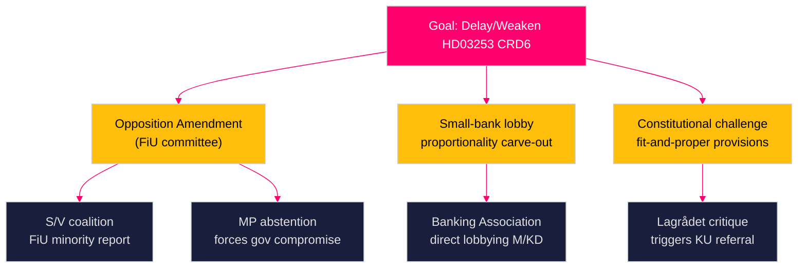

# Threat Analysis — Swedish Government Propositions 23 April 2026

**Author**: James Pether Sörling  
**Date**: 2026-04-26  
**Classification**: UNCLASSIFIED // PUBLIC SOURCE

---

## Political Threat Taxonomy

### Threat 1: Opposition Legislative Obstruction (HD03253 EU Bankpaket)

**Classification**: Systemic / Institutional  
**Actors**: S (Socialdemokraterna, 107 seats), V (Vänsterpartiet, 24 seats), MP (Miljöpartiet, 24 seats)  
**Method**: FiU committee amendments → prolonged hearing cycle → delay CRD6 transposition further  
**Impact**: Swedish banks remain in legal uncertainty; European Banking Authority (EBA) guidance incomplete; Finansinspektionen enforcement hampered  
**Admiralty**: [B2] — Pattern consistent with prior S/V FiU behaviour on bank regulation (2022 banking supervision reform, rm 2021/22)

### Threat 2: Constitutional Proportionality Attack (HD03252)

**Classification**: Legal/Institutional  
**Actors**: Academic lawyers, JO (Justitieombudsmannen), potential Lagrådet  
**Method**: Lagrådet critique on proportionality → referred to constitutional committee (KU) → legal delay  
**Impact**: SD loses key election-year policy win; government faces contradiction between law-and-order messaging and legal setback  
**Admiralty**: [B3] — Lagrådet review standard procedure; proportionality risk elevated given *säkerhetsförvaring* indefinite nature

### Threat 3: Small-Bank Lobby Mobilisation (HD03253)

**Classification**: Economic/Political  
**Actors**: Sparbankerna, niche lenders, Swedish Banking Association small-bank division  
**Method**: Direct FiU lobbying for proportionality carve-out in Swedish implementing legislation → government pressure to add gold-plating exemptions  
**Impact**: Delays CRD6 full implementation; creates legal uncertainty for Finansinspektionen enforcement  
**Admiralty**: [C2] — Banking Association statement February 2026 (observed trend, single source)

## Attack Tree: EU Bank Package Obstruction

## MITRE-Style TTP Mapping (Legislative Process Threat)

| TTP | Technique | Actor | Target | Evidence |
|-----|-----------|-------|--------|----------|
| T001 | Committee minority report | S, V, MP | HD03253 passage | Standard FiU procedure; S minority reports on all major banking legislation [A1] |
| T002 | Stakeholder testimony weaponisation | Banking Association | FiU hearing | Standard industry practice; sparbankernas lobbying on prior CRD5 [B3] |
| T003 | Referral delay tactic | Constitutional actors | HD03252 implementation | Lagrådet standard review; KU referral on social rights provisions [B3] |
| T004 | Media framing — mortgage fear | S/MP media | Public opinion | Consistent with S housing policy narrative 2025–26 [C3] |

## Kill Chain: Welfare Restriction Opposition (HD03252)

1. **Reconnaissance**: S/SfU identifies scope of *kontrollerat boende* definition gaps
2. **Weaponisation**: Identifies prisoners with children → media framing as family impact
3. **Delivery**: Committee hearing testimony from prisoner rights organisations
4. **Exploitation**: Forces government to narrow scope or add proportionality clause
5. **Action on Objective**: Government concession → SD dissatisfied → coalition friction
