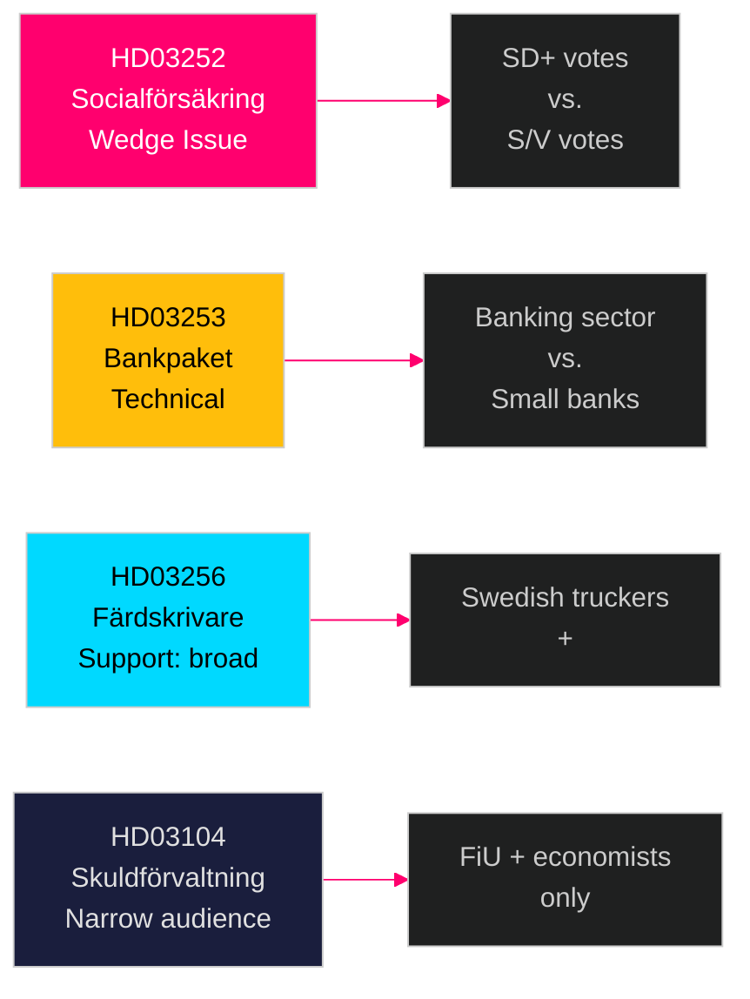

# Voter Segmentation — Swedish Government Propositions 23 April 2026

**Author**: James Pether Sörling  
**Date**: 2026-04-26  
**Classification**: UNCLASSIFIED // PUBLIC SOURCE

---

## Demographic Impact Analysis

### HD03253 (EU Bankpaket) — Voter Segment Impact

| Segment | Impact | Direction | Notes |
|---------|--------|-----------|-------|
| Banking sector employees (~80,000) | HIGH direct | Mixed — compliance burden | Finansinspektionen staff welcome expanded powers; bank compliance teams face workload |
| Mortgage borrowers (4.5M households) | MEDIUM indirect | Negative risk | CRR3 output floor may tighten credit over 2027–2030 |
| Small-town bank customers (sparbanker) | MEDIUM | Negative risk | Niche bank carve-out matters to rural communities |
| Financial investors | LOW | Neutral-positive | CRD6 compliance reduces systemic risk premium |

### HD03252 (Socialförsäkringsförmåner) — Voter Segment Impact

| Segment | Impact | Direction | Notes |
|---------|--------|-----------|-------|
| Prison population (~kontrollerat boende, ~4,500) | HIGH direct | Negative | Direct benefit recipients |
| Families of prisoners | MEDIUM | Negative | Income reduction affects households |
| SD core voters (law-and-order, Norrland + outer suburbs) | MEDIUM | Positive — electoral signal | Welfare conditionality is core SD appeal |
| S/V core voters (trade union, social rights) | MEDIUM | Negative — electoral mobilisation | Reinforces left-bloc anti-SD narrative |
| General public | LOW | Mildly positive | Taxpayer welfare-for-criminals frame resonates broadly |

### HD03256 (Färdskrivare) — Voter Segment Impact

| Segment | Impact | Direction | Notes |
|---------|--------|-----------|-------|
| Road haulage industry (Swedish truckers, ~70,000) | LOW-MEDIUM | Positive | Level playing field against foreign competition |
| Transport sector workers (unionised) | LOW | Positive | Enforcement protects drivers from exploitative employers |

### HD03104 (Skuldförvaltning) — Voter Segment Impact

| Segment | Impact | Direction | Notes |
|---------|--------|-----------|-------|
| Financial literati / economists | LOW | Neutral | Informational document |
| Climate-aware voters | LOW | Slight positive | Green bond programme evaluated |

## Regional Analysis

| Region | Relevant proposition | Specific segment |
|--------|---------------------|-----------------|
| Norrland (M/SD stronghold, rural) | HD03252 | SD welfare restriction appeal strong; sparbanker CRD6 impact moderate |
| Greater Stockholm | HD03253 | Banking sector concentration; capital markets impact |
| Göteborg | HD03253 | Volvofinans, regional bank carve-out concerns |
| Malmö/Öresund | HD03252, HD03256 | Cross-border trucking; crime/welfare politics prominent |

## Ideological Segment Positions

| Ideology | HD03253 | HD03252 | HD03256 | HD03104 |
|----------|---------|---------|---------|---------|
| Libertarian right | Support (market discipline) | Support (welfare reform) | Support (level playing field) | Support (fiscal discipline) |
| Social conservative | Support | Strongly support | Support | Neutral |
| Social democrat | Qualified support | Strongly oppose | Neutral | Qualified support |
| Green left | Neutral | Oppose | Neutral | Support (green bonds) |
| Populist (both SD and V) | Oppose (elite finance) | SD: support / V: oppose | Support | Oppose (technocratic) |

