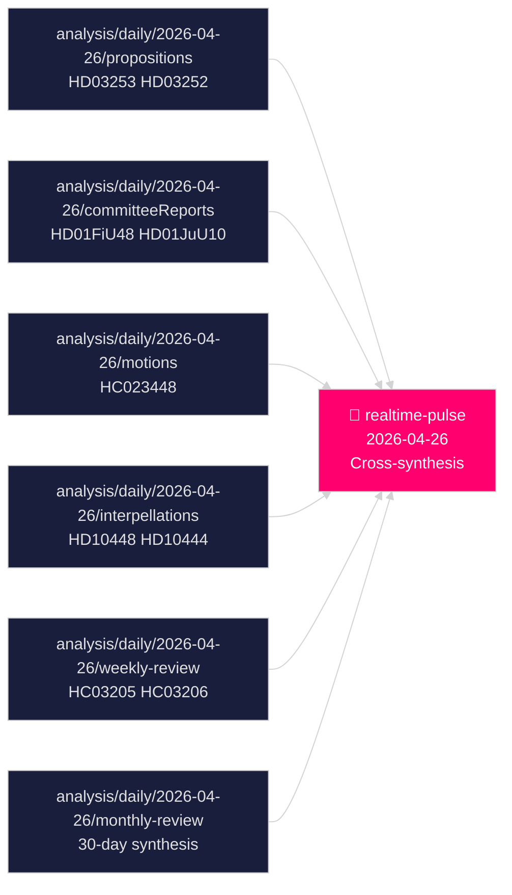

# Cross-Reference Map — Realtime Pulse 2026-04-26

## Intra-Pulse Cross-References

| Edge | Source doc | Target doc | Label | Rationale |
|------|-----------|-----------|-------|-----------|
| HD01FiU48 → HD01FiU23 | Fuel relief budget | Riksbank profit retention | thematic | Simultaneous fiscal loosening vs monetary caution |
| HD01JuU10 → HD01CU25 | Weapons law | Prison expansion | bundle | Law-and-order legislative cluster |
| HD01JuU31 → HD01CU25 | Police reform failure | Prison expansion | continues | Both address criminal justice capacity deficits |
| HC03205 → HC03206 | MSB→MfcF rename | Riksrevisionen audit | amends | Rename follows audit findings on governance |
| HD03253 → HD10448 | EU bankpaket | SD energy interpellation | thematic | Both involve SD's EU regulatory stance |
| HD10444 → HD10447 | Employer contribution | Sick-pay reversal | coordinated-filing | S coordinated dual interpellation on labour costs |

## Sibling Folder Cross-References

### analysis/daily/2026-04-26/propositions

- Cites: HD03253 (EU bankpaket), HD03252 (welfare restriction), HD03256 (tachograph), HD03104 (debt management)
- Key synthesis: Government legislative sprint — four major items submitted 2026-04-23
- Link: `analysis/daily/2026-04-26/propositions/synthesis-summary.md`

### analysis/daily/2026-04-26/committeeReports

- Cites: HD01FiU48, HD01JuU10, HD01CU25, HD01FiU23, HD01JuU31, HD01SoU25
- Key synthesis: Legislative approval cluster — security + fiscal populism + banking oversight
- Link: `analysis/daily/2026-04-26/committeeReports/synthesis-summary.md`

### analysis/daily/2026-04-26/motions

- Cites: Written questions HC023448 (healthcare readiness), HC023447 (juvenile justice), HC023446 (information sharing)
- Key synthesis: Opposition accountability targeting KD/L ministers on welfare and rights gaps
- Link: `analysis/daily/2026-04-26/motions/synthesis-summary.md`

### analysis/daily/2026-04-26/interpellations

- Cites: HD10448 (SD energy disinformation), HD10444 (employer contributions), HD10447 (sick pay), HD10439 (police Stockholm), HD10443 (social dumping)
- Key synthesis: Coordinated S parliamentary offensive targeting labour, housing, foreign affairs, public safety
- Link: `analysis/daily/2026-04-26/interpellations/synthesis-summary.md`

### analysis/daily/2026-04-26/weekly-review

- Cites: HC03205 (civil defence), HC03206 (Riksrevisionen audit), HC03203 (uranium mining), HC03208 (trade secrets)
- Key synthesis: Security-first legislative sprint; 500,000+ unemployed backdrop
- Link: `analysis/daily/2026-04-26/weekly-review/synthesis-summary.md`

### analysis/daily/2026-04-26/monthly-review

- Cites: Multi-type 30-day synthesis; SD discipline; PIR-A Demoskop trigger; 140 days to election
- Key synthesis: Legislative ledger closing; campaign framing beginning
- Link: `analysis/daily/2026-04-26/monthly-review/synthesis-summary.md`

## Cross-Type Thematic Clusters

### Cluster A: Pre-Election Security Architecture

Documents: HC03205, HC03206, HD01JuU10, HD01CU25, HD01JuU31
Spans: weekly-review + committeeReports + propositions
Intelligence gap: Riksrevisionen found police reform failed (HD01JuU31) while government simultaneously expands prison capacity (HD01CU25) — contradiction unresolved in parliamentary record

### Cluster B: Fiscal Policy Divergence

Documents: HD01FiU48, HD01FiU23, HD03104
Spans: committeeReports + propositions
Intelligence gap: Government loosening (HD01FiU48 4.1B SEK) vs Riksbank restraint (HD01FiU23 zero dividend) — no public coordination statement

### Cluster C: Labour Market Accountability

Documents: HD10444, HD10447, HC10744–HC10746 (weekly-review unemployment interpellations)
Spans: interpellations + motions + weekly-review
Intelligence gap: 8.5% unemployment + sick-pay reversal + employer-contribution abuse creates multi-front vulnerability not addressed in any government communication this week

