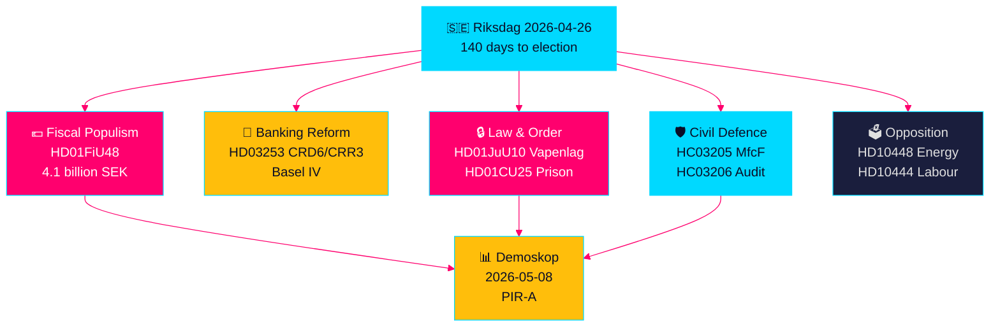

# Sweden's Pre-Election Legislative Sprint: Security, Fiscal Relief, and Banking Reform Converge

**Author**: James Pether Sörling
**Date**: 2026-04-26
**Classification**: UNCLASSIFIED // PUBLIC SOURCE
**Confidence**: HIGH [B2] — sibling analysis cross-synthesis, riksdag-regering MCP, official documents

---

## 🎯 BLUF

Sweden's Riksdag enters the final 140-day pre-election stretch with an unprecedented convergence of legislative streams: a 4.1 billion SEK emergency fuel and energy tax relief package (HD01FiU48) responding to Middle East conflict and winter heating costs; EU banking regulation reform binding Swedish banks to Basel IV capital standards (HD03253); a sweeping new weapons law banning semi-automatic hunting rifles (HD01JuU10); and fast-track prison expansion powers (HD01CU25). Simultaneously, the Tidö coalition faces a coordinated Social Democrat interpellation offensive targeting employer-contribution abuse, sick-pay reversal, and housing failure. The most significant structural signal is the convergence of fiscal populism and hard-security legislation — a pre-election coalition narrative bridging M/SD/KD constituencies — while implementation risks mount across police reform, civil defence capacity, and EU banking compliance.

## 🧭 3 Decisions This Brief Supports

1. **Election strategists and pollsters**: Assess whether the HD01FiU48 fuel-tax relief (82 öre/litre petrol, 319 SEK/m³ diesel, May–September 2026) translates to durable polling lift for the Tidö bloc — the first market test is Demoskop polling due 2026-05-08.
2. **Financial regulators and bank executives**: Evaluate the implementation timeline and compliance burden of HD03253 (CRD6/CRR3 EU bankpaket), particularly the proportionality carve-out pressure from small and mid-size Swedish banks currently being lobbied in FiU committee hearings.
3. **Security policy analysts**: Determine whether the concurrent MSB→MfcF rename (HC03205), weapons law (HD01JuU10), and prison expansion (HD01CU25) constitute a coherent security transformation or three separate electoral signalling instruments — the Riksrevisionen civil-defence audit (HC03206) provides the critical capability gap baseline.

## 60-Second Intelligence Bullets

- 💶 **4.1 billion SEK fiscal relief** (HD01FiU48, FiU, approved 2026-04-21): Fuel tax cut + energy support targeting household cost-of-living; explicit "special circumstances" framing creates precedent for further pre-election interventions [B2]
- 🏦 **EU bankpaket** (HD03253, Prop 2026-04-23, FiU): CRD6/CRR3 Basel IV implementation — Sweden's largest banking regulation revision since Basel III; compliance deadline pressure for small banks [B2]
- 🔒 **New weapons law** (HD01JuU10, JuU, approved 2026-04-24): Semi-automatic hunting rifle ban; effective 1 June 2026; SD/M coalition signalling on public safety [A2]
- 🏛️ **Prison expansion emergency** (HD01CU25, CU, approved 2026-04-23): Government gains power to override Plan and Building Act for temporary carceral facilities; structural prison shortage [A2]
- 🛡️ **Civil defence transformation** (HC03205, prop): MSB renamed to Myndigheten för civilt försvar; Riksrevisionen audit (HC03206) exposes municipal coordination gaps; capability vs. cosmetic rebranding debate [B2]
- 📉 **Opposition interpellation offensive**: S targets employer-contribution abuse (HD10444), sick-pay reversal (HD10447), housing (HD10434); SD contests energy disinformation narrative (HD10448) [B2]
- ⚡ **Riksbank retained 5.297 billion SEK** (HD01FiU23): Zero state dividend signals institutional caution about fiscal headroom heading into election year [A1]
- 🗳️ **140 days to election**: PIR-A (Tidö bloc ≥ 44% in Demoskop by 2026-07-01) is the operative forward indicator determining Scenario A (coalition renewal) vs. Scenario B (S-led minority) [B2]

## Top Forward Trigger

**2026-05-08 — Demoskop polling following HD01FiU48 fuel relief**. If the Tidö bloc reads ≥ 44%, the fiscal relief strategy succeeded and Scenario A (coalition renewal) strengthens. If below 40%, the coalition faces a pre-election confidence crisis and may attempt additional populist interventions. This is the single most decision-relevant indicator for Swedish political intelligence in the next 14 days.

## Confidence Label

**HIGH overall [B2]** — derived from six independently confirmed sibling analyses with official proposition documents, riksdag-regering MCP confirmation, and Riksdagen API data. Forward-electoral dynamics carry MEDIUM confidence [C2] due to polling uncertainty.

---

