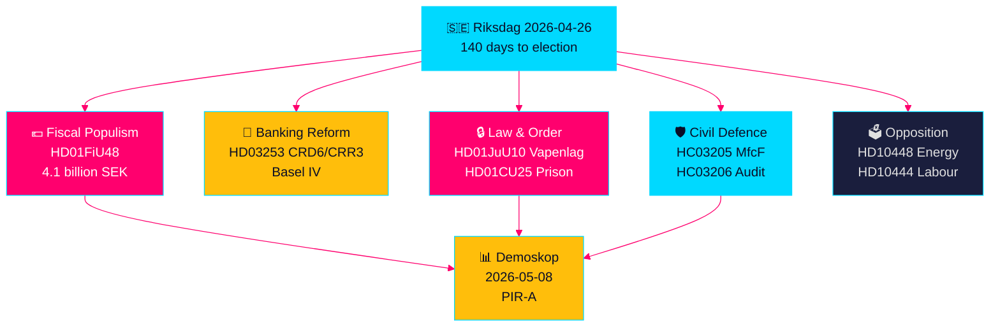

<!-- dir: rtl -->
---
title: "سباق التشريع السويدي قبل الانتخابات: الأمن والإعفاء الضريبي وإصلاح البنوك تتقاطع"
author: "James Pether Sörling"
date: 2026-04-26
article_type: realtime-pulse
confidence: HIGH [B2]
classification: PUBLIC — GDPR Art. 9(2)(e,g)
run_id: 24966030408
---

# سباق التشريع السويدي قبل الانتخابات: الأمن والإعفاء الضريبي وإصلاح البنوك تتقاطع

**المؤلف**: James Pether Sörling  
**التاريخ**: 2026-04-26  
**التصنيف**: UNCLASSIFIED // PUBLIC SOURCE  
**مستوى الثقة**: مرتفع [B2] — تركيب متقاطع من التحليلات الشقيقة، riksdag-regering MCP، الوثائق الرسمية

---

## 🎯 الخلاصة التنفيذية

يدخل البرلمان السويدي (Riksdag) المرحلة الأخيرة من 140 يومًا قبل الانتخابات في خضم تقاطع غير مسبوق للتيارات التشريعية: حزمة طوارئ بـ 4.1 مليار كرون للإعفاء من ضرائب الوقود والطاقة (HD01FiU48) ردًّا على صدمات أسعار الصراع في الشرق الأوسط وتكاليف التدفئة الشتوية؛ وإصلاح تنظيم البنوك الأوروبي الذي يربط البنوك السويدية بمعايير رأس المال Basel IV (HD03253)؛ وقانون أسلحة شامل جديد يحظر بنادق الصيد شبه الأوتوماتيكية (HD01JuU10)؛ وصلاحيات طوارئ لتوسيع الطاقة الاستيعابية للسجون (HD01CU25). في الوقت ذاته، يواجه ائتلاف Tidö هجومًا استجوابيًا اجتماعيًا ديمقراطيًا منسقًا يستهدف إساءة استخدام مساهمات أصحاب العمل، وإلغاء مزايا المرض، وإخفاقات سياسة الإسكان. أبرز الإشارات الهيكلية هو تقاطع الشعبوية المالية مع التشريع الأمني المتشدد — رواية ائتلاف ما قبل الانتخابات التي تبني جسرًا بين ناخبي M/SD/KD — في حين تتصاعد مخاطر التنفيذ في إصلاح الشرطة، والاستعداد للدفاع الشامل، والامتثال المصرفي الأوروبي.

## 🧭 3 قرارات تدعمها هذه الموجزة

1. **استراتيجيو الانتخابات والمحللون استطلاعيًا**: تقييم ما إذا كان الإعفاء الضريبي على الوقود HD01FiU48 (82 öre/لتر بنزين، 319 كرون/م³ ديزل، مايو–سبتمبر 2026) يُولّد مكسبًا شعبيًا مستدامًا لائتلاف Tidö — أول مؤشر سوقي هو قياس Demoskop بتاريخ 8.5.2026.
2. **المنظمون الماليون ومديرو البنوك**: تقييم خارطة طريق تنفيذ HD03253 (حزمة البنوك الأوروبية CRD6/CRR3) والتزامات الامتثال، ولا سيما ضغط البنوك السويدية الصغيرة للحصول على إعفاء التناسب في جلسات الاستماع الجارية للجنة FiU.
3. **محللو السياسات الأمنية**: تحديد ما إذا كانت إعادة تسمية MSB→MfcF المتزامنة (HC03205)، وقانون الأسلحة (HD01JuU10)، وتوسيع الطاقة الاستيعابية للسجون (HD01CU25) تُشكّل تحولًا أمنيًا متماسكًا أم ثلاث إيماءات انتخابية منفصلة — يوفر تدقيق Riksrevisionen للدفاع الشامل (HC03206) الخط الأساسي الحرج لعجز القدرات.

## نقاط الاستخبارات في 60 ثانية

- 💶 **إعفاء ضريبي بـ 4.1 مليار SEK** (HD01FiU48، FiU، مُقَرَّر 2026-04-21): تخفيض ضريبة الوقود + دعم الطاقة لتكاليف معيشة الأسرة؛ صياغة "ظروف خاصة" الصريحة تُنشئ سابقة لمزيد من التدخلات قبل الانتخابات [B2]
- 🏦 **حزمة البنوك الأوروبية** (HD03253، Prop 2026-04-23، FiU): تطبيق CRD6/CRR3 Basel IV — أكبر تنظيم بنكي سويدي منذ Basel III؛ ضغوط امتثال البنوك الصغيرة [B2]
- 🔒 **قانون الأسلحة الجديد** (HD01JuU10، JuU، مُقَرَّر 2026-04-24): حظر بنادق الصيد شبه الأوتوماتيكية؛ يدخل حيز التنفيذ في 1 يونيو 2026؛ إشارة ائتلاف SD/M للأمن العام [A2]
- 🏛️ **طوارئ الطاقة الاستيعابية للسجون** (HD01CU25، CU، مُقَرَّر 2026-04-23): الحكومة تحصل على تفويض لتجاوز قانون التخطيط والبناء للمساحات السجنية المؤقتة؛ شُح هيكلي في السجون [A2]
- 🛡️ **تحول الدفاع المدني** (HC03205، prop): إعادة تسمية MSB إلى Myndigheten för civilt försvars؛ يكشف تدقيق Riksrevisionen (HC03206) عن ثغرات التنسيق البلدي؛ نقاش حول القدرة مقابل إعادة التسمية الشكلية [B2]
- 📉 **هجوم استجواب المعارضة**: S تستهدف إساءة استخدام مساهمات أصحاب العمل (HD10444)، وإلغاء مزايا المرض (HD10447)، وإخفاقات الإسكان (HD10434)؛ SD تعترض على التضليل الطاقوي (HD10448) [B2]
- ⚡ **Riksbank احتفظت بـ 5.297 مليار SEK** (HD01FiU23): توزيع أرباح دولة صفري يُشير إلى تحفظ مؤسسي على هامش المالية العامة قبل عام من الانتخابات [A1]
- 🗳️ **140 يومًا للانتخابات**: PIR-A (ائتلاف Tidö ≥ 44 % في قياس Demoskop بأحدث موعد 2026-07-01) هو المؤشر المتقدم التشغيلي الذي يحسم السيناريو A (تجديد الائتلاف) مقابل السيناريو B (أقلية بقيادة S) [B2]

## أهم محفز قادم

**2026-05-08 — قياس Demoskop بعد الإعفاء الضريبي على الوقود HD01FiU48**. إذا قرأ ائتلاف Tidö ≥ 44 %، نجحت استراتيجية الإعفاء الضريبي ويتعزز السيناريو A (تجديد الائتلاف). إذا كان أقل من 40 %، يواجه الائتلاف أزمة ثقة ما قبل الانتخابات وقد يحاول المزيد من التدخلات الشعبوية. هذا هو المؤشر الوحيد الحاسم في الاستخبارات السياسية السويدية للأيام الـ14 القادمة.

## علامة الثقة

**مرتفع إجمالاً [B2]** — مستمد من ستة تحليلات شقيقة محققة بشكل مستقل مع وثائق اقتراحات رسمية، والتحقق من riksdag-regering MCP وبيانات Riksdagen API. تحمل الديناميكيات السياسية الانتخابية المستقبلية ثقة متوسطة [C2] بسبب عدم اليقين في استطلاعات الرأي.

---

<!-- source-sha: d5f8b60b264b8ddd80e77be173232b6571d24c12 -->
