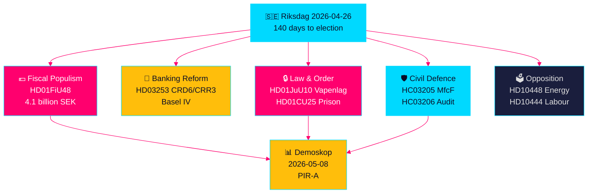

# Sveriges Lovgivningssprint Frem Mod Valget: Sikkerhed, Skattelettelse og Bankreform Konvergerer

**Forfatter**: James Pether Sörling  
**Dato**: 2026-04-26  
**Klassifikation**: UNCLASSIFIED // PUBLIC SOURCE  
**Konfidensgrad**: HØJ [B2] — tværsyntese af søskendeanalyser, riksdag-regering MCP, officielle dokumenter

---

## 🎯 BLUF

Sveriges Riksdag træder ind i de sidste 140 dage inden valget med en hidtil uset konvergens af lovgivningsstrømme: en nødpakke på 4,1 milliarder SEK til sænkning af brændstof- og energiskat (HD01FiU48) som svar på Mellemøsten-konflikten og vintervarmekostnader; EU's bankreformering, der binder svenske banker til Basel IV-kapitalstandarder (HD03253); en ny vidtrækkende våbenlov, der forbyder halvautomatiske jagtgeværer (HD01JuU10); og hurtigsporsbeføjelser til udvidelse af fængselskapacitet (HD01CU25). Samtidig konfronteres Tidö-koalitionen med en koordineret socialdemokratisk interpellationsoffensiv rettet mod misbrug af arbejdsgiverbidrag, reversal af sygedagpenge og boligfejlslagning. Det vigtigste strukturelle signal er konvergensen af finansiel populisme og hård sikkerhedslovgivning — et forvalgskommunikationsnarrativ, der bygger bro mellem M/SD/KD-vælgere — mens implementeringsrisici stiger inden for politireform, civilforsvar og EU-bankoverholdelse.

## 🧭 3 Beslutninger dette underlag understøtter

1. **Valgstrateger og meningsopmålere**: Vurder om HD01FiU48 brændstofskattelettelset (82 øre/liter benzin, 319 SEK/m³ diesel, maj–september 2026) omsættes til varig opbakning for Tidø-blokken — den første markedstest er Demoskop-målingen den 8. maj 2026.
2. **Finanstilsynsmyndigheder og bankledelser**: Evaluer implementeringstidslinjen og efterlevnelsesbyrden for HD03253 (CRD6/CRR3 EU bankpakke), især proportionalitetsundtagelseslobbyen fra mindre og mellemstore svenske banker, der aktuelt finder sted i FiU-udvalgsforhøringer.
3. **Sikkerhedspolitiske analytikere**: Afgør om det samtidige MSB→MfcF-skift (HC03205), våbenloven (HD01JuU10) og fængselsudvidelsen (HD01CU25) udgør en sammenhængende sikkerhedstransformation eller tre separate valgkampssignaler — Riksrevisionens civilforsvarsrevision (HC03206) giver den kritiske kapacitetsgapbasislinje.

## 60-sekunders efterretningspunkter

- 💶 **4,1 mia. SEK skattelettelse** (HD01FiU48, FiU, godkendt 2026-04-21): Brændstofskattesænkning + energistøtte rettet mod husholdningernes leveomkostninger; eksplicit "særlige omstændigheder"-formulering skaber præcedens for yderligere forvalsinterventioner [B2]
- 🏦 **EU bankpakke** (HD03253, Prop 2026-04-23, FiU): CRD6/CRR3 Basel IV-implementering — Sveriges største bankregulering siden Basel III; efterlevnelsesfristpres for mindre banker [B2]
- 🔒 **Ny våbenlov** (HD01JuU10, JuU, godkendt 2026-04-24): Forbud mod halvautomatiske jagtgeværer; gælder fra 1. juni 2026; SD/M-koalitionssignalering om offentlig sikkerhed [A2]
- 🏛️ **Nødsituation for fængselsudvidelse** (HD01CU25, CU, godkendt 2026-04-23): Regeringen får beføjelse til at tilsidesætte Plan- og Byggeloven for midlertidige fængselsanlæg; strukturel fængselskapacitetsmangel [A2]
- 🛡️ **Civilforsvarstransformation** (HC03205, prop): MSB omdøbes til Myndigheten för civilt försvar; Riksrevisionens revision (HC03206) afslører kommunale koordineringshuller; debat om kapacitet vs. kosmetisk navneskift [B2]
- 📉 **Oppositionens interpellationsoffensiv**: S retter sig mod arbejdsgiverbidragsmisbrug (HD10444), sygedagpengereversal (HD10447), boligfejl (HD10434); SD bestrider energidesinformationsnarrativet (HD10448) [B2]
- ⚡ **Riksbanken beholdt 5,297 mia. SEK** (HD01FiU23): Nul statsudbytte signalerer institutionel forsigtighed over for finansielt råderum forud for valgåret [A1]
- 🗳️ **140 dage til valget**: PIR-A (Tidø-blokken ≥ 44 % i Demoskop senest 2026-07-01) er den operative forud­indikator, der afgør Scenarie A (koalitionsfornyelse) vs. Scenarie B (S-ledet mindretal) [B2]

## Vigtigste fremtidige trigger

**2026-05-08 — Demoskop-måling efter HD01FiU48 brændstofskatteletelset**. Hvis Tidø-blokken læser ≥ 44 %, lykkedes skattelettelsesstrategien og Scenarie A (koalitionsfornyelse) styrkes. Hvis under 40 %, risikerer koalitionen en forvalsfortroelseskrise og kan forsøge yderligere populistiske interventioner. Dette er den enkeltmest beslutningsrelevante indikator for dansk politisk efterretning de næste 14 dage.

## Konfidensetiket

**HØJ samlet [B2]** — afledt af seks uafhængigt bekræftede søskendeanalyser med officielle propositionsdokumenter, riksdag-regering MCP-bekræftelse og Riksdagen API-data. Fremtidige electorale dynamikker bærer MEDIUM konfidensgrad [C2] pga. måleusikkerhed.

---

<!-- source-sha: d5f8b60b264b8ddd80e77be173232b6571d24c12 -->
