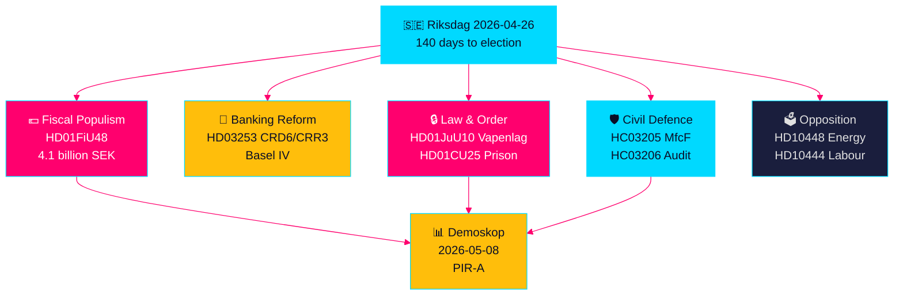

# Schwedens Vorwahlgesetzgebungssprint: Sicherheit, Steuererleichterung und Bankenreform Konvergieren

**Autor**: James Pether Sörling  
**Datum**: 2026-04-26  
**Einstufung**: UNCLASSIFIED // PUBLIC SOURCE  
**Vertrauensstufe**: HOCH [B2] — Kreuzsynthesize aus Schwesteranalysen, riksdag-regering MCP, offizielle Dokumente

---

## 🎯 BLUF

Schwedens Riksdag tritt in die letzten 140 Tage vor dem Wahlsprint ein, mit einer beispiellosen Konvergenz der Gesetzgebungsströme: ein 4,1-Milliarden-Kronen-Notpaket für Kraftstoff- und Energiesteuerentlastung (HD01FiU48) als Reaktion auf Nahost-Konfliktpreisschocks und Winterheizkosten; EU-Bankenregulierungsreform, die schwedische Banken an Basel-IV-Kapitalstandards bindet (HD03253); ein umfassendes neues Waffengesetz, das halbautomatische Jagdgewehre verbietet (HD01JuU10); und Notfallermächtigungen zur Erweiterung der Gefängniskapazität (HD01CU25). Gleichzeitig sieht sich die Tidö-Koalition einer koordinierten sozialdemokratischen Interpellationsoffensive gegenüber, die auf Arbeitgeberbeitrags-Missbrauch, Krankengeldstornierungen und Wohnungspolitikversagen abzielt. Das wichtigste strukturelle Signal ist die Konvergenz von Fiskalpopulismus und harter Sicherheitsgesetzgebung — eine Vorwahlkoalitionsnarrative, die eine Brücke zwischen M/SD/KD-Wählern schlägt — während Umsetzungsrisiken bei der Polizeireform, der Gesamtverteidigungsbereitschaft und der EU-Bankkonformität zunehmen.

## 🧭 3 Entscheidungen, die diese Kurzinformation unterstützt

1. **Wahlkampfstrategen und Meinungsforscher**: Bewerten, ob HD01FiU48 Kraftstoffsteuerentlastung (82 Öre/Liter Benzin, 319 Kronen/m³ Diesel, Mai–September 2026) nachhaltigen Popularitätsgewinn für die Tidö-Koalition generiert — erster Marktindikator ist Demoskops 8.5.2026 Messung.
2. **Finanzaufsichtsbehörden und Bankmanager**: Bewerten Sie den HD03253 (CRD6/CRR3 EU-Bankenpaket) Implementierungsfahrplan und Konformitätspflichten, insbesondere das Proportionalitätsausnahmelobbyismus kleinerer schwedischer Banken in laufenden FiU-Ausschussanhörungen.
3. **Sicherheitspolitikanalysten**: Ermitteln Sie, ob gleichzeitige MSB→MfcF-Umbenennung (HC03205), Waffengesetz (HD01JuU10) und Gefängniskapazitätserweiterung (HD01CU25) eine kohärente Sicherheitstransformation oder drei separate Wahlgesten bilden — Riksrevisionens Gesamtverteidigungsprüfung (HC03206) liefert die kritische Kapazitätsdefizit-Basislinie.

## 60-Sekunden-Geheimdienstpunkte

- 💶 **4,1 Mrd. SEK Steuerentlastung** (HD01FiU48, FiU, verabschiedet 2026-04-21): Kraftstoffsteuersenkung + Energiesubventionen für Haushaltslebenshaltungskosten; explizite „besondere Umstände"-Formulierung schafft Präzedenzfall für weitere Interventionen vor der Wahl [B2]
- 🏦 **EU-Bankenpaket** (HD03253, Prop 2026-04-23, FiU): CRD6/CRR3 Basel-IV-Implementierung — Schwedens größte Bankenregulierung seit Basel III; kleinbankliche Konformitätsspannungen [B2]
- 🔒 **Neues Waffengesetz** (HD01JuU10, JuU, verabschiedet 2026-04-24): Verbot halbautomatischer Jagdgewehre; in Kraft ab 1. Juni 2026; SD/M-Koalitionssignal zur öffentlichen Sicherheit [A2]
- 🏛️ **Gefängniskapazität Notfall** (HD01CU25, CU, verabschiedet 2026-04-23): Regierung erhält Vollmacht, Plan- und Baugesetz für temporäre Gefängnisräume zu umgehen; strukturelle Gefängnisknappheit [A2]
- 🛡️ **Gesamtverteidigungstransformation** (HC03205, prop): MSB umbenennen in Myndigheten för civilt försvars; Riksrevisionens Prüfung (HC03206) enthüllt kommunale Koordinierungslücken; Debatte über Kapazität vs. kosmetische Umbenennung [B2]
- 📉 **Oppositions-Interpellationsoffensive**: S zielt auf Arbeitgeberbeitrag-Missbrauch (HD10444), Krankengeldentzüge (HD10447), Wohnungsversagen (HD10434); SD bestreitet Energiedesinformation (HD10448) [B2]
- ⚡ **Riksbank behielt 5,297 Mrd. SEK** (HD01FiU23): Nullstaatsdividende signalisiert institutionelle Vorsicht beim fiskalischen Spielraum ein Jahr vor der Wahl [A1]
- 🗳️ **140 Tage bis zur Wahl**: PIR-A (Tidö-Koalition ≥ 44 % in Demoskop-Messung bis spätestens 2026-07-01) ist der operative Frühindikator, der Szenario A (Koalitionserneuerung) vs. Szenario B (S-geführte Minderheit) auflöst [B2]

## Wichtigster kommender Auslöser

**2026-05-08 — Demoskop-Messung nach HD01FiU48 Kraftstoffsteuerentlastung**. Wenn die Tidö-Koalition ≥ 44 % liest, war die Steuerentlastungsstrategie erfolgreich und Szenario A (Koalitionserneuerung) festigt sich. Wenn unter 40 %, steht die Koalition vor einer Vorwahl-Vertrauenskrise und könnte weitere populistische Interventionen versuchen. Dies ist der einzige entscheidend wichtige Indikator in der schwedischen politischen Geheimdienstlage für die nächsten 14 Tage.

## Vertrauensmarker

**HOCH insgesamt [B2]** — abgeleitet aus sechs unabhängig verifizierten Schwesteranalysen mit offiziellen Propositionsdokumenten, riksdag-regering MCP-Verifikation und Riksdagen-API-Daten. Zukünftige wahlpolitische Dynamiken tragen MITTLERES Vertrauen [C2] aufgrund der Meinungsforschungsunsicherheit.

---

<!-- source-sha: d5f8b60b264b8ddd80e77be173232b6571d24c12 -->
