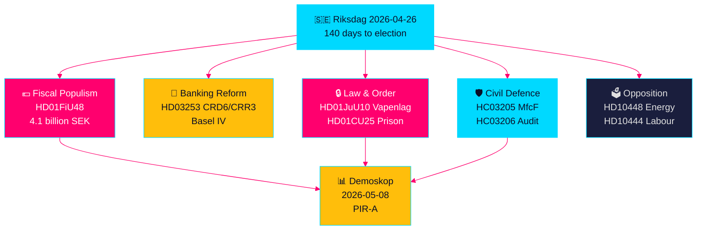

# Sprint Legislativo Preelectoral Sueco: Seguridad, Alivio Fiscal y Reforma Bancaria Convergen

**Autor**: James Pether Sörling  
**Fecha**: 2026-04-26  
**Clasificación**: UNCLASSIFIED // PUBLIC SOURCE  
**Nivel de confianza**: ALTO [B2] — síntesis cruzada de análisis hermanos, riksdag-regering MCP, documentos oficiales

---

## 🎯 BLUF

El Riksdag sueco entra en los últimos 140 días antes de las elecciones con una convergencia sin precedentes de flujos legislativos: un paquete de emergencia de 4,1 mil millones de coronas para alivio fiscal en combustible y energía (HD01FiU48) en respuesta a los shocks de precios del conflicto de Oriente Medio y los costos de calefacción invernal; una reforma de regulación bancaria de la UE que vincula los bancos suecos a los estándares de capital Basilea IV (HD03253); una nueva ley integral de armas que prohíbe los rifles de caza semiautomáticos (HD01JuU10); y poderes de emergencia para ampliar la capacidad penitenciaria (HD01CU25). Simultáneamente, la coalición Tidö enfrenta una ofensiva coordinada de interpelaciones socialdemócratas dirigidas al abuso de contribuciones patronales, cancelaciones de prestaciones por enfermedad y fracasos en política de vivienda. La señal estructural más importante es la convergencia del populismo fiscal y la legislación de seguridad dura — una narrativa de coalición preelectoral que tiende un puente entre votantes M/SD/KD — mientras los riesgos de implementación aumentan en la reforma policial, la preparación para la defensa total y el cumplimiento bancario de la UE.

## 🧭 3 Decisiones que apoya este briefing

1. **Estrategas electorales y encuestadores**: Evaluar si el alivio fiscal de combustible HD01FiU48 (82 öre/litro gasolina, 319 coronas/m³ diésel, mayo–septiembre 2026) genera ganancia de popularidad sostenida para la coalición Tidö — el primer indicador de mercado es la medición Demoskop del 8.5.2026.
2. **Reguladores financieros y directivos bancarios**: Evaluar la hoja de ruta de implementación HD03253 (paquete bancario UE CRD6/CRR3) y las obligaciones de cumplimiento, especialmente el cabildeo de exención de proporcionalidad de bancos suecos pequeños en audiencias de comisión FiU en curso.
3. **Analistas de política de seguridad**: Determinar si el renombramiento simultáneo MSB→MfcF (HC03205), la ley de armas (HD01JuU10) y la expansión de capacidad penitenciaria (HD01CU25) constituyen una transformación de seguridad coherente o tres gestos electorales separados — la auditoría de defensa total de Riksrevisionen (HC03206) proporciona la línea base crítica de déficit de capacidad.

## Puntos de inteligencia en 60 segundos

- 💶 **Alivio fiscal de 4,1 Mrd SEK** (HD01FiU48, FiU, aprobado 2026-04-21): Reducción de impuesto al combustible + subsidios energéticos para el costo de vida familiar; formulación explícita de "circunstancias especiales" crea precedente para más intervenciones antes de las elecciones [B2]
- 🏦 **Paquete bancario UE** (HD03253, Prop 2026-04-23, FiU): Implementación CRD6/CRR3 Basilea IV — la mayor regulación bancaria sueca desde Basilea III; tensiones de cumplimiento de bancos pequeños [B2]
- 🔒 **Nueva ley de armas** (HD01JuU10, JuU, aprobada 2026-04-24): Prohibición de rifles de caza semiautomáticos; entrada en vigor el 1 de junio de 2026; señal de coalición SD/M sobre seguridad pública [A2]
- 🏛️ **Emergencia capacidad penitenciaria** (HD01CU25, CU, aprobado 2026-04-23): El gobierno recibe autorización para eludir la ley de planificación y construcción para espacios penitenciarios temporales; escasez estructural de prisiones [A2]
- 🛡️ **Transformación de defensa civil** (HC03205, prop): Renombrar MSB como Myndigheten för civilt försvars; la auditoría de Riksrevisionen (HC03206) revela brechas de coordinación municipal; debate capacidad vs. renombramiento cosmético [B2]
- 📉 **Ofensiva de interpelación de la oposición**: S apunta al abuso de contribuciones patronales (HD10444), supresiones de prestaciones por enfermedad (HD10447), fracasos de vivienda (HD10434); SD disputa la desinformación energética (HD10448) [B2]
- ⚡ **Riksbank retuvo 5.297 Mrd SEK** (HD01FiU23): El dividendo estatal cero señala cautela institucional sobre el margen fiscal un año antes de las elecciones [A1]
- 🗳️ **140 días para las elecciones**: PIR-A (coalición Tidö ≥ 44 % en medición Demoskop a más tardar 2026-07-01) es el indicador adelantado operativo que resuelve el Escenario A (renovación de coalición) vs. Escenario B (minoría liderada por S) [B2]

## Detonante futuro más importante

**2026-05-08 — Medición Demoskop post-alivio fiscal combustible HD01FiU48**. Si la coalición Tidö lee ≥ 44 %, la estrategia de alivio fiscal tuvo éxito y el Escenario A (renovación de coalición) se consolida. Si por debajo del 40 %, la coalición enfrenta una crisis de confianza preelectoral y podría intentar más intervenciones populistas. Este es el único indicador decisivamente importante en la inteligencia política sueca para los próximos 14 días.

## Marcador de confianza

**ALTO globalmente [B2]** — derivado de seis análisis hermanos verificados independientemente con documentos de proposición oficiales, verificación riksdag-regering MCP y datos de la API Riksdagen. Las futuras dinámicas de política electoral llevan confianza MEDIA [C2] debido a la incertidumbre de las encuestas.

---

<!-- source-sha: d5f8b60b264b8ddd80e77be173232b6571d24c12 -->
