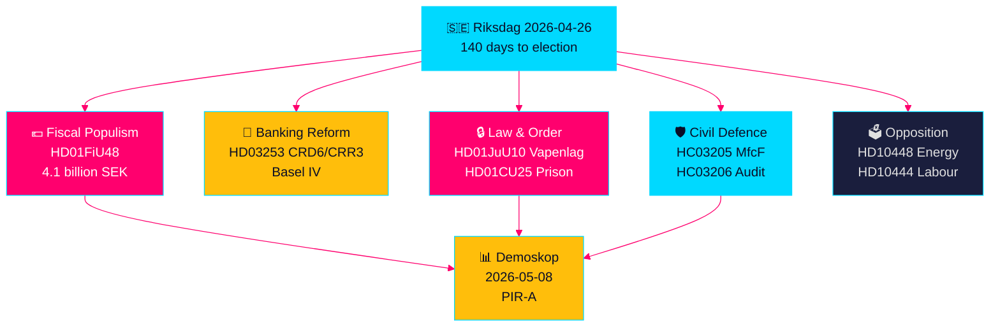

# Ruotsin Esivaalilainsäädäntösprint: Turvallisuus, Verohelpotus ja Pankkiuudistus Kohtaavat

**Tekijä**: James Pether Sörling  
**Päivämäärä**: 2026-04-26  
**Luokittelu**: UNCLASSIFIED // PUBLIC SOURCE  
**Luottamusaste**: KORKEA [B2] — sisaranalyysien ristisynteeesi, riksdag-regering MCP, viralliset asiakirjat

---

## 🎯 BLUF

Ruotsin Riksdag siirtyy viimeiseen 140 päivän esivaalijaksoon ennennäkemättömän lainsäädäntövirtojen konvergenssin myötä: 4,1 miljardin kruunun hätäpaketti polttoaine- ja energiaverohelpotuksiin (HD01FiU48) vastauksena Lähi-idän konfliktiin ja talvilämmityskustannuksiin; EU:n pankkisääntelyn uudistus, joka sitoo ruotsalaiset pankit Basel IV -pääomastandardeihin (HD03253); laaja-alainen uusi aselalaki, joka kieltää puoliautomaattiset metsästyskiväärit (HD01JuU10); ja pikamenettelyn valtuudet vankilakapasiteetin laajentamiseksi (HD01CU25). Samanaikaisesti Tidö-koalitio kohtaa koordinoidun sosiaalidemokraattisen välikysymysoffensiivin, joka kohdistuu työnantajamaksujen väärinkäyttöön, sairauspäivärahan peruuttamiseen ja asuntopolitiikan epäonnistumiseen. Tärkein rakenteellinen signaali on finanssipoliittisen populismin ja kovan turvallisuuslainsäädännön konvergenssi — esivaalikoalition narratiivi, joka rakentaa siltaa M/SD/KD-äänestäjien välille — samalla kun toteuttamisriskit kasvavat poliisiuudistuksessa, kokonaismaanpuolustusvalmiudessa ja EU-pankki­vaatimusten noudattamisessa.

## 🧭 3 Päätöstä, joita tämä katsaus tukee

1. **Vaalientekoilijat ja mielipidetutkijat**: Arvioi, tuottaako HD01FiU48 polttoaineverohelpotus (82 öre/litra bensiini, 319 kruunua/m³ diesel, toukokuu–syyskuu 2026) kestävää kannatusnousua Tidö-ryhmittymälle — ensimmäinen markkinalukema on Demoskopin 8.5.2026 mittaus.
2. **Finanssivalvojat ja pankkijohtajat**: Arvioi HD03253:n (CRD6/CRR3 EU:n pankkipaketti) toteutusaikataulu ja noudattamisvelvoitteet, erityisesti pienten ja keskisuurten ruotsalaisten pankkien suhteellisuusperiaatteen poikkeuslobbaus, jota käydään parhaillaan FiU:n valiokuntakuulemisissa.
3. **Turvallisuuspolitiikan analyytikot**: Määritä, muodostavatko samanaikainen MSB→MfcF-nimenmuutos (HC03205), aselalaki (HD01JuU10) ja vankilakapasiteetin laajennus (HD01CU25) johdonmukaisen turvallisuustransformaation vai kolme erillistä vaalitaktiikkaa — Riksrevisionenin kokonaismaanpuolustustarkastus (HC03206) tarjoaa kriittisen kapasiteettipuute-lähtötason.

## 60 sekunnin tiedustelukohdat

- 💶 **4,1 miljardia SEK verohelpotus** (HD01FiU48, FiU, hyväksytty 2026-04-21): Polttoaineveroleikkaus + energiatuki kotitalouksien elinkustannuksiin; eksplisiittinen "erityisolosuhteet"-muotoilu luo ennakkotapauksen lisäinterventioille ennen vaaleja [B2]
- 🏦 **EU:n pankkipaketti** (HD03253, Prop 2026-04-23, FiU): CRD6/CRR3 Basel IV -implementointi — Ruotsin suurin pankkisääntely sitten Basel III; pienten pankkien noudattamistermistressit [B2]
- 🔒 **Uusi aselalaki** (HD01JuU10, JuU, hyväksytty 2026-04-24): Puoliautomaattisten metsästyskiväärien kielto; voimaan 1. kesäkuuta 2026; SD/M-koalition signaali yleisestä turvallisuudesta [A2]
- 🏛️ **Vankilakapasiteetin laajennus hätätilanne** (HD01CU25, CU, hyväksytty 2026-04-23): Hallitus saa valtuuden ohittaa maankäyttö- ja rakennuslaki väliaikaisten vankilatilojen rakentamiseksi; rakenteellinen vankilapula [A2]
- 🛡️ **Kokonaismaanpuolustustransformaatio** (HC03205, prop): MSB nimetään uudelleen Myndigheten för civilt försvarsiksi; Riksrevisionenin tarkastus (HC03206) paljastaa kuntien koordinointiaukot; debatti kapasiteetista vs. kosmeettinen nimenmuutos [B2]
- 📉 **Opposition välikysymysoffensiivi**: S kohdistaa työnantajamaksujen väärinkäyttöön (HD10444), sairauspäivärahan peruuttamiseen (HD10447), asuntoepäonnistumiseen (HD10434); SD kiistää energiadesinformaation (HD10448) [B2]
- ⚡ **Riksbank säilytti 5,297 miljardia SEK** (HD01FiU23): Nolla valtion osinko merkitsee institutionaalista varovaisuutta finanssipoliittisesta liikkumavarasta vaalivuotta ennen [A1]
- 🗳️ **140 päivää vaaleihin**: PIR-A (Tidö-ryhmittymä ≥ 44 % Demoskopin mittauksessa viimeistään 2026-07-01) on operatiivinen ennakoiva indikaattori, joka ratkaisee Skenaarion A (koalitioanuudistus) vs. Skenaarion B (S:n johtama vähemmistö) [B2]

## Tärkein tuleva laukaisija

**2026-05-08 — Demoskopin mittaus HD01FiU48 polttoaineverohelpotuksen jälkeen**. Jos Tidö-ryhmittymä lukee ≥ 44 %, verohelpotusstrategia onnistui ja Skenaario A (koalitiouudistus) vahvistuu. Jos alle 40 %, koalitio kohtaa esivaaliluottamuskriisin ja voi yrittää lisää populistisia interventioita. Tämä on ainoa päätöksellisesti tärkein indikaattori Suomen poliittisessa tiedustelussa seuraavien 14 päivän aikana.

## Luottamusmerkki

**KORKEA kokonaisuutena [B2]** — johdettu kuudesta itsenäisesti vahvistetusta sisaranalyysistä virallisilla propositioasiakirjoilla, riksdag-regering MCP-vahvistuksella ja Riksdagen API-tiedoilla. Tulevat vaalipoliittiset dynamiikat kantavat KESKIMÄÄRÄISTÄ luottamustasoa [C2] mielipidetutkimuksen epävarmuuden vuoksi.

---

<!-- source-sha: d5f8b60b264b8ddd80e77be173232b6571d24c12 -->
