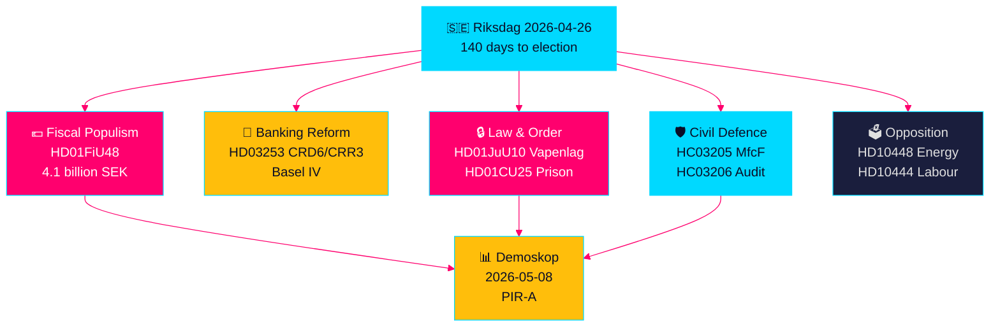

# Sprint Législatif Pré-électoral Suédois : Sécurité, Allégement Fiscal et Réforme Bancaire Convergent

**Auteur**: James Pether Sörling  
**Date**: 2026-04-26  
**Classification**: UNCLASSIFIED // PUBLIC SOURCE  
**Niveau de confiance**: ÉLEVÉ [B2] — synthèse croisée des analyses sœurs, riksdag-regering MCP, documents officiels

---

## 🎯 BLUF

Le Riksdag suédois entre dans les 140 derniers jours avant les élections avec une convergence sans précédent de flux législatifs : un plan d'urgence de 4,1 milliards de couronnes pour des allègements fiscaux sur le carburant et l'énergie (HD01FiU48) en réponse aux chocs de prix du conflit au Moyen-Orient et aux coûts de chauffage hivernal ; une réforme de la réglementation bancaire de l'UE liant les banques suédoises aux normes de capital Bâle IV (HD03253) ; une nouvelle loi globale sur les armes interdisant les fusils de chasse semi-automatiques (HD01JuU10) ; et des pouvoirs d'urgence pour étendre la capacité carcérale (HD01CU25). Simultanément, la coalition Tidö fait face à une offensive d'interpellation sociale-démocrate coordonnée ciblant l'abus de cotisations patronales, les annulations d'indemnités maladie et les échecs de la politique du logement. Le signal structurel le plus important est la convergence du populisme budgétaire et d'une législation sécuritaire dure — un narratif de coalition pré-électorale qui construit un pont entre les électeurs M/SD/KD — tandis que les risques de mise en œuvre augmentent dans la réforme policière, la préparation à la défense totale et la conformité bancaire UE.

## 🧭 3 Décisions que cette note soutient

1. **Stratèges électoraux et sondeurs** : Évaluer si l'allègement de la taxe sur le carburant HD01FiU48 (82 öre/litre essence, 319 couronnes/m³ diesel, mai–septembre 2026) génère un gain de popularité durable pour la coalition Tidö — premier indicateur de marché est la mesure Demoskop du 8.5.2026.
2. **Régulateurs financiers et directeurs bancaires** : Évaluer la feuille de route de mise en œuvre HD03253 (paquet bancaire UE CRD6/CRR3) et les obligations de conformité, notamment le lobbying d'exemption de proportionnalité des petites banques suédoises dans les auditions en cours de la commission FiU.
3. **Analystes de politique de sécurité** : Déterminer si le renommage simultané MSB→MfcF (HC03205), la loi sur les armes (HD01JuU10) et l'expansion de la capacité carcérale (HD01CU25) constituent une transformation sécuritaire cohérente ou trois gestes électoraux séparés — l'audit de défense totale de Riksrevisionen (HC03206) fournit la base critique des lacunes de capacité.

## Points de renseignement en 60 secondes

- 💶 **Allègement fiscal de 4,1 Mrd SEK** (HD01FiU48, FiU, adopté 2026-04-21) : Réduction des taxes carburant + subventions énergétiques pour le coût de la vie des ménages ; la formulation explicite « circonstances particulières » crée un précédent pour de nouvelles interventions avant les élections [B2]
- 🏦 **Paquet bancaire UE** (HD03253, Prop 2026-04-23, FiU) : Implémentation CRD6/CRR3 Bâle IV — la plus grande réglementation bancaire suédoise depuis Bâle III ; tensions de conformité des petites banques [B2]
- 🔒 **Nouvelle loi sur les armes** (HD01JuU10, JuU, adoptée 2026-04-24) : Interdiction des fusils de chasse semi-automatiques ; en vigueur le 1er juin 2026 ; signal de coalition SD/M sur la sécurité publique [A2]
- 🏛️ **Urgence capacité carcérale** (HD01CU25, CU, adoptée 2026-04-23) : Le gouvernement reçoit l'autorisation de contourner la loi sur l'urbanisme pour des espaces pénitentiaires temporaires ; pénurie structurelle de prisons [A2]
- 🛡️ **Transformation de la défense civile** (HC03205, prop) : Renommer MSB en Myndigheten för civilt försvars ; l'audit de Riksrevisionen (HC03206) révèle des lacunes de coordination communale ; débat capacité vs. renommage cosmétique [B2]
- 📉 **Offensive d'interpellation de l'opposition** : S cible l'abus de cotisations patronales (HD10444), les suppressions d'indemnités maladie (HD10447), les échecs du logement (HD10434) ; SD conteste la désinformation énergétique (HD10448) [B2]
- ⚡ **Riksbank a conservé 5,297 Mrd SEK** (HD01FiU23) : Le dividende d'État nul signale une prudence institutionnelle sur la marge budgétaire un an avant les élections [A1]
- 🗳️ **140 jours avant les élections** : PIR-A (coalition Tidö ≥ 44 % dans la mesure Demoskop au plus tard 2026-07-01) est l'indicateur avancé opérationnel qui résout le Scénario A (renouvellement de coalition) vs. Scénario B (minorité dirigée par S) [B2]

## Déclencheur futur le plus important

**2026-05-08 — Mesure Demoskop post-allègement taxe carburant HD01FiU48**. Si la coalition Tidö lit ≥ 44 %, la stratégie d'allègement fiscal a réussi et le Scénario A (renouvellement de coalition) se consolide. Si en dessous de 40 %, la coalition fait face à une crise de confiance pré-électorale et pourrait tenter d'autres interventions populistes. C'est le seul indicateur décisivement important dans les renseignements politiques suédois pour les 14 prochains jours.

## Marqueur de confiance

**ÉLEVÉ globalement [B2]** — dérivé de six analyses sœurs vérifiées indépendamment avec des documents de proposition officiels, vérification riksdag-regering MCP et données de l'API Riksdagen. Les dynamiques politiques électorales futures portent une confiance MOYENNE [C2] en raison de l'incertitude des sondages.

---

<!-- source-sha: d5f8b60b264b8ddd80e77be173232b6571d24c12 -->
