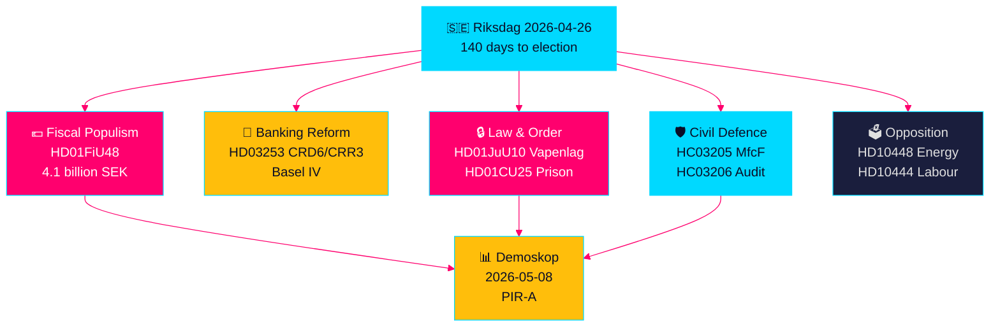

<!-- dir: rtl -->
---
title: "ספרינט חקיקה שוודי לפני הבחירות: ביטחון, הקלת מס ורפורמה בנקאית מתכנסים"
author: "James Pether Sörling"
date: 2026-04-26
article_type: realtime-pulse
confidence: HIGH [B2]
classification: PUBLIC — GDPR Art. 9(2)(e,g)
run_id: 24966030408
---

# ספרינט חקיקה שוודי לפני הבחירות: ביטחון, הקלת מס ורפורמה בנקאית מתכנסים

**מחבר**: James Pether Sörling  
**תאריך**: 2026-04-26  
**סיווג**: UNCLASSIFIED // PUBLIC SOURCE  
**רמת אמינות**: גבוהה [B2] — סינתזה צולבת של ניתוחים אחים, riksdag-regering MCP, מסמכים רשמיים

---

## 🎯 תקציר מנהלים

הריקסדאג השוודי נכנס ל-140 הימים האחרונים לפני הבחירות עם התכנסות חסרת תקדים של זרמי חקיקה: חבילת חירום של 4.1 מיליארד כתר להקלת מס דלק ואנרגיה (HD01FiU48) בתגובה לזעזועי מחירים מהסכסוך במזרח התיכון ועלויות חימום חורפיות; רפורמה ברגולציה הבנקאית האירופית המחייבת את הבנקים השוודיים לתקני הון Basel IV (HD03253); חוק נשק חדש ומקיף האוסר על רובי ציד חצי-אוטומטיים (HD01JuU10); וסמכויות חירום להרחבת הקיבולת הכלאית (HD01CU25). בו-זמנית, קואליציית Tidö מתמודדת עם מתקפת בקשות הבהרה סוציאל-דמוקרטיות מתואמות המכוונת לניצול לרעה של תרומות מעסיקים, ביטולי דמי מחלה וכישלונות במדיניות הדיור. האות המבני החשוב ביותר הוא התכנסות הפופוליזם הפיסקאלי וחקיקת הביטחון הקשה — נרטיב קואליציוני לפני הבחירות הבונה גשר בין בוחרי M/SD/KD — בעוד שסיכוני היישום גדלים ברפורמת המשטרה, המוכנות להגנה כוללת והציות הבנקאי האירופי.

## 🧭 3 החלטות שמסמך זה תומך בהן

1. **אסטרטגי בחירות וסוקרים**: הערכה האם הקלת מס הדלק HD01FiU48 (82 öre/ליטר בנזין, 319 כתר/מ"ק דיזל, מאי–ספטמבר 2026) מייצרת עלייה פופולרית מתמשכת לקואליציית Tidö — מדד השוק הראשון הוא מדידת Demoskop מ-8.5.2026.
2. **רגולטורים פיננסיים ומנהלי בנקים**: הערכת מפת הדרכים לביצוע HD03253 (חבילת בנקים אירופית CRD6/CRR3) וחובות הציות, בפרט לובינג פטור מפרופורציונליות של בנקים שוודיים קטנים בדיוני ועדת FiU המתנהלים.
3. **אנליסטים של מדיניות ביטחון**: קביעה האם שינוי שם MSB→MfcF בו-זמני (HC03205), חוק הנשק (HD01JuU10) והרחבת קיבולת הכלא (HD01CU25) מהווים טרנספורמציה ביטחונית קוהרנטית או שלוש מחוות בחירות נפרדות — ביקורת ההגנה הכוללת של Riksrevisionen (HC03206) מספקת קו בסיס קריטי לגירעון בקיבולת.

## נקודות מודיעין של 60 שניות

- 💶 **הקלת מס של 4.1 מיליארד SEK** (HD01FiU48, FiU, אושר 2026-04-21): הפחתת מס דלק + סובסידיות אנרגיה לעלות מחיה של משקי בית; ניסוח מפורש "נסיבות מיוחדות" יוצר תקדים להתערבויות נוספות לפני הבחירות [B2]
- 🏦 **חבילת בנקים אירופית** (HD03253, Prop 2026-04-23, FiU): יישום CRD6/CRR3 Basel IV — הרגולציה הבנקאית השוודית הגדולה ביותר מאז Basel III; מתחים בציות בנקים קטנים [B2]
- 🔒 **חוק נשק חדש** (HD01JuU10, JuU, אושר 2026-04-24): איסור על רובי ציד חצי-אוטומטיים; בתוקף מ-1 ביוני 2026; אות קואליציית SD/M על בטיחות הציבור [A2]
- 🏛️ **חירום קיבולת כלא** (HD01CU25, CU, אושר 2026-04-23): הממשלה מקבלת הרשאה לעקוף חוק תכנון ובנייה לשטחי כלא זמניים; מחסור מבני בכלאות [A2]
- 🛡️ **טרנספורמציה בהגנה האזרחית** (HC03205, prop): שינוי שם MSB ל-Myndigheten för civilt försvars; ביקורת Riksrevisionen (HC03206) חושפת פערי תיאום עירוניים; דיון קיבולת לעומת שינוי שם קוסמטי [B2]
- 📉 **מתקפת בקשות הבהרה של האופוזיציה**: S מכוונת לניצול לרעה של תרומות מעסיקים (HD10444), ביטולי דמי מחלה (HD10447), כישלונות דיור (HD10434); SD חולקת על הסרת מידע אנרגטי (HD10448) [B2]
- ⚡ **ריקסבנק שמר 5.297 מיליארד SEK** (HD01FiU23): דיבידנד מדינה אפס מאות ​​זהירות מוסדית על שולי פיסקאליים שנה לפני הבחירות [A1]
- 🗳️ **140 יום לבחירות**: PIR-A (קואליציית Tidö ≥ 44 % במדידת Demoskop לכל המאוחר 2026-07-01) הוא המדד המוביל האופרטיבי המכריע תרחיש A (חידוש קואליציה) מול תרחיש B (מיעוט בהנהגת S) [B2]

## הטריגר העתידי החשוב ביותר

**2026-05-08 — מדידת Demoskop לאחר הקלת מס הדלק HD01FiU48**. אם קואליציית Tidö קוראת ≥ 44 %, אסטרטגיית הקלת המס הצליחה ותרחיש A (חידוש קואליציה) מתגבש. אם מתחת ל-40 %, הקואליציה מתמודדת עם משבר אמון לפני בחירות ועשויה לנסות התערבויות פופוליסטיות נוספות. זהו המדד היחיד החשוב בצורה מכרעת במודיעין הפוליטי השוודי ל-14 הימים הבאים.

## סמן אמינות

**גבוה בסך הכל [B2]** — נגזר משישה ניתוחי אחים שאומתו באופן עצמאי עם מסמכי הצעה רשמיים, אימות riksdag-regering MCP ונתוני Riksdagen API. דינמיקות פוליטיות בחירותיות עתידיות נושאות אמינות בינונית [C2] בשל אי-וודאות בסקרים.

---

<!-- source-sha: d5f8b60b264b8ddd80e77be173232b6571d24c12 -->
