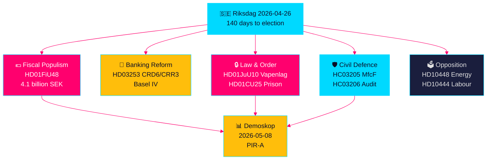

# スウェーデン選挙前立法スプリント：安全保障、減税、銀行改革が収束

**著者**: James Pether Sörling  
**日付**: 2026-04-26  
**区分**: UNCLASSIFIED // PUBLIC SOURCE  
**信頼度**: 高 [B2] — 姉妹分析の相互合成、riksdag-regering MCP、公式文書

---

## 🎯 要旨

スウェーデンのリクスダーグは選挙まで残り140日となり、立法潮流の前例のない収束を迎えている。中東紛争による価格ショックと冬季暖房費に対応した41億クローナの燃料・エネルギー税緊急救済パッケージ（HD01FiU48）、スウェーデンの銀行をバーゼルIV資本基準に縛るEU銀行規制改革（HD03253）、半自動狩猟ライフルを禁止する包括的な新武器法（HD01JuU10）、そして刑務所収容能力拡大のための緊急権限（HD01CU25）が同時進行している。同時に、Tidö連立は雇用主拠出金の乱用、傷病手当のキャンセル、住宅政策の失敗を標的とした社会民主党の組織的な質問攻勢に直面している。最も重要な構造的シグナルは、財政ポピュリズムと強硬な安全保障立法の収束――M/SD/KD支持者間の橋渡しを構築する選挙前連立ナラティブ――であり、警察改革、総合防衛準備、EU銀行コンプライアンスにおける実施リスクが高まっている。

## 🧭 この概要が支援する3つの意思決定

1. **選挙戦略家と世論調査員**: HD01FiU48燃料税軽減（ガソリン82öre/リットル、ディーゼル319クローナ/m³、2026年5月〜9月）がTidö連立の持続的な支持率向上を生み出すかを評価 — 最初の市場指標はDemoskopの2026年5月8日測定。
2. **金融規制当局と銀行経営陣**: HD03253（EUCRd6/CRR3銀行パッケージ）の実施ロードマップとコンプライアンス義務を評価、特に進行中のFiU委員会公聴会での小規模スウェーデン銀行の比例原則免除ロビー活動。
3. **安全保障政策アナリスト**: MSB→MfcF改名（HC03205）、武器法（HD01JuU10）、刑務所収容能力拡大（HD01CU25）の同時実施が一貫した安全保障変革を構成するか、3つの別個の選挙的身振りかを判断 — リクスレビジョーネンの総合防衛監査（HC03206）が能力不足の重要基準値を提供。

## 60秒インテリジェンスポイント

- 💶 **41億SEK減税** (HD01FiU48、FiU、2026-04-21可決): 燃料税軽減+家庭生活費向けエネルギー補助金; 「特別事情」の明示的表現が選挙前のさらなる介入の先例を作る [B2]
- 🏦 **EU銀行パッケージ** (HD03253、Prop 2026-04-23、FiU): CRD6/CRR3バーゼルIV実施 — バーゼルIII以来のスウェーデン最大銀行規制; 小規模銀行のコンプライアンス緊張 [B2]
- 🔒 **新武器法** (HD01JuU10、JuU、2026-04-24可決): 半自動狩猟ライフル禁止; 2026年6月1日施行; SD/M連立の公安シグナル [A2]
- 🏛️ **刑務所収容能力緊急事態** (HD01CU25、CU、2026-04-23可決): 政府が一時的な刑務所スペースのために計画建設法を回避する権限を取得; 構造的な刑務所不足 [A2]
- 🛡️ **市民防衛変革** (HC03205、prop): MSBをMyndigheten för civilt försvarに改名; リクスレビジョーネン監査（HC03206）が自治体調整ギャップを明らかに; 能力対コスメティック改名の議論 [B2]
- 📉 **野党質問攻勢**: Sが雇用主拠出金乱用（HD10444）、傷病給付廃止（HD10447）、住宅失敗（HD10434）を標的; SDがエネルギー偽情報（HD10448）に反論 [B2]
- ⚡ **リクスバンクが52.97億SEKを保持** (HD01FiU23): 国家配当ゼロが選挙1年前の財政余裕に対する機関的慎重さを示す [A1]
- 🗳️ **選挙まで140日**: PIR-A（Tidö連立2026-07-01までのDemoskop測定で≥44%）がシナリオA（連立更新）対シナリオB（S主導少数政権）を解決する運用先行指標 [B2]

## 最重要な今後のトリガー

**2026-05-08 — HD01FiU48燃料税軽減後のDemoskop測定**。Tidö連立が≥44%であれば減税戦略は成功しシナリオA（連立更新）が固まる。40%未満であれば連立は選挙前信頼危機に直面し、さらなるポピュリスト介入を試みる可能性がある。これは今後14日間のスウェーデン政治インテリジェンスで唯一決定的に重要な指標。

## 信頼度マーカー

**総合高 [B2]** — 公式命題文書、riksdag-regering MCP検証、リクスダーグAPIデータで独立して検証された6つの姉妹分析から導出。将来の選挙政治ダイナミクスは世論調査の不確実性から中程度の信頼 [C2]。

---

<!-- source-sha: d5f8b60b264b8ddd80e77be173232b6571d24c12 -->
