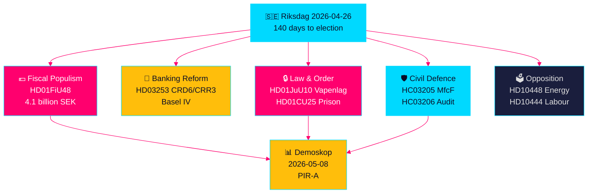

# 스웨덴 선거 전 입법 스프린트: 안보, 감세, 은행 개혁이 수렴

**저자**: James Pether Sörling  
**날짜**: 2026-04-26  
**분류**: UNCLASSIFIED // PUBLIC SOURCE  
**신뢰도**: 높음 [B2] — 자매 분석 교차 합성, riksdag-regering MCP, 공식 문서

---

## 🎯 핵심 요약

스웨덴 릭스다그는 선거까지 140일을 앞두고 전례 없는 입법 흐름의 수렴을 맞이하고 있다. 중동 분쟁 가격 충격과 동계 난방비에 대응한 41억 크로나의 연료·에너지세 긴급 감세 패키지(HD01FiU48), 스웨덴 은행을 바젤 IV 자본 기준에 묶는 EU 은행 규제 개혁(HD03253), 반자동 사냥총을 금지하는 포괄적 신규 무기법(HD01JuU10), 교도소 수용 능력 확대를 위한 긴급 권한(HD01CU25)이 동시에 진행되고 있다. 동시에 Tidö 연립은 고용주 기여금 남용, 상병급여 취소, 주거정책 실패를 겨냥한 사민당의 조직적 질문 공세에 직면해 있다. 가장 중요한 구조적 신호는 재정 포퓰리즘과 강경 안보 입법의 수렴 — M/SD/KD 유권자 간 가교를 구축하는 선거 전 연립 서사 — 이며, 경찰 개혁, 총체적 국방 태세, EU 은행 준수에서 이행 위험이 커지고 있다.

## 🧭 이 브리핑이 지원하는 3가지 의사결정

1. **선거 전략가와 여론조사원**: HD01FiU48 연료세 경감(휘발유 82öre/리터, 디젤 319크로나/m³, 2026년 5~9월)이 Tidö 연립에 지속적인 지지율 상승을 가져오는지 평가 — 첫 시장 지표는 Demoskop의 2026.5.8 측정.
2. **금융 규제기관과 은행 임원**: HD03253(EU CRD6/CRR3 은행 패키지) 이행 로드맵과 준수 의무를 평가, 특히 진행 중인 FiU 위원회 청문회에서 소규모 스웨덴 은행의 비례 원칙 면제 로비.
3. **안보정책 분석가**: MSB→MfcF 동시 개명(HC03205), 무기법(HD01JuU10), 교도소 능력 확대(HD01CU25)가 일관된 안보 변혁을 구성하는지 3개의 별도 선거 제스처인지 판단 — 릭스레비지오넨 총체적 국방 감사(HC03206)가 능력 부족의 핵심 기준선 제공.

## 60초 인텔리전스 포인트

- 💶 **41억 SEK 감세** (HD01FiU48, FiU, 2026-04-21 가결): 연료세 감소 + 가계 생활비 에너지 보조금; 명시적 "특수 상황" 표현이 선거 전 추가 개입 선례 형성 [B2]
- 🏦 **EU 은행 패키지** (HD03253, Prop 2026-04-23, FiU): CRD6/CRR3 바젤 IV 이행 — 바젤 III 이후 최대 스웨덴 은행 규제; 소규모 은행 준수 긴장 [B2]
- 🔒 **신규 무기법** (HD01JuU10, JuU, 2026-04-24 가결): 반자동 사냥총 금지; 2026년 6월 1일 발효; SD/M 연립의 공공 안전 신호 [A2]
- 🏛️ **교도소 수용 능력 긴급 사태** (HD01CU25, CU, 2026-04-23 가결): 정부가 임시 교도소 공간을 위해 계획 건설법 우회 권한 획득; 구조적 교도소 부족 [A2]
- 🛡️ **시민 국방 변혁** (HC03205, prop): MSB를 Myndigheten för civilt försvar로 개명; 릭스레비지오넨 감사(HC03206)가 지자체 조정 공백 드러냄; 역량 대 외형 개명 논쟁 [B2]
- 📉 **야당 질문 공세**: S가 고용주 기여금 남용(HD10444), 상병급여 폐지(HD10447), 주거 실패(HD10434) 겨냥; SD가 에너지 허위 정보(HD10448) 반박 [B2]
- ⚡ **릭스방크가 52.97억 SEK 보유** (HD01FiU23): 국가 배당금 제로가 선거 1년 전 재정 여력에 대한 기관적 신중함 신호 [A1]
- 🗳️ **선거까지 140일**: PIR-A (Tidö 연립 2026-07-01까지 Demoskop 측정 ≥44%)가 시나리오 A(연립 갱신) 대 시나리오 B(S 주도 소수 정부)를 해결하는 운영 선행 지표 [B2]

## 가장 중요한 향후 트리거

**2026-05-08 — HD01FiU48 연료세 경감 후 Demoskop 측정**. Tidö 연립이 ≥44%이면 감세 전략이 성공하고 시나리오 A(연립 갱신)가 굳어진다. 40% 미만이면 연립이 선거 전 신뢰 위기에 직면해 추가 포퓰리스트 개입을 시도할 수 있다. 이것은 향후 14일간 스웨덴 정치 인텔리전스에서 결정적으로 중요한 유일한 지표이다.

## 신뢰도 마커

**총체적으로 높음 [B2]** — 공식 명제 문서, riksdag-regering MCP 검증, 릭스다그 API 데이터로 독립 검증된 6개 자매 분석에서 도출. 미래 선거 정치 역학은 여론조사 불확실성으로 인해 중간 신뢰도 [C2] 부담.

---

<!-- source-sha: d5f8b60b264b8ddd80e77be173232b6571d24c12 -->
