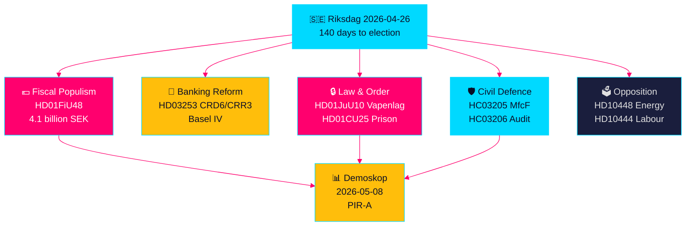

# Zweeds Voorverkiezingswetgevingssprint: Veiligheid, Belastingverlichting en Bankenhervorming Convergeren

**Auteur**: James Pether Sörling  
**Datum**: 2026-04-26  
**Classificatie**: UNCLASSIFIED // PUBLIC SOURCE  
**Betrouwbaarheidsniveau**: HOOG [B2] — kruissynthese van zusteranalyses, riksdag-regering MCP, officiële documenten

---

## 🎯 BLUF

De Zweedse Riksdag betreedt de laatste 140 dagen voor de verkiezingen met een ongekende convergentie van wetgevende stromen: een noodpakket van 4,1 miljard kronen voor brandstof- en energiebelastingverlichting (HD01FiU48) als reactie op prijsschokken door het Midden-Oostenconflict en verwarmingskosten in de winter; een EU-bankenreglementering die Zweedse banken bindt aan Basel IV-kapitaalstandaarden (HD03253); een nieuwe uitgebreide wapenwet die semi-automatische jachtgeweren verbiedt (HD01JuU10); en noodbevoegdheden om de gevangeniscapaciteit uit te breiden (HD01CU25). Tegelijkertijd staat de Tidö-coalitie voor een gecoördineerde sociaaldemocratische interpellatieoffensief gericht op misbruik van werkgeversbijdragen, annuleringen van ziekte-uitkeringen en mislukkingen in het woonbeleid. Het belangrijkste structurele signaal is de convergentie van fiscaal populisme en harde veiligheidswetgeving — een voorverkiezingscoalitienarratief dat een brug slaat tussen M/SD/KD-kiezers — terwijl de implementatierisico's toenemen bij politiehervorming, totale defensiegereedheid en EU-bankconformiteit.

## 🧭 3 Beslissingen die deze briefing ondersteunt

1. **Verkiezingsstrategisten en opiniepeilaars**: Evalueer of de brandstofbelastingverlichting HD01FiU48 (82 öre/liter benzine, 319 kronen/m³ diesel, mei–september 2026) duurzame populariteitswinst genereert voor de Tidö-coalitie — eerste marktindicator is de Demoskop-meting van 8.5.2026.
2. **Financiële toezichthouders en bankdirecteuren**: Beoordeel het implementatieroadmap HD03253 (EU-bankenpakket CRD6/CRR3) en nalevingsverplichtingen, met name het proportionaliteitsuitzondering-lobbyen van kleinere Zweedse banken in lopende FiU-commissiehearings.
3. **Veiligheidsbeleidsanalisten**: Bepaal of de gelijktijdige MSB→MfcF-hernoeming (HC03205), de wapenwet (HD01JuU10) en de uitbreiding van de gevangeniscapaciteit (HD01CU25) een coherente veiligheidstransformatie of drie afzonderlijke verkiezingsgebaren vormen — de totale defensie-audit van Riksrevisionen (HC03206) biedt de kritieke capaciteitsdeficit-basislijn.

## 60-seconden inlichtingenpunten

- 💶 **Belastingverlichting van 4,1 Mrd SEK** (HD01FiU48, FiU, aangenomen 2026-04-21): Brandstofbelastingverlaging + energiesubsidies voor huishoudenslevenskosten; expliciete formulering "bijzondere omstandigheden" schept precedent voor verdere interventies voor de verkiezingen [B2]
- 🏦 **EU-bankenpakket** (HD03253, Prop 2026-04-23, FiU): CRD6/CRR3 Basel IV-implementatie — Zweedse grootste bankenregulering sinds Basel III; nalevingsspanningen bij kleine banken [B2]
- 🔒 **Nieuwe wapenwet** (HD01JuU10, JuU, aangenomen 2026-04-24): Verbod op semi-automatische jachtgeweren; van kracht per 1 juni 2026; SD/M-coalitiesignaal over openbare veiligheid [A2]
- 🏛️ **Noodgeval gevangeniscapaciteit** (HD01CU25, CU, aangenomen 2026-04-23): Regering krijgt machtiging om de ruimtelijke ordeningswet te omzeilen voor tijdelijke gevangenisruimtes; structurele gevangenisschaarste [A2]
- 🛡️ **Burgerverdedigingstransformatie** (HC03205, prop): MSB hernoemd naar Myndigheten för civilt försvars; Riksrevisionens audit (HC03206) onthult gemeentelijke coördinatiehiaten; debat capaciteit vs. cosmetische hernoeming [B2]
- 📉 **Oppositionele interpellatieoffensief**: S richt zich op misbruik werkgeversbijdragen (HD10444), intrekkingen ziekte-uitkeringen (HD10447), woonmislukkingen (HD10434); SD betwist energiedesinformatie (HD10448) [B2]
- ⚡ **Riksbank behield 5.297 Mrd SEK** (HD01FiU23): Nul staatsdividend signaleert institutionele voorzichtigheid over fiscale ruimte een jaar voor de verkiezingen [A1]
- 🗳️ **140 dagen tot de verkiezingen**: PIR-A (Tidö-coalitie ≥ 44 % in Demoskop-meting uiterlijk 2026-07-01) is de operationele voorlopende indicator die Scenario A (coalitiehernieuwing) vs. Scenario B (door S geleide minderheid) oplost [B2]

## Belangrijkste aankomende trigger

**2026-05-08 — Demoskop-meting na brandstofbelastingverlichting HD01FiU48**. Als de Tidö-coalitie ≥ 44 % leest, was de belastingverlichtingsstrategie succesvol en consolideert Scenario A (coalitiehernieuwing) zich. Als onder 40 %, staat de coalitie voor een pre-verkiezingsvertrouwenscrisis en kan verdere populistische interventies proberen. Dit is de enige beslissend belangrijke indicator in Zweedse politieke inlichtingen voor de komende 14 dagen.

## Betrouwbaarheidsindicator

**HOOG totaal [B2]** — afgeleid van zes onafhankelijk geverifieerde zusteranalyses met officiële propositiondocumenten, riksdag-regering MCP-verificatie en Riksdagen API-gegevens. Toekomstige verkiezingspolitieke dynamieken dragen GEMIDDELD vertrouwen [C2] vanwege de onzekerheid van opiniepeilingen.

---

<!-- source-sha: d5f8b60b264b8ddd80e77be173232b6571d24c12 -->
