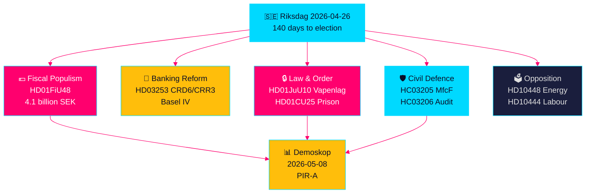

# Sveriges Lovgivningssprint Mot Valget: Sikkerhet, Skattelette og Bankreform Konvergerer

**Forfatter**: James Pether Sörling  
**Dato**: 2026-04-26  
**Klassifisering**: UNCLASSIFIED // PUBLIC SOURCE  
**Konfidensnivå**: HØY [B2] — tverrsyntese av søskenanalyser, riksdag-regering MCP, offisielle dokumenter

---

## 🎯 BLUF

Sveriges Riksdag går inn i den siste 140-dagers perioden før valget med en enestående konvergens av lovgivningsstrømmer: en nødpakke på 4,1 milliarder SEK for senkede drivstoff- og energiskatter (HD01FiU48) som svar på Midtøsten-konflikten og vinteroppvarmingskostnader; EUs bankreformering som binder svenske banker til Basel IV-kapitalstandarder (HD03253); en vidtrekkende ny våpenlov som forbyr halvautomatiske jaktgeværer (HD01JuU10); og hurtigsporsbeføyelser for utvidelse av fengselskapasitet (HD01CU25). Samtidig møter Tidö-koalisjonen en koordinert sosialdemokratisk interpellasjonsoffensiv rettet mot misbruk av arbeidsgiverbidrag, reversering av sykepenger og boligmislykkelse. Det viktigste strukturelle signalet er konvergensen av finansiell populisme og hard sikkerhetslovgivning — et forvalgskommunikasjonsnarrativ som bygger bro mellom M/SD/KD-velgere — mens implementeringsrisikoer øker innen politireform, sivilforsvar og EU-bankoverholdelse.

## 🧭 3 Beslutninger dette underlaget støtter

1. **Valgstrateger og meningsmålere**: Vurder om HD01FiU48 drivstoffskatteletten (82 øre/liter bensin, 319 SEK/m³ diesel, mai–september 2026) gir varig opinionsoppsving for Tidö-blokken — den første markedstesten er Demoskop-målingen 8. mai 2026.
2. **Finanstilsynsmyndigheter og bankledelser**: Evaluer implementeringstidslinjen og etterlevningsbyrden for HD03253 (CRD6/CRR3 EU bankpakke), særlig proporsjonalitetsunntakslobiering fra mindre og mellomstore svenske banker som for øyeblikket finner sted i FiU-utvalgsforhøringer.
3. **Sikkerhetspolitiske analytikere**: Avgjør om det samtidige MSB→MfcF-skiftet (HC03205), våpenloven (HD01JuU10) og fengselsutvidelsen (HD01CU25) utgjør en sammenhengende sikkerhetstransformasjon eller tre separate valgkampsignaler — Riksrevisjonens sivilforsvagsrevisjon (HC03206) gir den kritiske kapasitetsgapsbasisen.

## 60-sekunders etterretningspunkter

- 💶 **4,1 mrd. SEK skattelette** (HD01FiU48, FiU, godkjent 2026-04-21): Drivstoffskattelette + energistøtte rettet mot husholdningenes levekostnader; eksplisitt "særlige omstendigheter"-formulering skaper presedens for ytterligere forvalsintervensjoner [B2]
- 🏦 **EU bankpakke** (HD03253, Prop 2026-04-23, FiU): CRD6/CRR3 Basel IV-implementering — Sveriges største bankregulering siden Basel III; etterlevningsfristpress for mindre banker [B2]
- 🔒 **Ny våpenlov** (HD01JuU10, JuU, godkjent 2026-04-24): Forbud mot halvautomatiske jaktgeværer; gjelder fra 1. juni 2026; SD/M-koalisjonssignalering om offentlig sikkerhet [A2]
- 🏛️ **Nødsituasjon for fengselsutvidelse** (HD01CU25, CU, godkjent 2026-04-23): Regjeringen får myndighet til å omgå Plan- og bygningsloven for midlertidige fengselsanlegg; strukturell fengselskapasitetsmangel [A2]
- 🛡️ **Sivilforsvarstransformasjon** (HC03205, prop): MSB omdøpes til Myndigheten för civilt försvar; Riksrevisjonens revisjon (HC03206) avdekker kommunale koordineringshuller; debatt om kapasitet vs. kosmetisk navneskifte [B2]
- 📉 **Opposisjonens interpellasjonsoffensiv**: S retter seg mot arbeidsgiverbidragsmisbruk (HD10444), sykepengereversering (HD10447), boligsvikt (HD10434); SD bestrider energidesinformasjonsnarrativet (HD10448) [B2]
- ⚡ **Riksbanken beholdt 5,297 mrd. SEK** (HD01FiU23): Null statsutbytte signalerer institusjonell forsiktighet overfor finansielt handlingsrom foran valgåret [A1]
- 🗳️ **140 dager til valget**: PIR-A (Tidö-blokken ≥ 44 % i Demoskop innen 2026-07-01) er den operative fremoverpekende indikatoren som avgjør Scenario A (koalisjonsfornyelse) vs. Scenario B (S-ledet mindretall) [B2]

## Viktigste fremtidige trigger

**2026-05-08 — Demoskop-måling etter HD01FiU48 drivstoffskatteletten**. Hvis Tidö-blokken leser ≥ 44 %, lyktes skattelettelsesstrategien og Scenario A (koalisjonsfornyelse) styrkes. Hvis under 40 %, risikerer koalisjonen en forvalsfortrolelseskrise og kan forsøke ytterligere populistiske intervensjoner. Dette er den enkeltmest beslutningsrelevante indikatoren for norsk politisk etterretning de neste 14 dagene.

## Konfidensnivå

**HØY totalt [B2]** — avledet fra seks uavhengig bekreftede søskenanalyser med offisielle proposisjonsdokumenter, riksdag-regering MCP-bekreftelse og Riksdagen API-data. Fremtidige electorale dynamikker bærer MEDIUM konfidensnivå [C2] pga. målingsusikkerhet.

---

<!-- source-sha: d5f8b60b264b8ddd80e77be173232b6571d24c12 -->
