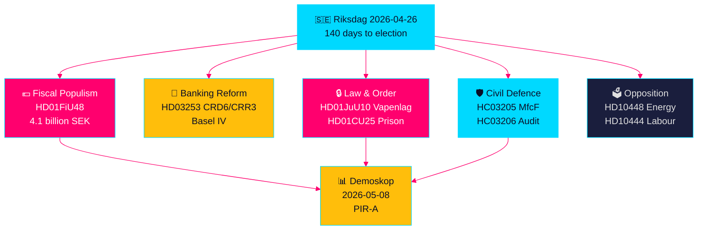

# Sveriges Förvalslagstiftningssprint: Säkerhet, Skattelättnad och Bankreform Konvergerar

**Författare**: James Pether Sörling  
**Datum**: 2026-04-26  
**Klassificering**: UNCLASSIFIED // PUBLIC SOURCE  
**Konfidensgrad**: HÖG [B2] — korssyntes av syskonanalyser, riksdag-regering MCP, officiella dokument

---

## 🎯 BLUF

Sveriges Riksdag inträder i det sista 140-dagars förvalsskedet med en oöverträffad konvergens av lagstiftningsströmmar: ett nödpaket på 4,1 miljarder kronor för sänkt drivmedels- och energiskatt (HD01FiU48) som svar på Mellanösternkonflikten och vinterkostnader; EU:s bankregleringsreform som binder svenska banker till Basel IV-kapitalstandarder (HD03253); en genomgripande ny vapenwlag som förbjuder halvautomatiska jaktvapen (HD01JuU10); och snabbspårade befogenheter för utbyggnad av fängelsekapacitet (HD01CU25). Samtidigt ställs Tidökoalitionen inför en samordnad socialdemokratisk interpellationsoffensiv riktad mot arbetsgivaravgiftsmissbruk, sjukpenningreversal och misslyckad bostadspolitik. Den viktigaste strukturella signalen är konvergensen av finansiell populism och hård säkerhetslagstiftning — ett förvals­koalitionsnarrativ som bygger broar mellan M/SD/KD-väljare — medan implementeringsrisker ökar inom polisreform, totalförsvarskraft och EU-bankefterlevnad.

## 🧭 3 Beslut som detta underlag stöder

1. **Valensstrateger och opinionsmätare**: Bedöm huruvida HD01FiU48 drivmedels­skattelättnaden (82 öre/liter bensin, 319 kr/m³ diesel, maj–september 2026) ger varaktig opinionslyft för Tidöblocket — det första marknadsprovet är Demoskops mätning den 8 maj 2026.
2. **Finansiella tillsynsmyndigheter och bankledningar**: Utvärdera implementeringstidslinje och efterlevnadsbörda för HD03253 (CRD6/CRR3 EU bankpaket), särskilt propor­tionalitets­undantagslobbning från mindre och medelstora svenska banker, som för tillfället pågår i FiU:s utskottsutfrågningar.
3. **Säkerhetspolitiska analytiker**: Avgör om den samtida MSB→MfcF-bytet (HC03205), vapenlagen (HD01JuU10) och fängelseexpansionen (HD01CU25) utgör en sammanhängande säkerhetstransformation eller tre separata valrörelsesignaler — Riksrevisionens civila­försvarsrevision (HC03206) ger den kritiska kapacitetsgapbaslinjen.

## 60-sekunders underrättelsepunkter

- 💶 **4,1 miljarder SEK skattelättnad** (HD01FiU48, FiU, godkänt 2026-04-21): Drivmedelsskattesänkning + energistöd riktat mot hushållens levnadskostnader; explicit "särskilda omständigheter"-formulering skapar prejudikat för ytterligare förvals­interventioner [B2]
- 🏦 **EU bankpaket** (HD03253, Prop 2026-04-23, FiU): CRD6/CRR3 Basel IV-implementering — Sveriges största bankreglering sedan Basel III; efterlevnadsdedlinestress för mindre banker [B2]
- 🔒 **Ny vapenwlag** (HD01JuU10, JuU, godkänt 2026-04-24): Förbud mot halvautomatiska jaktvapen; gäller från 1 juni 2026; SD/M-koalitionssignalering om allmän säkerhet [A2]
- 🏛️ **Fängelseexpansionsnödsituation** (HD01CU25, CU, godkänt 2026-04-23): Regeringen får befogenhet att åsidosätta Plan- och bygglagen för tillfälliga anstaltsbyggnader; strukturell fängelsekapacitetsbrist [A2]
- 🛡️ **Civilförsvarsomvandling** (HC03205, prop): MSB namnändras till Myndigheten för civilt försvar; Riksrevisionens revision (HC03206) påvisar kommunala samordningsgap; debatt om kapacitet vs. kosmetisk namnbyte [B2]
- 📉 **Oppositionens interpellationsoffensiv**: S riktar sig mot arbetsgivaravgiftsmissbruk (HD10444), sjukpenningreversal (HD10447), bostadsfrågan (HD10434); SD bestrider energidesinformationsnarrativet (HD10448) [B2]
- ⚡ **Riksbanken behöll 5,297 miljarder SEK** (HD01FiU23): Noll statlig utdelning signalerar institutionell försiktighet kring finansiellt manöverutrymme inför valåret [A1]
- 🗳️ **140 dagar till valet**: PIR-A (Tidöblocket ≥ 44 % i Demoskop senast 2026-07-01) är den operativa forwardsindikatorn som avgör Scenario A (koalitionsförnyelse) vs. Scenario B (S-ledd minoritet) [B2]

## Viktigaste framtida trigger

**2026-05-08 — Demoskops mätning efter HD01FiU48 drivmedels­skattelättnad**. Om Tidöblocket når ≥ 44 % lyckades skattelättnadsstrategin och Scenario A (koalitionsförnyelse) stärks. Om under 40 % riskerar koalitionen en förvals­förtroendes­kris och kan försöka ytterligare populistiska interventioner. Detta är den enstaka mest besluts­relevanta indikatorn för svensk politisk underrättelsetjänst de närmaste 14 dagarna.

## Konfidensetikett

**HÖG totalt [B2]** — härledd från sex oberoende bekräftade syskonanalyser med officiella propositions­dokument, riksdag-regering MCP-bekräftelse och Riksdagen API-data. Framtida electorala dynamiker bär MEDIUM konfidensgrad [C2] pga. mätosäkerhet.

---

<!-- source-sha: d5f8b60b264b8ddd80e77be173232b6571d24c12 -->
