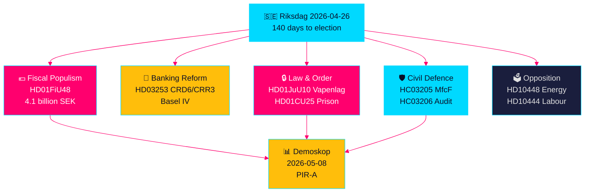

# 瑞典选前立法冲刺：安全、减税与银行改革三流汇聚

**作者**: James Pether Sörling  
**日期**: 2026-04-26  
**密级**: UNCLASSIFIED // PUBLIC SOURCE  
**置信度**: 高 [B2] — 姐妹分析交叉综合，riksdag-regering MCP，官方文件

---

## 🎯 核心摘要

瑞典议会进入选举前最后140天，迎来前所未有的立法浪潮交汇：41亿克朗燃油及能源税紧急减税方案（HD01FiU48），应对中东冲突价格冲击与冬季取暖费用；将瑞典银行绑定巴塞尔IV资本标准的欧盟银行监管改革（HD03253）；全面新武器法禁止半自动猎枪（HD01JuU10）；以及扩大监狱容量的紧急授权（HD01CU25）。与此同时，Tidö联合政府面临社会民主党协调一致的质询攻势，目标锁定雇主缴款滥用、病假补贴取消和住房政策失败。最重要的结构性信号是财政民粹主义与强硬安全立法的汇聚——在M/SD/KD选民之间构建桥梁的选前联合叙事——而警察改革、总体国防准备和欧盟银行合规的执行风险持续上升。

## 🧭 本简报支持的3项决策

1. **选举策略师和民调人员**：评估HD01FiU48燃油税减免（汽油82öre/升，柴油319克朗/立方米，2026年5—9月）是否为Tidö联合政府带来持续支持率提升——首个市场指标为Demoskop的2026年5月8日测量结果。
2. **金融监管机构与银行高管**：评估HD03253（欧盟CRD6/CRR3银行包）的实施路线图和合规义务，尤其是小型瑞典银行在FiU委员会持续听证中就比例原则豁免进行的游说。
3. **安全政策分析师**：判断MSB→MfcF同步更名（HC03205）、武器法（HD01JuU10）与监狱容量扩张（HD01CU25）是否构成连贯的安全转型，还是三个独立选举姿态——瑞典审计署总体国防审计（HC03206）提供能力缺口关键基线。

## 60秒情报要点

- 💶 **41亿SEK减税** (HD01FiU48，FiU，2026-04-21通过)：燃油税削减+家庭生活成本能源补贴；明确"特殊情况"表述为选前更多干预开创先例 [B2]
- 🏦 **欧盟银行包** (HD03253，Prop 2026-04-23，FiU)：CRD6/CRR3巴塞尔IV实施——巴塞尔III以来最大规模瑞典银行监管；小型银行合规紧张 [B2]
- 🔒 **新武器法** (HD01JuU10，JuU，2026-04-24通过)：禁止半自动猎枪；2026年6月1日起生效；SD/M联合公共安全信号 [A2]
- 🏛️ **监狱容量紧急状态** (HD01CU25，CU，2026-04-23通过)：政府获授权绕过规划建设法建设临时监狱；结构性监狱短缺 [A2]
- 🛡️ **民防转型** (HC03205，prop)：MSB更名为Myndigheten för civilt försvar；瑞典审计署审计（HC03206）揭示地方政府协调缺口；能力与表面更名之争 [B2]
- 📉 **反对党质询攻势**：S锁定雇主缴款滥用（HD10444）、病假补贴削减（HD10447）、住房失败（HD10434）；SD反驳能源虚假信息（HD10448） [B2]
- ⚡ **瑞典央行保留52.97亿SEK** (HD01FiU23)：国家股息为零，表明选举前一年财政空间的机构审慎 [A1]
- 🗳️ **距选举140天**：PIR-A（Tidö联合2026-07-01前Demoskop测量≥44%）是解析场景A（联合政府续期）与场景B（S主导少数派）的运营领先指标 [B2]

## 最重要的未来触发点

**2026-05-08 — HD01FiU48燃油税减免后的Demoskop测量**。如Tidö联合≥44%，减税策略成功，场景A（联合续期）巩固。若低于40%，联合政府面临选前信任危机，可能尝试更多民粹干预措施。这是未来14天瑞典政治情报中唯一决定性重要指标。

## 置信度标记

**总体高 [B2]** — 来源于六项独立核实的姐妹分析，附官方命题文件、riksdag-regering MCP核查和议会API数据。未来选举政治动态因民调不确定性携带中等置信度 [C2]。

---

<!-- source-sha: d5f8b60b264b8ddd80e77be173232b6571d24c12 -->
