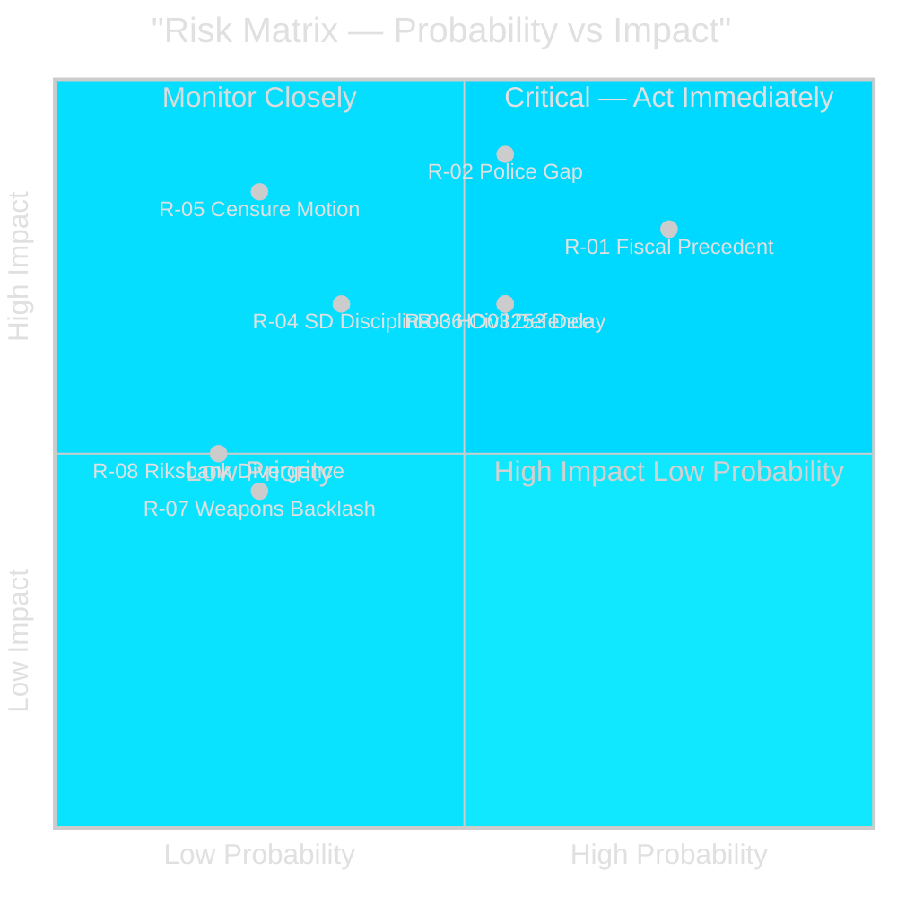

# Risk Assessment — Realtime Pulse 2026-04-26

## Risk Matrix

Probability × Impact (P×I) framework applied to the legislative cluster identified in this pulse.

| Risk ID | Risk | Probability | Impact | P×I | Admiralty | Evidence |
|---------|------|-------------|--------|-----|-----------|----------|
| R-01 | Fuel relief fiscal precedent leads to second "special circumstances" package | High | High | 🔴 Critical | [B2] | HD01FiU48 approval precedent; pre-election timing from riksdagen.se |
| R-02 | Police reform failure enables security incident before election | Medium | Very High | 🔴 Critical | [B2] | HD01JuU31 Riksrevisionen finding; 9 open recommendations unactioned from riksdagen.se |
| R-03 | HD03253 committee passage delayed by small-bank lobbying | Medium | High | 🟠 High | [B2] | FiU proportionality carve-out pressure; EU transposition deadline risk |
| R-04 | SD breaks voting discipline on HD03253 (EU banking) | Low-Medium | High | 🟡 Medium | [C2] | Eurosceptic SD base pressure; no evidence of internal SD opposition yet |
| R-05 | Opposition interpellation offensive escalates to formal censure motion | Low | Very High | 🟡 Medium | [B2] | S five-front campaign; coordinated with spring budget window |
| R-06 | Civil defence rename seen as cosmetic — capability gap exposed before election | Medium | High | 🟠 High | [B2] | HC03206 Riksrevisionen audit found municipal coordination gaps |
| R-07 | Weapons law triggers rural backlash undermining SD support | Low | Medium | 🟢 Low | [C2] | Semi-auto hunting rifle ban affects niche constituency |
| R-08 | IMF/Riksbank divergence on fiscal policy becomes political issue | Low | Medium | 🟢 Low | [B2] | HD01FiU23 zero dividend; IMF WEO Apr-2026 surplus narrowing signal |

## Priority Risks

### R-01 — Fiscal Precedent (🔴 Critical)

**Mechanism**: HD01FiU48 established that "special circumstances" can justify extraordinary mid-session budget amendments. With 140 days to election, any new energy price spike, extreme weather event, or economic shock could trigger demand for a second package. Sweden's fiscal surplus target and EU fiscal rules compliance would be at risk if two consecutive emergency packages are approved in the same calendar year.

**Mitigation**: Government should resist pressure for automatic fuel relief extension beyond September 2026. Finance Minister Svantesson must maintain credible commitment to fiscal rules in parliamentary communications.

**Monitor**: SEK/EUR rate, Brent crude price, monthly CPI data from SCB. Trigger level: Brent above $100/barrel for 30+ consecutive days.

### R-02 — Police Capacity Gap (🔴 Critical)

**Mechanism**: HD01JuU31 acknowledged the 2015 police reform failed its efficiency targets. Nine open Riksrevisionen recommendations remain unactioned. If a major security incident (organised crime, terrorism, mass disorder) occurs before September 2026, the accountability narrative falls directly on the current government — particularly damaging for a coalition that has made public safety its primary electoral offering.

**Mitigation**: Government should issue a formal response plan to HD01JuU31 recommendations within 30 days. Silence is the worst possible option given Riksrevisionen's public findings.

**Monitor**: Polismyndigheten incident statistics; Riksrevisionen follow-up publications; S/V motion filing on police reform.

### R-06 — Civil Defence Capability Gap (🟠 High)

**Mechanism**: HC03206 Riksrevisionen audit found municipal civil defence coordination insufficient. The MSB→MfcF rename (HC03205) may be portrayed as cosmetic if no tangible capability improvement is demonstrated before the election.

**Mitigation**: Defence Minister Bohlin must publish a concrete capability milestone plan for MfcF within 60 days.

