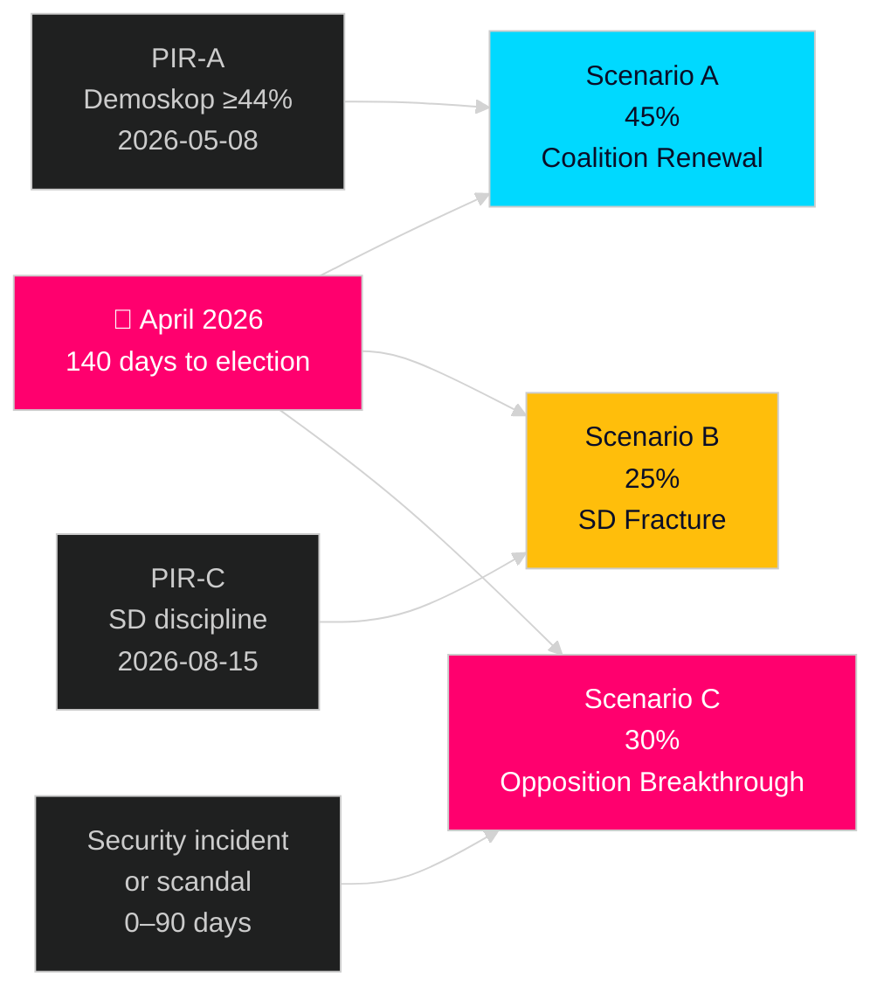

# Scenario Analysis — Realtime Pulse 2026-04-26

## Scenario Framework

Three scenarios for Swedish political trajectory through September 2026 election, based on this realtime pulse intelligence picture.

---

## Scenario A: Coalition Renewal — "Stability Premium"

**Probability**: 45% (WEP: Roughly even) [C2]

**Trigger conditions**:
- Demoskop 2026-05-08 shows Tidö bloc ≥ 44% (PIR-A)
- HD03253 (EU bankpaket) passes FiU committee without major amendment
- No major security incident before election
- Fuel relief (HD01FiU48) delivers cost-of-living narrative dividend

**Narrative**: The Tidö coalition's legislative sprint pays off. Voters reward fiscal relief, security delivery, and European compliance. SD maintains discipline. The law-and-order package (HD01JuU10 + HD01CU25) delivers credibility on public safety. The opposition's interpellation campaign fails to penetrate pre-election cycle media attention.

**Key indicators**:
- Demoskop ≥ 44% by 2026-07-01
- FiU committee approval of HD03253 without carve-outs that delay implementation
- No repeat of "special circumstances" fiscal package demanded

**Implications**: M-led government continues; Sweden's EU banking regulation aligns on schedule; civil defence transformation proceeds under MfcF mandate.

---

## Scenario B: Government Coalition Fracture — "SD Breakaway"

**Probability**: 25% (WEP: Unlikely) [C2]

**Trigger conditions**:
- SD demands major carve-outs on HD03253 EU bankpaket incompatible with EU directive
- Energy disinformation interpellation (HD10448) escalates to formal SD-led parliamentary inquiry into SVT
- Labour market shock (unemployment exceeds 9%) fuels SD base anger at coalition economic record
- HD01FiU48 "special circumstances" precedent exploited by SD for further welfare demands

**Narrative**: SD uses its parliamentary leverage to extract concessions that damage the coalition's EU compliance narrative. Energy and media policy becomes an intra-coalition fault line. The coalition's centre-right core (M/KD/L) is caught between SD demands and European obligations. Government stability weakens entering the final pre-election sprint.

**Key indicators**:
- SD files formal reservation (reservation) on HD03253 committee report
- SD press releases directly contradict government position on energy policy
- Youth unemployment exceeds 20% (SCB monthly data)

**Implications**: Coalition publicly fractured; S gains narrative advantage; EU banking reforms delayed; Nordic security cooperation credibility at risk.

---

## Scenario C: Opposition Breakthrough — "Accountability Cascade"

**Probability**: 30% (WEP: Unlikely to Roughly even) [C2]

**Trigger conditions**:
- Major security incident linked to police capacity gap (HD01JuU31 unactioned recommendations)
- Employer-contribution abuse scandal escalates into formal investigation (HD10444)
- SCB housing start data confirms housebuilding collapse below 20,000 units/year
- Demoskop below 40% for Tidö bloc following HD01FiU48 fuel relief

**Narrative**: The Social Democrats' coordinated interpellation campaign gains traction as each government failure generates a news cycle. The police reform accountability gap becomes a crisis when a major incident reveals the consequences of unactioned Riksrevisionen recommendations. The housing failure and labour market narrative converge into a voter-visible competence question. S/V/MP achieve pre-election momentum.

**Key indicators**:
- S tables formal motion of no confidence in specific minister(s)
- Three or more RiR follow-up findings published before August
- Demoskop showing S bloc leading in mid-summer polling

**Implications**: Election campaign begins earlier than scheduled; international media attention on Sweden's political stability; potential for minority S-led government post-election.

---

## Scenario Comparison

| Dimension | A: Stability Premium | B: SD Fracture | C: Opposition Breakthrough |
|-----------|---------------------|----------------|---------------------------|
| Probability | 45% | 25% | 30% |
| Electoral outcome | Coalition renewal | Hung parliament | S-led government |
| EU compliance | On track | Partially delayed | On track (S pro-EU) |
| Civil defence | MfcF capability investment | Contested | Enhanced |
| Economic trajectory | Fiscal discipline maintained | SD demands further relief | S increases welfare spending |

