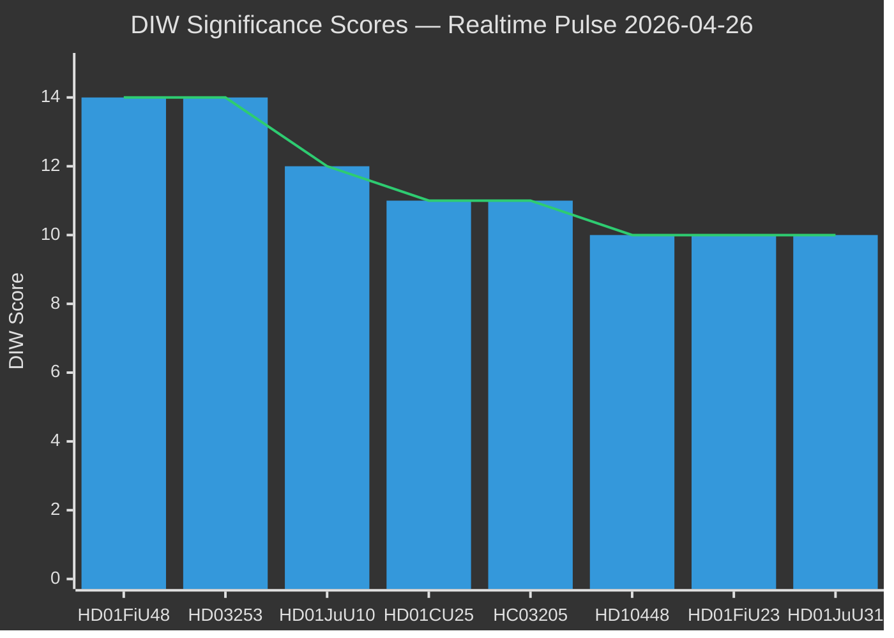
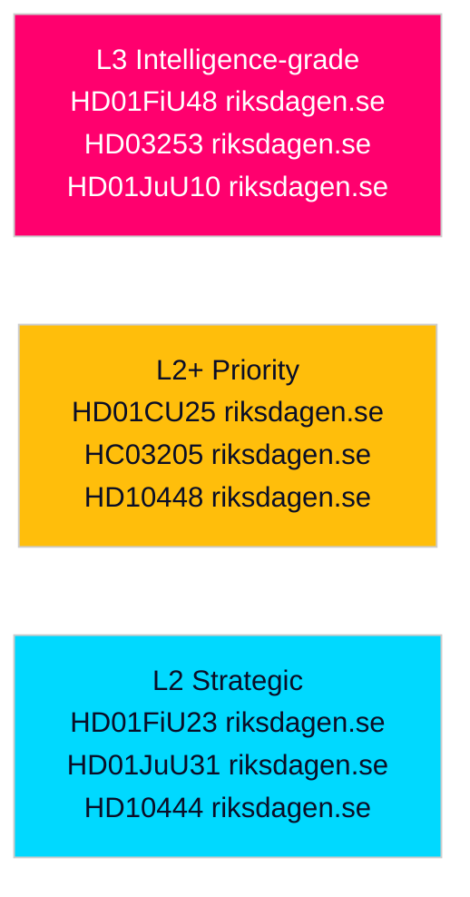

# Significance Scoring — Realtime Pulse 2026-04-26

## DIW Framework (Depth, Impact, Width)

All items scored on three axes (1–5 each): **D**epth of policy change, **I**mpact on affected population, **W**idth of institutional coverage.

## Ranked Items

| Rank | dok_id | Item | D | I | W | DIW Total | Tier | Evidence |
|------|--------|------|---|---|---|-----------|------|----------|
| 1 | HD01FiU48 | Extra ändringsbudget fuel & energy relief | 4 | 5 | 5 | 14 | L3 | riksdagen.se [B2] |
| 2 | HD03253 | EU Bankpaket CRD6/CRR3 | 5 | 4 | 5 | 14 | L3 | riksdagen.se [B2] |
| 3 | HD01JuU10 | New weapons law | 4 | 4 | 4 | 12 | L3 | riksdagen.se [A2] |
| 4 | HD01CU25 | Fast-track prison expansion | 4 | 3 | 4 | 11 | L2+ | riksdagen.se [A2] |
| 5 | HC03205 | MSB→MfcF civil defence rename | 3 | 3 | 5 | 11 | L2+ | riksdagen.se [B2] |
| 6 | HD10448 | SD energy disinformation interpellation | 3 | 3 | 4 | 10 | L2+ | riksdagen.se [B2] |
| 7 | HD01FiU23 | Riksbankens verksamhet 2025 | 3 | 3 | 4 | 10 | L2 | riksdagen.se [A1] |
| 8 | HD01JuU31 | Police reform assessment (RiR failure) | 3 | 3 | 4 | 10 | L2 | riksdagen.se [A1] |
| 9 | HC03206 | Riksrevisionen civil-defence audit | 3 | 3 | 4 | 10 | L2 | riksdagen.se [B2] |
| 10 | HD10444/HD10447 | S labour interpellations (x2) | 2 | 3 | 3 | 8 | L2 | riksdagen.se [B2] |

## Sensitivity Analysis

- **If HD03253 fails committee passage**: Tier L3 item drops to L2+ — significant damage to EU-compliance narrative but limited immediate economic impact
- **If fuel-tax relief is made permanent**: HD01FiU48 impact score rises from I=5 to a structural permanent fiscal change; DIW total would exceed current scoring
- **If police reform failure generates formal Riksdag investigation**: HD01JuU31 escalates from L2 to L2+ and creates broader coalition accountability risk

## Scoring Rationale

1. **HD01FiU48 (D4/I5/W5)**: Direct cost-of-living relief touching every Swedish household; emergency "special circumstances" precedent; cross-party electoral significance. Source: riksdagen.se confirmed committee approval [B2].
2. **HD03253 (D5/I4/W5)**: Deepest banking regulation reform in a decade; compliance affects all licensed Swedish banks; EU single rulebook alignment. Source: riksdagen.se [B2].
3. **HD01JuU10 (D4/I4/W4)**: Comprehensive weapons law replacing fragmented legislation; criminal justice and civil liberties implications. Source: riksdagen.se [A2].

