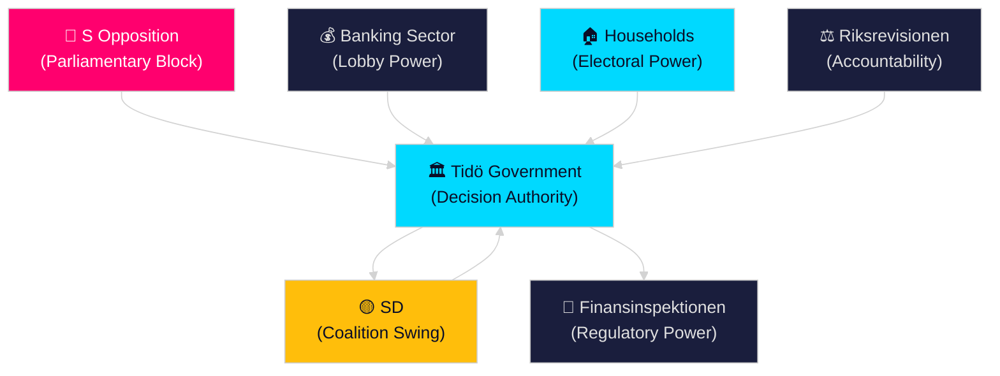

# Stakeholder Perspectives — Realtime Pulse 2026-04-26

## Primary Stakeholders

### Tidö Coalition Government (M/SD/KD/L)

**Interests**: Electoral survival (September 2026), legislative legacy, EU compliance, macroeconomic stability.

**Position on key legislation**:
- HD01FiU48: Government-initiated; positions as responsible cost-of-living response
- HD03253: Government-submitted; EU transposition obligation; wants swift committee passage
- HD01JuU10: Government-backed; signals law-and-order delivery to SD/M base
- HC03205: Government initiative; frames as substantive defence reform, not cosmetic

**Internal tensions**: L on sick-pay reversal (HD10447 interpellation pressure); KD on welfare reform boundaries; SD on EU bankpaket Eurosceptic pressure.

**Evidence**: riksdagen.se propositions by ministers Wykman, Strömmer, Bohlin, Carlson [B2]

### Social Democrat Party (S) — Opposition

**Interests**: Electoral gain; expose implementation gaps; rebuild welfare-state narrative.

**Position**: Systematic interpellation offensive (HD10444, HD10447, HD10434, HD10445, HD10448 context); preparing spring budget counter-proposals; targeting KD ministers as weakest coalition link.

**Key actors**: Johanna Haraldsson (Labour interpellation); Anna Wallentheim (Education/prison); Olle Thorell (Foreign Affairs); party leader Magdalena Andersson likely coordinating overall strategy.

**Evidence**: riksdagen.se interpellation filings [B2]

### Sweden Democrats (SD)

**Interests**: Maintain base loyalty; constrain EU regulatory creep; contest renewable energy narrative; signal independence from M within coalition.

**Position**: Josef Fransson's HD10448 energy interpellation tests boundaries; SD parliamentary group vote discipline maintained on April session bills; potential FiU carve-out demand on HD03253.

**Evidence**: riksdagen.se interpellation HD10448 [B2]; sibling analysis coalition-discipline tracking [B2]

### Finansinspektionen

**Interests**: Enhanced supervisory powers under HD03253 (CRD6); adequate resources for implementation; maintaining independence from political pressure on proportionality carve-outs.

**Position**: Benefits from HD03253's expanded fit-and-proper requirements; may resist small-bank lobby proportionality demands that would constrain supervisory discretion.

**Evidence**: riksdagen.se HD03253 proposition [B2]

### Swedish Banking Sector (Bankföreningen + small banks)

**Interests**: Competitive compliance burden; proportionality carve-outs for smaller institutions; smooth Basel IV transition.

**Tensions**: Large banks (SEB, Handelsbanken, SHB, Swedbank) broadly supportive of HD03253 alignment; small and regional banks lobby FiU for carve-outs. No primary evidence of specific positions, but committee lobbying is structurally expected for EU banking directives [C2].

### Swedish Households

**Interests**: Cost-of-living relief; public safety; healthcare; housing affordability.

**Position on HD01FiU48**: Direct beneficiaries of fuel and energy tax cuts; May–September timing maximises summer driving season relevance. This is the most politically visible stakeholder group.

**Evidence**: riksdagen.se HD01FiU48 committee approval [B2]

### Riksrevisionen

**Interests**: Institutional independence; government responsiveness to audit findings; maintaining constitutional credibility.

**Position**: HD01JuU31 (police reform) and HC03206 (civil defence) findings are on record without government remediation plans; second-order risk if government appears to ignore findings.

**Evidence**: riksdagen.se HD01JuU31 [A1], HC03206 [B2]

## Stakeholder Power Map

