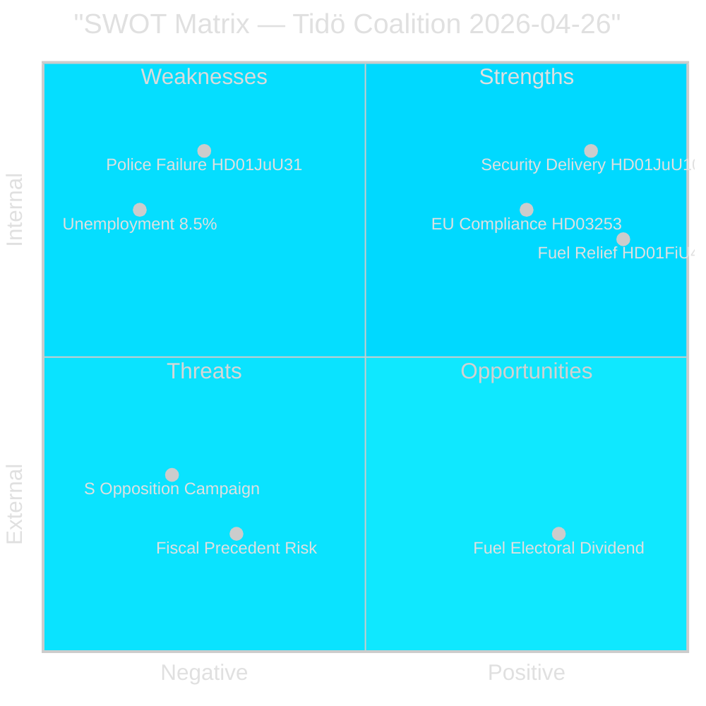

# SWOT Analysis — Tidö Coalition Pre-Election Position, 26 April 2026

## Analytical Framework

Applying the political SWOT framework to the Tidö coalition's position 140 days before the September 2026 election, based on the legislative activity evidenced in this realtime-pulse session.

---

### Strengths

| Strength | Evidence | Admiralty | Weight |
|----------|----------|-----------|--------|
| Legislative delivery on security agenda | HD01JuU10 (weapons law approved), HD01CU25 (prison expansion emergency powers), HC03205 (civil defence transformation) — all passed riksdagen.se [A2] | [A2] | High |
| EU compliance demonstration | HD03253 (CRD6/CRR3 bankpaket) submitted on schedule; Sweden positioned as reliable EU single-rulebook implementer [B2] | [B2] | High |
| Cost-of-living fiscal response | HD01FiU48 delivers 4.1 billion SEK household relief before peak summer driving and heating season; tangible voter-visible impact from riksdagen.se [B2] | [B2] | Very High |
| Coalition cohesion | SD maintained voting discipline across all major committee approvals in April 2026 session; no defections recorded via riksdag-regering MCP [B2] | [B2] | Medium |
| Stable monetary framework | Riksbank retaining 5.297 billion SEK (HD01FiU23) signals institutional confidence in Sweden's financial position; riksdagen.se [A1] | [A1] | Medium |

### Weaknesses

| Weakness | Evidence | Admiralty | Weight |
|----------|----------|-----------|--------|
| Police reform delivery failure | Riksrevisionen found 2015 police reform failed efficiency targets (HD01JuU31); parliamentary response was to close without remedial action — riksdagen.se [A1] | [A1] | High |
| Unemployment at 8.5% | Interpellations HC10744–HC10746 from weekly-review sibling confirm 500,000+ unemployed; youth and disability unemployment at EU-high levels [B2] | [B2] | Very High |
| Housing delivery gap | S interpellations (HD10434, HD10445) confirm Stockholm housebuilding decline and municipal pre-emption gap; construction minister Carlson under pressure from riksdagen.se [B2] | [B2] | High |
| EU bankpaket compliance burden | Small banks disproportionately affected by CRD6/CRR3 (HD03253); FiU committee lobbying for proportionality carve-outs signals internal tension [B2] | [B2] | Medium |
| Sick-pay reversal controversy | HD10447 interpellation shows employer sick-pay co-payment abolition is contested; welfare-state narrative risk [B2] | [B2] | Medium |

### Opportunities

| Opportunity | Evidence | Admiralty | Weight |
|-------------|----------|-----------|--------|
| Fuel relief electoral dividend | HD01FiU48 May–September timing maximises pre-election visibility; Demoskop reading 2026-05-08 will quantify [B2] | [B2] | Very High |
| Security narrative consolidation | Weapons law + prison expansion + civil defence transformation = coherent security portfolio; achieves SD base mobilisation from riksdagen.se [A2] | [A2] | High |
| EU compliance leadership positioning | HD03253 demonstrates Sweden as proactive EU banking regulator; differentiates from Hungary/Poland narrative [B2] | [B2] | Medium |
| Opposition overreach risk | SD interpellation (HD10448) on energy "disinformation" may backfire if it appears to suppress legitimate energy policy debate; creates S counter-narrative opportunity [C2] | [C2] | Low |
| Elder care positive signal | HD01SoU25 elder care package approved with multi-party support; defensible welfare record for KD constituency from riksdagen.se [A2] | [A2] | Medium |

### Threats

| Threat | Evidence | Admiralty | Weight |
|--------|----------|-----------|--------|
| Fiscal precedent risk | "Special circumstances" framing of HD01FiU48 creates expectation of further pre-election relief packages; bond market and EU fiscal rules compliance risk [B2] | [B2] | High |
| Opposition coordinated campaign | S five-front interpellation offensive (labour, housing, sick pay, foreign affairs, education) is systematic and timed to spring budget window; escalation risk to formal censure motions [B2] | [B2] | High |
| Police capacity gap becoming a crisis | HD01JuU31 acknowledged failure without remediation; if a major security incident occurs before September 2026, accountability falls on current government [B2] | [B2] | High |
| SD information-environment contest | HD10448 reveals SD is willing to use parliamentary tools to contest SVT/Riksdag energy information framing; intra-coalition information environment risk [C2] | [C2] | Medium |
| IMF fiscal discipline signal | WEO Apr-2026 projects Sweden's fiscal surplus narrowing; a second "special circumstances" package would risk Riksdag's own surplus target credibility [B2] | [B2] | Medium |

