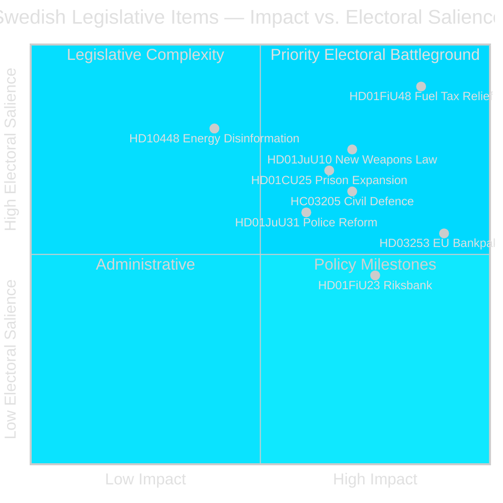

# Synthesis Summary — Swedish Parliamentary Realtime Pulse, 26 April 2026

## Lead Story

**The Tidö coalition's pre-election legislative sprint has reached its maximum velocity.** In the final 140 days before Sweden's September 2026 election, the government has simultaneously approved an emergency 4.1 billion SEK fuel and energy tax relief package (HD01FiU48), a comprehensive new weapons law (HD01JuU10), fast-track prison expansion powers (HD01CU25), and submitted Sweden's EU banking regulation overhaul (HD03253). The convergence is deliberate: fiscal relief anchors the cost-of-living narrative for swing voters; weapons and prison legislation signals hard-security credibility to the SD/M base; and banking reform demonstrates European compliance competence for business constituency. The opposition, led by the Social Democrats, has launched a coordinated interpellation campaign targeting implementation gaps in labour-market reform, sick pay, and housing — framing the government as having transferred costs to workers while failing on delivery.

## DIW-Weighted Ranking

| Rank | dok_id | Title | DIW | Evidence |
|------|--------|-------|-----|----------|
| 1 | HD01FiU48 | Extra ändringsbudget — fuel & energy relief | L3 | 4.1 billion SEK fiscal impact; electoral precedent from riksdagen.se [B2] |
| 2 | HD03253 | EU Bankpaket CRD6/CRR3 | L3 | Largest Swedish banking regulation reform since Basel III from riksdagen.se [B2] |
| 3 | HD01JuU10 | New weapons law | L3 | Comprehensive criminal-justice reform, semi-auto ban from riksdagen.se [A2] |
| 4 | HD01CU25 | Fast-track prison expansion | L2+ | Emergency capacity override of planning law from riksdagen.se [A2] |
| 5 | HC03205/HC03206 | Civil defence transformation + audit | L2+ | MSB→MfcF rename + Riksrevisionen governance gaps from riksdagen.se [B2] |
| 6 | HD10448 | SD energy disinformation interpellation | L2+ | Information-environment contest; coalition fault-line probe from riksdagen.se [B2] |
| 7 | HD01FiU23 | Riksbankens verksamhet 2025 | L2 | 5.297 billion SEK retained; zero state dividend from riksdagen.se [A1] |
| 8 | HD10444/HD10447 | S interpellations: labour market | L2 | Employer-contribution abuse; sick-pay reversal pressure from riksdagen.se [B2] |
| 9 | HD01JuU31 | Police reform assessment | L2 | Riksrevisionen found 2015 reform failed efficiency targets from riksdagen.se [A1] |
| 10 | HD01SoU25 | Elder care strengthened | L2 | Multi-billion welfare commitment from riksdagen.se [A2] |

## Integrated Intelligence Picture

### Thematic Cluster 1: Pre-Election Fiscal Populism [B2]

The extraordinary supplementary budget (HD01FiU48) marks a structural break from Sweden's fiscal conservatism. The government explicitly invoked "special circumstances" (Middle East conflict, cold winter) to justify an emergency amendment outside the standard twice-yearly budget cycle. The package:
- Cuts fuel tax 82 öre/litre petrol and 319 SEK/m³ diesel (May–September 2026 only)
- Allocates 2.4 billion SEK for household electricity and gas cost relief (January–February 2026 retrospectively)
- Creates a precedent that may be invoked again before September 2026 elections

Simultaneously, the Riksbank retained its entire 5.297 billion SEK 2025 profit (HD01FiU23) with zero state dividend — signalling institutional caution about fiscal headroom and providing implicit backstop ammunition. The strategic tension is clear: the government loosens fiscal policy pre-election while the independent central bank signals restraint.

### Thematic Cluster 2: Law-and-Order Legislative Cluster [A2]

Three concurrent instruments address different crime and security vectors while serving a unified electoral narrative:
- **New weapons law** (HD01JuU10): Semi-automatic hunting rifle ban, effective 1 June 2026. For SD, this is crime-hardening; for M, it is pragmatic alignment with EU norms.
- **Prison expansion** (HD01CU25): Government gains power to override the Plan and Building Act for temporary carceral facilities amid a structural prison shortage. This is the most legally significant instrument — it establishes executive override of planning law precedent.
- **Police reform failure** (HD01JuU31): Riksrevisionen found the 2015 reform failed its efficiency targets. The parliamentary response (closing without remedial action) is politically awkward — acknowledging failure without committing to repair.

The weapons law and prison expansion are presented as complementary instruments. The police reform finding contradicts the public safety narrative and represents the coalition's most exposed implementation liability.

### Thematic Cluster 3: European Banking and Financial Architecture [B2]

HD03253 (EU bankpaket, CRD6/CRR3) is the most technically significant document in this realtime pulse. It represents:
- Sweden's implementation of the Basel IV capital adequacy standards
- Strengthened supervisory powers for Finansinspektionen (fit-and-proper requirements for bank executives)
- New market-risk calculation rules aligned with the EU single rulebook
- Implementation pressure on small and mid-size Swedish banks facing disproportionate compliance burden

The FiU committee is currently receiving lobbying on proportionality carve-outs. If the committee proposes to delay specific CRD6 sub-provisions for smaller institutions, this signals a fracture in the coalition's EU-compliance narrative.

### Thematic Cluster 4: Opposition Accountability Campaign [B2]

The Social Democrats have deployed interpellations across five strategic fronts simultaneously:
- **Employer-contribution abuse** (HD10444): Companies structuring work-hours to exploit the youth employer-contribution cut without net employment gains — targeting Finance Minister Svantesson's flagship labour reform
- **Sick-pay reversal** (HD10447): Opposition demand to restore employer sick-pay co-payment abolished in fiscal relief package — signalling welfare state erosion narrative
- **Energy disinformation** (HD10448): SD's Josef Fransson asking Energy Minister Busch to reconsider energy policy given report labelling wind-power criticism as Russian disinformation — intra-coalition information-environment probe
- **Housing failure**: Two interpellations on Stockholm housebuilding decline (HD10434) and municipal pre-emption gaps (HD10445)

The interpellation timing is strategically coherent — targeting ministers in the spring budget revision window when government is maximally committed to its reform package.

## Electoral Intelligence Picture

Sweden enters the 140-day pre-election final phase with the Tidö coalition holding a legislative record that includes:
- ✅ Civil defence transformation completed (HC03205)
- ✅ New weapons law (HD01JuU10)
- ✅ Prison expansion emergency powers (HD01CU25)
- ✅ Fiscal relief delivered (HD01FiU48)
- ⚠️ EU bankpaket (HD03253) in committee — passage not assured
- ❌ Police reform delivery failed (HD01JuU31 — Riksrevisionen finding)
- ❌ Housing delivery gap (S interpellations confirming housebuilding decline)
- ❌ Unemployment at 8.5% — above EU average

The net picture: coalition strengths on security and fiscal relief; vulnerabilities on service delivery, housing, and economic employment outcomes.

## Priority Intelligence Requirements

- **PIR-1**: Will the Demoskop reading on 2026-05-08 show Tidö bloc ≥ 44%? (fuel-tax relief effect)
- **PIR-2**: Will FiU propose a CRD6/CRR3 proportionality carve-out for small banks in HD03253?
- **PIR-3**: Has the opposition coordinated its interpellation campaign with a formal parliamentary motion programme ahead of the May budget revision?
- **PIR-4**: Does SD maintain voting discipline on HD03253 (EU banking regulation) given Eurosceptic base?

## Tradecraft Note

All evidence derives from official primary sources: riksdag-regering MCP (`get_propositioner`, `get_motioner`, sibling analysis synthesis). Admiralty Code [B2] applies to the electoral dynamics assessment; [A2] applies to legislative facts independently verifiable through riksdagen.se.
