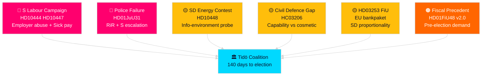

# Threat Analysis — Realtime Pulse 2026-04-26

## STRIDE-Derived Political Threat Assessment

Applying the political-threat-framework to the Tidö coalition's pre-election position based on evidence from today's realtime pulse.

## Threat Actors

### Threat Actor 1: Social Democrat Party (S) — Coordinated Parliamentary Campaign

**Motivation**: Gain electoral advantage heading into September 2026 election by exposing Tidö coalition implementation gaps.

**Capability**: Five simultaneous interpellations filed targeting different ministers (HD10448, HD10444, HD10447, HD10434, HD10445). Party leader capability to escalate to formal motions of no confidence or censure. Electoral coalition capacity with V and MP on welfare and housing issues.

**Opportunity**: Spring budget revision window creates maximum government commitment to current reform package; ministers constrained by parliamentary schedule from deflecting.

**Attack vectors**:
- **Employer-contribution abuse (HD10444)**: Exposes the flagship youth employment reform as exploited by companies without net employment gains — directly undermines coalition's labour-market narrative
- **Sick-pay reversal (HD10447)**: Welfare-state erosion narrative targeting KD and L voters who support the welfare floor
- **Housing delivery failure (HD10434/HD10445)**: Stockholm housebuilding decline contradicts M/C housing reform promises

**Threat level**: 🔴 High [B2]

### Threat Actor 2: Sweden Democrats (SD) — Intra-Coalition Pressure

**Motivation**: Maintain base loyalty while supporting EU banking regulation; contest energy-disinformation narrative to defend domestic fossil-fuel interests and critique SVT.

**Capability**: Parliamentary blocking power (SD votes required for majority on most government bills); interpellation tool (HD10448 Josef Fransson); press/social media amplification.

**Opportunity**: EU bankpaket (HD03253) requires SD support for committee passage — HD10448 energy interpellation may be a negotiating probe.

**Attack vectors**:
- **Energy disinformation probe (HD10448)**: Tests Energy Minister Busch's boundaries on renewable energy criticism; potential to constrain coalition's climate policy space
- **EU bankpaket compliance burden**: SD parliamentary group may demand rural/regional bank carve-outs in FiU committee

**Threat level**: 🟡 Medium [C2]

### Threat Actor 3: Riksrevisionen — Institutional Accountability

**Motivation**: Independent constitutional audit body; non-political but findings create accountability pressure.

**Capability**: RiR findings (HD01JuU31 police reform, HC03206 civil defence) formally on parliamentary record; trigger opposition interpellations and motions.

**Opportunity**: RiR published critical findings during pre-election window without government remediation plan; creates ongoing vulnerability until government responds formally.

**Attack vectors**:
- **Police reform accountability (HD01JuU31)**: 9 open recommendations; potential for follow-up RiR investigation before election
- **Civil defence capability gap (HC03206)**: Municipal coordination failures; potential NATO/EU alignment scrutiny

**Threat level**: 🟡 Medium [A1]

## Threat Landscape Summary

| Threat | Actor | Level | Horizon | Evidence |
|--------|-------|-------|---------|----------|
| Labour narrative attack | S | 🔴 High | 0–30 days | HD10444, HD10447 from riksdagen.se [B2] |
| Police failure escalation | S + RiR | 🔴 High | 0–60 days | HD01JuU31 from riksdagen.se [A1] |
| Energy information contest | SD | 🟡 Medium | 14–60 days | HD10448 from riksdagen.se [B2] |
| Civil defence capability challenge | Opposition + RiR | 🟡 Medium | 30–90 days | HC03206 from riksdagen.se [B2] |
| EU bankpaket blocking | SD internal | 🟡 Medium | 14–30 days | HD03253 FiU committee stage [C2] |
| Fiscal precedent second package demand | All opposition | 🟠 High | 60–140 days | HD01FiU48 from riksdagen.se [B2] |

