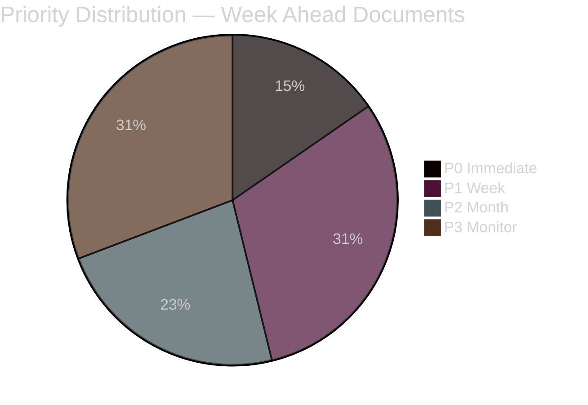

# Classification Results — Week Ahead 2026-04-27 to 2026-05-03

**Author**: James Pether Sörling | **Date**: 2026-04-26

## Classification Matrix

All data: PUBLIC PRIMARY SOURCE. GDPR Art. 9(2)(e) — publicly made political opinions. Purpose: democratic transparency.

| dok_id | Policy Domain | Political Dimension | Urgency | Conflict Level | Reversibility | Electoral Relevance | Data Sensitivity |
|--------|--------------|---------------------|---------|----------------|---------------|--------------------|--------------------|
| HD01JuU10 | Crime/Security | Right-wing consolidation | HIGH | Moderate | Low (new law) | HIGH pre-2026 | LOW — public |
| HD01JuU31 | Policing/Governance | Cross-party | HIGH | Low-Moderate | Medium | MEDIUM | LOW — public |
| HD03231 | Foreign policy/Ukraine | Broad consensus | MEDIUM | Very low | High | LOW | LOW — public |
| HD03232 | Foreign policy/Ukraine | Broad consensus | MEDIUM | Very low | High | LOW | LOW — public |
| HD01CU25 | Justice/Prisons | Centre-right | HIGH | Low | Low | MEDIUM | LOW — public |
| HD01SoU25 | Social welfare/Elderly | Cross-party | HIGH | Moderate | Medium | HIGH | LOW — public |
| HD03252 | Social security/Justice | Centre-right | MEDIUM | Moderate | Low | MEDIUM | LOW — public |
| HD03253 | Financial/Banking | Technical | LOW | Very low | Low | LOW | LOW — public |
| HD10448 | Energy policy | SD-KD tension | LOW | Low | High | LOW | LOW — public |

## Priority Tier Assignment

**P0 — Immediate action (48h)**: HD01JuU10, HD01JuU31
**P1 — Week-horizon (7 days)**: HD03231, HD03232, HD01CU25, HD01SoU25
**P2 — Month-horizon (30 days)**: HD03252, HD03253, HD03244
**P3 — Background/monitoring**: HD10448, HD11747-HD11749

## Retention & Access Notes
All documents are PUBLIC under Offentlighetsprincipen (TF 2:1). No retention restrictions. GDPR Art. 9(2)(e) applies to named political actors; Art. 9(2)(g) for public-interest analysis. No special access controls required.

style P0 fill:#ff006e
