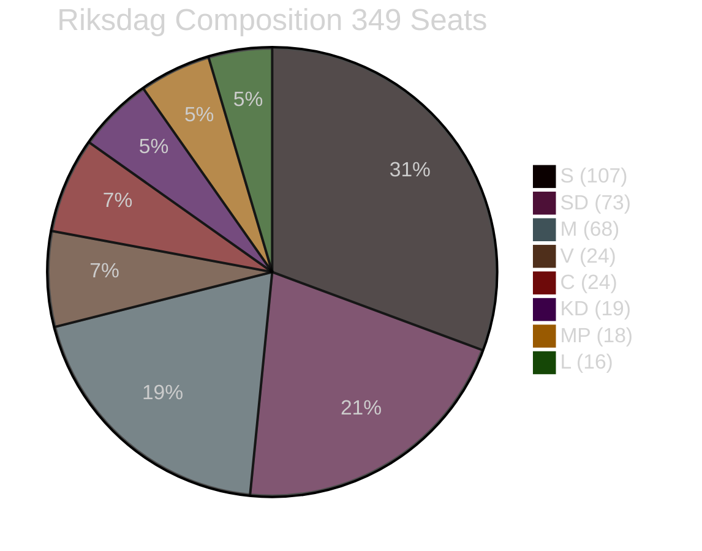

# Coalition Mathematics — Week Ahead 2026-04-27 to 2026-05-03

**Author**: James Pether Sörling | **Date**: 2026-04-26

## Current Riksdag Composition (349 seats)

| Party | Seats | Bloc | Notes |
|-------|-------|------|-------|
| S | 107 | Opposition | Largest party |
| SD | 73 | Government (support) | Supply & confidence |
| M | 68 | Government (coalition) | PM's party |
| V | 24 | Opposition | Left bloc |
| C | 24 | Opposition | Centre-right floating |
| KD | 19 | Government (coalition) | Finance minister |
| MP | 18 | Opposition | Green |
| L | 16 | Government (coalition) | Liberal |
| **Total** | **349** | | |

**Governing majority**: M+KD+L+SD = 68+19+16+73 = **176 seats** (bare majority of 175+1)

## Expected Voting Patterns — Key Legislation This Week

### HD01JuU10 — Ny Vapenlag (New Weapons Law)

| Party | Expected vote | Seats | Notes |
|-------|--------------|-------|-------|
| M | Ja | 68 | Government sponsor |
| KD | Ja | 19 | Government coalition |
| L | Ja | 16 | Government coalition |
| SD | Ja | ~70 | Expected yes; hunter risk noted |
| C | Nej/Avstår | ~24 | Landsbygdsfråga concern |
| S | Nej | 107 | Opposition |
| V | Nej | 24 | Opposition |
| MP | Nej | 18 | Opposition |
| **Expected result** | **Bifall ~173-176 Ja** | | Tight if SD has abstentions |

### HD03231+HD03232 — Ukraine Accountability

| Party | Expected vote | Seats | Notes |
|-------|--------------|-------|-------|
| M | Ja | 68 | Strong pro-Ukraine |
| KD | Ja | 19 | Strong pro-Ukraine |
| L | Ja | 16 | Strong pro-Ukraine |
| SD | Ja | 73 | Ukraine support strong |
| C | Ja | 24 | Pro-Ukraine |
| S | Ja | 107 | Cross-party consensus |
| L | Ja | 16 | Already counted |
| V | Nej/Avstår | 24 | Skeptical of tribunal |
| MP | Ja | 18 | Pro-Ukraine |
| **Expected result** | **Bifall ~325+ Ja** | | Near-unanimous |

## Coalition Stability Indicator

**Tidö coalition seat count**: 176 (M+KD+L+SD)
**Majority required**: 175
**Buffer**: 1 vote

This is the tightest coalition majority in post-war Swedish parliamentary history. Even 1 SD absence (illness, dissent) removes the government majority. This mathematical fragility is why the 5 S interpellations may be timed to maximise ministerial bandwidth during a vote-heavy week.

## Key Vote Risk: HD01JuU10 Semi-Auto Hunting Rifle Ban

**If 4 SD members defect/absent** (Ja votes fall to ~172):
- Government needs: 3 votes from C, L, or others
- C position: likely Nej (landsbygd issue)
- V/MP/S: Nej (oppose the bill on different grounds)
- Result: Bill fails → Government embarrassment → Opposition capitalises

**Probability of defection scenario**: 12% (per scenario-analysis.md Scenario 2)
