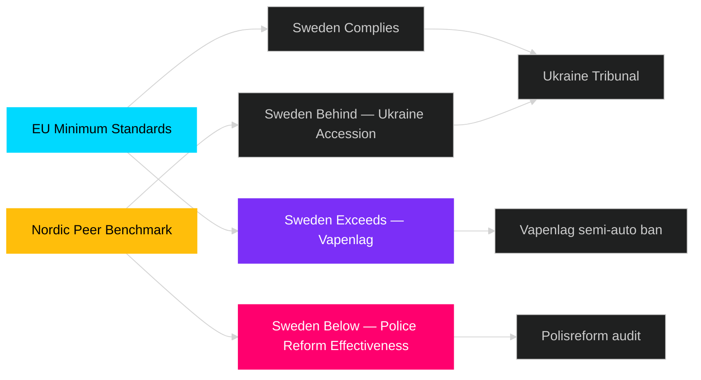

# Comparative International Analysis — Week Ahead 2026-04-27 to 2026-05-03

**Author**: James Pether Sörling | **Date**: 2026-04-26

**Comparator set**: Denmark (DK), Norway (NO), Germany (DE), EU institutions, Ukraine accountability framework

## Outside-In Analysis

### Weapons Regulation: HD01JuU10

| Jurisdiction | Approach | Key feature | Source |
|-------------|----------|-------------|--------|
| **Sweden (this week)** | New vapenlag banning new semi-auto hunting rifle permits | EU directive implementation + domestic extension | riksdagen.se HD01JuU10 |
| **Denmark** | DK implemented EU Firearms Directive 2021/555 in 2023 | No ban on semi-auto hunting rifles; focus on magazine limits | EUR-Lex |
| **Germany** | Waffengesetz 2020 — semi-auto limits for sport shooters; hunting sector largely exempt | Sector-specific exemptions maintained | Bundesjustizministerium |
| **EU** | Directive 2021/555 mandates category classification; national implementation varies | Sweden adding beyond-minimum national restriction | EUR-Lex 2021/555 |

**Intelligence**: Sweden's ban on new semi-auto hunting rifle permits goes beyond most EU counterparts. Denmark and Germany retain exemptions. This creates a potential regulatory divergence that hunters' associations will exploit in litigation risk framing. [B2]

### Police Reform Governance: HD01JuU31

| Jurisdiction | Police reform approach | Audit mechanism | Source |
|-------------|----------------------|-----------------|--------|
| **Sweden (this week)** | Polisreform 2015 — centralised national authority; Riksrevisionen finds inadequate effectiveness | Parliamentary oversight via JuU | riksdagen.se HD01JuU31 |
| **Norway** | Politireform 2016 — similar centralisation; Riksrevisjonen in Norway published more favourable findings by 2022 | Strong regional police council oversight | Riksrevisjonen.no |
| **Denmark** | Politi decentralised model retained post-2007 reform | Parliamentary Police Committee oversight | Justitsministeriet.dk |
| **Germany** | 16 Länder police forces; federal coordination via BKA | Land-level parliamentary scrutiny | Innenministerkonferenz |

**Intelligence**: Norway's police reform (comparable scope) achieved better Riksrevisjonen assessments within 7 years. Sweden's JuU31 finding is a comparative governance underperformance. [B2]

### Ukraine Accountability: HD03231+HD03232

| Jurisdiction | Special Tribunal status | Reparations commission | Source |
|-------------|------------------------|------------------------|--------|
| **Sweden (this week)** | Joining: HD03231 | Joining: HD03232 | riksdagen.se HD03231, HD03232 |
| **Denmark** | Joined: 2023 | Member | EUR-Lex Ukraine accountability instruments |
| **Norway** | Joined: 2023 | Member | EUR-Lex |
| **Germany** | Joined: 2023 | Member; significant financial contribution | EUR-Lex |
| **EU** | Supported establishment | Framework for reparations trust fund | Council of Europe, EU |

**Intelligence**: Sweden is a latecomer to both accountability instruments — Denmark and Norway joined in 2023, Germany soon after. Sweden's 2026 accession reflects delayed institutional processing, not opposition. Post-NATO accession, Sweden is normalising its international accountability posture. [B2]

## Summary Assessment

Sweden's legislative week reflects a **convergence with Nordic and EU norms** on Ukraine accountability (though delayed), a **divergence beyond minimum EU standards** on weapons regulation, and a **comparative governance underperformance** on police reform effectiveness relative to Norway. [B2]

