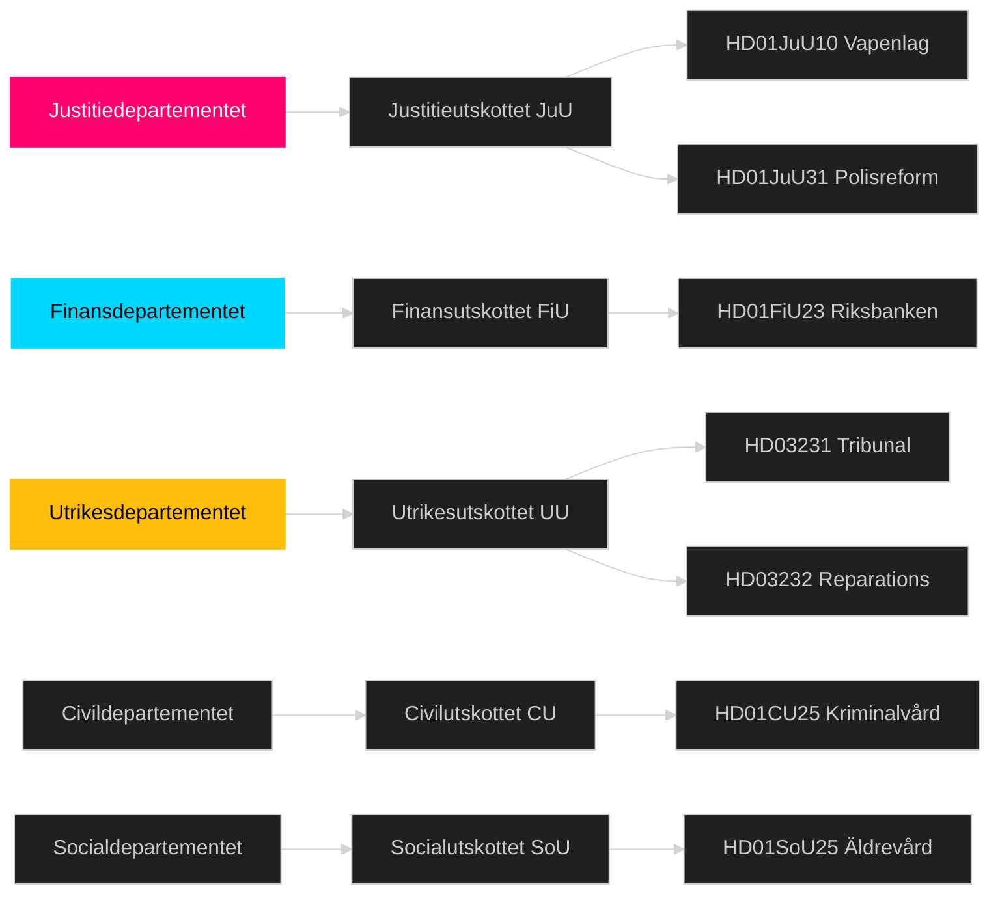

# Cross-Reference Map — Week Ahead 2026-04-27 to 2026-05-03

**Author**: James Pether Sörling | **Date**: 2026-04-26

## Policy Clusters

### Cluster A: Justice Reform and Security
- HD01JuU10 (ny vapenlag) → HD01JuU31 (polisreform) → HD01CU25 (kriminalvård) → HD03237 (betald polisutbildning) → HD03246 (skärpta regler unga lagöverträdare) → HD03252 (socialförsäkring fängelsestraff)
- **Legislative chain**: Weapons → Police effectiveness → Prison capacity → Police training → Juvenile justice → Prison benefits
- **Edge type**: coordinated-filing (Justitiedepartementet + CU + JuU)
- Source: riksdagen.se HD01JuU10, HD01JuU31, HD01CU25

### Cluster B: Ukraine War Accountability
- HD03231 (tribunal aggression) ↔ HD03232 (reparations commission)
- **Legislative chain**: Routed via Utrikesdepartementet; parallel propositions
- **Edge type**: bundle (same ministerial origin, same committee pathway)
- Source: riksdagen.se HD03231, HD03232

### Cluster C: Economic Regulation
- HD03253 (EU bankpaket) → HD01FiU23 (Riksbankens verksamhet 2025) → HD03104 (statens upplåning)
- **Edge type**: thematic (finanspolitik/banksektor)
- Source: riksdagen.se HD03253, HD01FiU23

### Cluster D: Social Welfare and Labour Market
- HD01SoU25 (äldrevård) → HD10447 interpellation sjuklön → HD10444 arbetsgivaravgifter → HD10443 social dumpning → HD03252 socialförsäkring fängelse
- **Edge type**: thematic (välfärd/arbetsmarknad)
- Source: HD01SoU25, HD10447, HD10443 riksdagen.se

## Legislative Chains

```
2025/26 Session Justice Reform:
HD03246 (unga lagöverträdare, Apr 2026)
→ HD01JuU10 (vapenlag, Apr 2026)
→ HD01CU25 (fängelsekapacitet, Apr 2026)
→ HD03252 (socialförsäkring fängelse, Apr 2026)
→ HD03237 (betald polisutbildning, Apr 2026)
[All: amends/continues criminal justice framework]
```

## Coordinated Activity Patterns

**S Interpellation Wave (2026-04-22 to 2026-04-24)**:
- HD10447 (S/Lundqvist → Busch/KD): sjuklönekostnader
- HD10444 (S/Svensson → Svantesson/M): arbetsgivaravgifter
- HD10445 (S/Kallifatides → Carlson/KD): förköpsrätt fastigheter
- HD10443 (S/Björk → Slottner/KD): social dumpning
- HD10446 (S/Eriksson → Svantesson/M): dödförklaringar
**Pattern**: coordinated-filing — five separate interpellations in 72 hours targeting four different ministers. Source: HD10447–HD10446 riksdagen.se [A2]

## Sibling Folder Citations

### analysis/daily/2026-04-26/month-ahead/
Month-ahead analysis for April 2026 contains coalition stability assessment and forward calendar. Referenced for: Tier-C cross-type synthesis of medium-term legislative outlook.

### analysis/daily/2026-04-26/weekly-review/
Weekly review for week ending 2026-04-26 contains analysis of completed legislation. Referenced for: historical baseline on Justice Ministry output pace.

## Committee Routing


