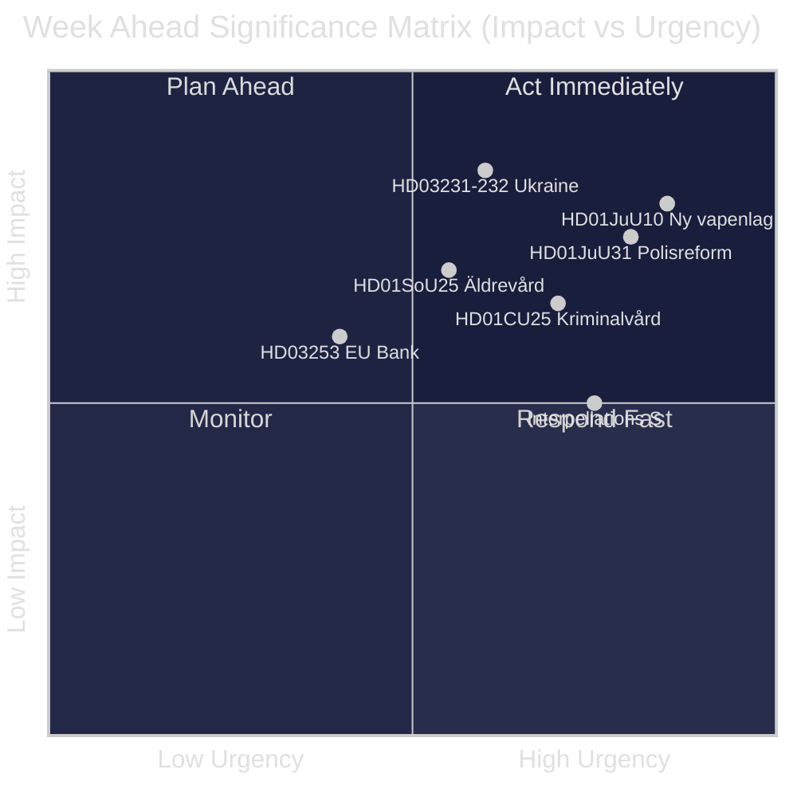
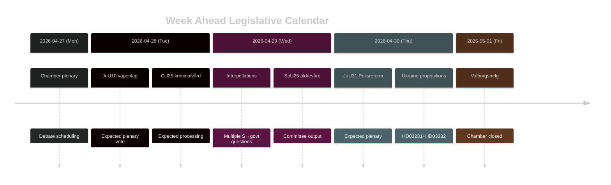

# Sweden Week Ahead: Justice Reform Wave, Ukraine Solidarity, and Social Welfare Adjustments

**Author**: James Pether Sörling | **Date**: 2026-04-26 | **Period**: 2026-04-27 to 2026-05-03

---

## 🎯 BLUF

The Swedish Riksdag enters the final sprint of riksmöte 2025/26 with a dense legislative agenda dominated by the Tidö coalition's justice reform programme. The week of 27 April–3 May 2026 features the pending adoption of a new weapons law (HD01JuU10, effective 1 June 2026), the parliamentary processing of Riksrevisionen's critical assessment of Polisreformen 2015 (HD01JuU31), and Sweden's formal accession to two Ukraine war accountability instruments (HD03231, HD03232). At the same time, the Social Democrats mount a sustained parliamentary pressure campaign through multiple interpellations targeting social welfare cuts and labour market policy — testing the government's pre-election narrative cohesion ahead of the September 2026 election. **Confidence: HIGH [B2]**

## 🧭 3 Decisions This Brief Supports

1. **Media/analyst planning**: Prioritise the new weapons law debate (HD01JuU10) and polisreform report (HD01JuU31) as the week's highest-impact legislative moments — both combine political salience with concrete policy change.
2. **Opposition tracking**: Monitor Social Democratic interpellation strategy (HD10447, HD10444, HD10443, HD10446) as a leading indicator of the S party's pre-election attack vectors on the government.
3. **Geopolitical monitoring**: Sweden's accession to the Ukraine tribunal (HD03231) and reparations commission (HD03232) signals deepening war accountability commitments — track ministerial statements from Maria Malmer Stenergard (UD).

## ⚡ 60-Second Intelligence Bullets

- 🔫 **New weapons law** (HD01JuU10): JuU proposes yes to government bill banning new permits for certain semi-automatic hunting rifles. Effective 1 June 2026. Hunters' associations opposed; SD and M voting in favour.
- 👮 **Polisreform 2015 review** (HD01JuU31): JuU processes Riksrevisionen's finding that Polismyndigheten has **not worked sufficiently effectively** to meet reform intentions. JuU proposes archiving the report but no new government mandate — a politically convenient resolution for the Tidö parties.
- 🏗️ **Prison capacity** (HD01CU25): CU says yes to temporary building permits for prisons and häkten to address the structural shortage driven by sentencing reforms. Effective 1 July 2026.
- 🇺🇦 **Ukraine accountability** (HD03231 + HD03232): Two propositions on Sweden's accession to the Special Tribunal for Aggression and the International Reparations Commission — solidifying Sweden's post-NATO transatlantic positioning.
- 👴 **Elderly care** (HD01SoU25): Committee report on strengthened measures for the elderly and informal carers — politically sensitive ahead of 2026 election.
- 🏦 **EU Bank Package** (HD03253): Proposition implementing EU capital adequacy requirements — technical but material for Swedish banking stability.
- ⚡ **Interpellation pressure**: S party fires five interpellations in one week (HD10447, HD10444–HD10446, HD10443) targeting employment costs, housing rights, social welfare, and health care.

## 🔭 Top Forward Trigger

**Weapons law vote timing** — the JuU10 committee report proposes the new vapenlag effective 1 June 2026. If opposition (C, MP, V) attempts delay motions in plenary, this becomes the flashpoint of the week. Track chamber agenda (kammarens föredragningslista) for vote scheduling.

## 📊 Significance Ranking (DIW)

| Rank | Document | DIW Score | Horizon |
|------|----------|-----------|---------|
| 1 | HD01JuU10 — Ny vapenlag | L2+ | Week |
| 2 | HD01JuU31 — Polisreformen 2015 | L2+ | Week |
| 3 | HD03231+HD03232 — Ukraine accountability | L2 | 30 days |
| 4 | HD01CU25 — Kriminalvård fastigheter | L2 | Month |
| 5 | HD01SoU25 — Äldrevård | L2 | Election |

