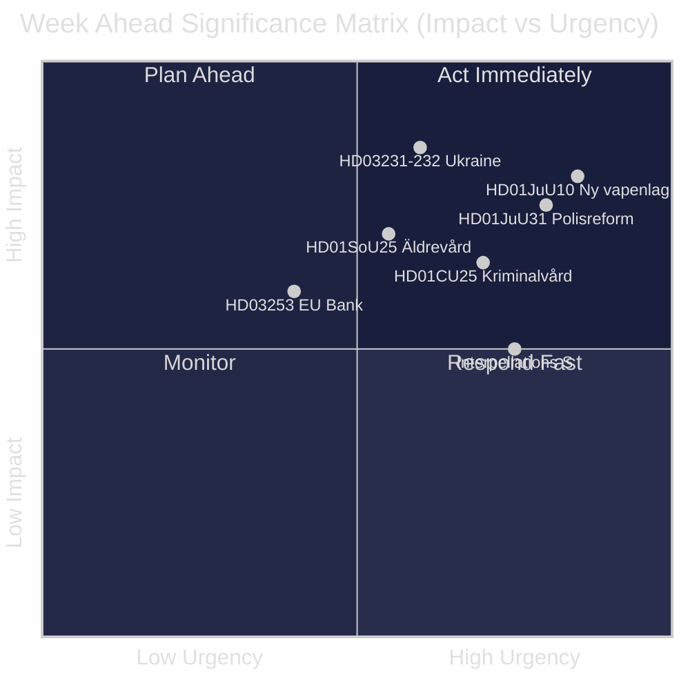
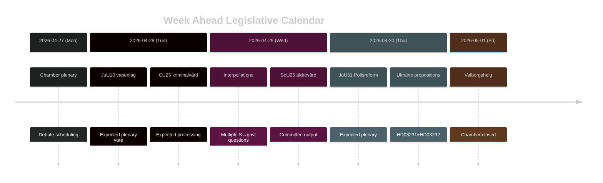

<!-- dir: rtl -->
---
title: "السويد الأسبوع القادم: موجة إصلاح العدالة والتضامن مع أوكرانيا وتعديلات الرعاية الاجتماعية — 2026-04-27 إلى 2026-05-03"
author: James Pether Sörling
date: 2026-04-26
classification: PUBLIC
confidence: HIGH [B2]
---

# السويد الأسبوع القادم: موجة إصلاح العدالة والتضامن مع أوكرانيا وتعديلات الرعاية الاجتماعية

**المؤلف**: James Pether Sörling | **التاريخ**: 2026-04-26 | **الفترة**: 2026-04-27 إلى 2026-05-03

---

## 🎯 BLUF

يدخل الريكسداغ المرحلة الأخيرة من الدورة البرلمانية riksmöte 2025/26 بجدول أعمال تشريعي مكثف يهيمن عليه برنامج إصلاح العدالة لتحالف تيدو. يتسم الأسبوع الممتد من 27 أبريل حتى 3 مايو 2026 باعتماد قانون أسلحة جديد (HD01JuU10، يسري اعتباراً من 1 يونيو 2026)، ومعالجة التقييم النقدي لهيئة المراجعة Riksrevisionen لإصلاح الشرطة 2015 (HD01JuU31)، وانضمام السويد الرسمي إلى أداتَين لتحديد المسؤولية عن الحرب الأوكرانية (HD03231، HD03232). في الوقت ذاته، يشنّ الاشتراكيون الديمقراطيون حملة ضغط برلمانية مستدامة عبر استجوابات متعددة تستهدف تقليصات الرعاية الاجتماعية وسياسات سوق العمل — اختباراً لتماسك الرواية الحكومية قبيل انتخابات سبتمبر 2026. **درجة الثقة: HIGH [B2]**

## 🧭 3 قرارات يدعمها هذا التقرير

1. **التخطيط الإعلامي والتحليلي**: منح الأولوية لنقاش قانون الأسلحة الجديد (HD01JuU10) وتقرير إصلاح الشرطة (HD01JuU31) باعتبارهما أبرز الأحداث التشريعية في الأسبوع — كلاهما يجمع الأهمية السياسية بتغيير ملموس في السياسة العامة.
2. **رصد المعارضة**: مراقبة استراتيجية الاستجواب لدى الاشتراكيين الديمقراطيين (HD10447، HD10444، HD10443، HD10446) كمؤشر مبكر على محاور الهجوم الانتخابي لحزب S ضد الحكومة.
3. **المراقبة الجيوسياسية**: يُشير انضمام السويد إلى المحكمة الأوكرانية (HD03231) ولجنة التعويضات (HD03232) إلى تعميق التزامات المساءلة في زمن الحرب — متابعة التصريحات الوزارية لـ Maria Malmer Stenergard (UD).

## ⚡ استخبارات في 60 ثانية

- 🔫 **قانون الأسلحة الجديد** (HD01JuU10): توصي JuU بالموافقة على مشروع القانون الحكومي الذي يحظر تصاريح جديدة لبعض بنادق الصيد شبه الأوتوماتيكية. يسري اعتباراً من 1 يونيو 2026. جمعيات الصيادين معترضة؛ SD وM يصوتان لصالح القانون.
- 👮 **مراجعة إصلاح الشرطة 2015** (HD01JuU31): تعالج JuU استنتاج Riksrevisionen بأن Polismyndigheten **لم تعمل بكفاءة كافية** لتحقيق أهداف الإصلاح. تقترح JuU حفظ التقرير دون منح الحكومة ولاية جديدة — حلٌّ مريح سياسياً لأحزاب تيدو.
- 🏗️ **طاقة السجون** (HD01CU25): توافق CU على تراخيص بناء مؤقتة للسجون وأماكن الاحتجاز السابق للمحاكمة لمعالجة النقص الهيكلي الناجم عن إصلاحات العقوبات. يسري اعتباراً من 1 يوليو 2026.
- 🇺🇦 **مساءلة أوكرانيا** (HD03231 + HD03232): اقتراحان بشأن انضمام السويد إلى المحكمة الخاصة للعدوان ولجنة التعويضات الدولية — تعزيز التموضع الأطلسي لما بعد الناتو.
- 👴 **رعاية المسنين** (HD01SoU25): تقرير لجنة حول تعزيز التدابير للمسنين ومقدمي الرعاية غير الرسميين — حساس سياسياً قبيل انتخابات 2026.
- 🏦 **حزمة الاتحاد الأوروبي البنكية** (HD03253): اقتراح لتطبيق متطلبات كفاية رأس المال في الاتحاد الأوروبي — تقني لكنه ذو أثر على الاستقرار المصرفي السويدي.
- ⚡ **ضغط الاستجوابات**: يقدم حزب S خمسة استجوابات في أسبوع واحد (HD10447، HD10444–HD10446، HD10443) تتعلق بتكاليف التوظيف وحقوق السكن والرعاية الاجتماعية والرعاية الصحية.

## 🔭 المحفز الأهم للمستقبل

**توقيت التصويت على قانون الأسلحة** — يقترح تقرير لجنة JuU10 نفاذ قانون الأسلحة الجديد vapenlag في 1 يونيو 2026. إذا حاولت المعارضة (C، MP، V) تقديم مقترحات تأجيل في الجلسة العامة، يصبح هذا بؤرة توتر الأسبوع. متابعة جدول أعمال المجلس لتحديد مواعيد التصويت.

## 📊 تصنيف الأهمية (DIW)

| الترتيب | الوثيقة | درجة DIW | الأفق الزمني |
|------|----------|-----------|---------|
| 1 | HD01JuU10 — Ny vapenlag | L2+ | أسبوع |
| 2 | HD01JuU31 — Polisreformen 2015 | L2+ | أسبوع |
| 3 | HD03231+HD03232 — Ukrainaansvar | L2 | 30 يوماً |
| 4 | HD01CU25 — Kriminalvård fastigheter | L2 | شهر |
| 5 | HD01SoU25 — Äldrevård | L2 | انتخابات |

<!-- source-sha: e799f2cf3c9c7f3ec4f6e9c9b91e6ad40f91af79 -->
