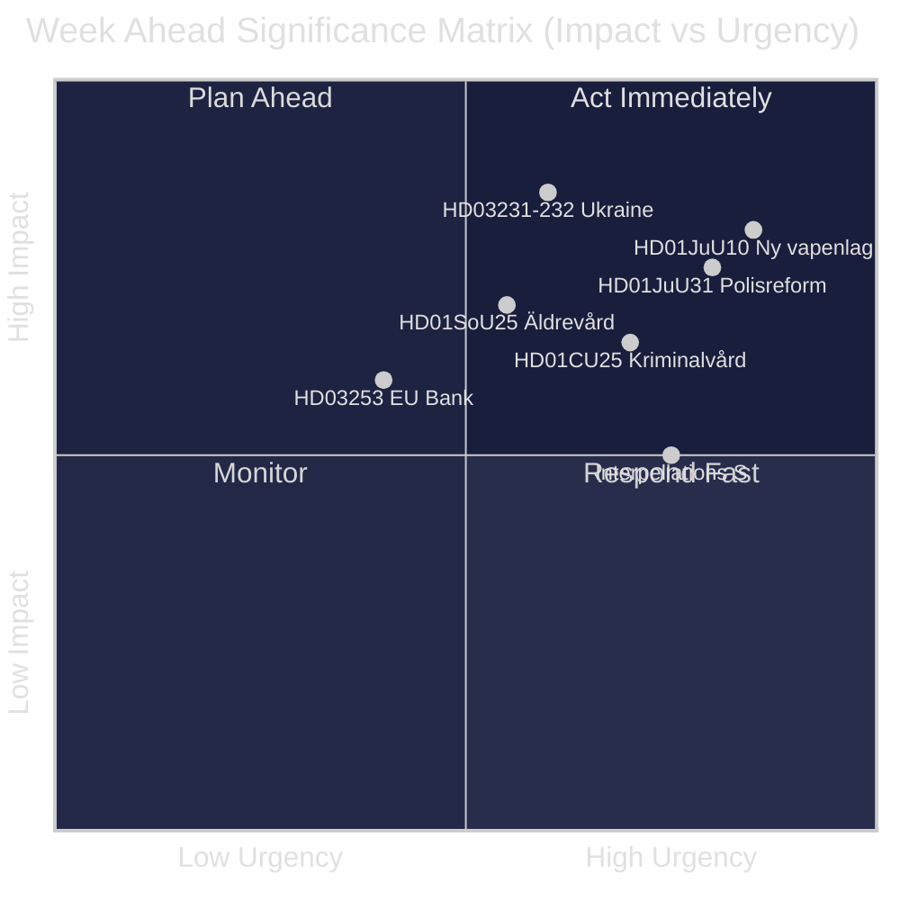
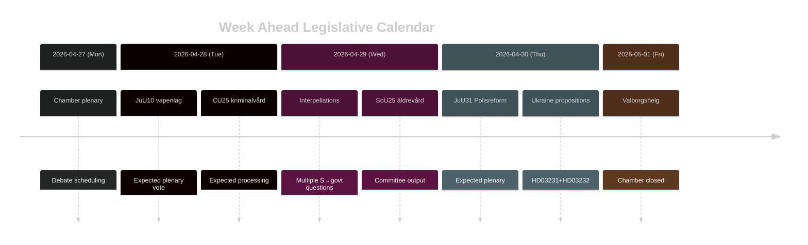

# Sverige Ugen Frem: Retfærdighedsreformbølge, Ukraine-solidaritet og Sociale Velfærdsjusteringer

**Forfatter**: James Pether Sörling | **Dato**: 2026-04-26 | **Periode**: 2026-04-27 til 2026-05-03

---

## 🎯 BLUF

Riksdagen går ind i slutspurten af riksmöte 2025/26 med en tæt lovgivningsdagsorden domineret af Tidö-koalitionens retfærdighedsreformprogram. Ugen 27. april–3. maj 2026 er præget af den forestående vedtagelse af en ny våbenlov (HD01JuU10, ikrafttrædelse 1. juni 2026), parlamentsbehandlingen af Riksrevisionens kritiske vurdering af Politireformen 2015 (HD01JuU31) og Sveriges formelle tiltrædelse af to Ukraine-krigsansvarsordninger (HD03231, HD03232). Samtidig fører Socialdemokraterne en vedvarende parlamentarisk pressekampagne via flere forespørgsler rettet mod sociale velfærdsnedskæringer og arbejdsmarkedspolitik — en test af regeringens narrativkohæsion forud for valget i september 2026. **Konfidens: HIGH [B2]**

## 🧭 3 Beslutninger Dette Underlag Understøtter

1. **Medie-/analytisk planlægning**: Prioritér debatten om den nye våbenlov (HD01JuU10) og politireformrapporten (HD01JuU31) som ugens vigtigste lovgivningsmomenter — begge kombinerer politisk relevans med konkret politikændring.
2. **Oppositionsovervågning**: Følg Socialdemokraternes forespørgselsstrategi (HD10447, HD10444, HD10443, HD10446) som ledende indikator for S-partiets pre-valgangrebsvektorer mod regeringen.
3. **Geopolitisk overvågning**: Sveriges tiltrædelse af Ukraine-tribunalen (HD03231) og erstatningskommissionen (HD03232) signalerer dybere krigsansvarsforpligtelser — følg ministerudtalelser fra Maria Malmer Stenergard (UD).

## ⚡ 60-Sekunders Efterretning

- 🔫 **Ny våbenlov** (HD01JuU10): JuU foreslår ja til regeringsforslaget om forbud mod nye tilladelser til visse halvautomatiske jagtgevær. Ikrafttrædelse 1. juni 2026. Jægerorganisationer imod; SD og M stemmer for.
- 👮 **Politireform 2015-gennemgang** (HD01JuU31): JuU behandler Riksrevisionens konstatering om, at Polismyndigheten **ikke har arbejdet tilstrækkeligt effektivt** for at opfylde reformintentionerne. JuU foreslår at lægge rapporten til side uden nyt regeringsmandat — et politisk bekvemt udfald for Tidö-partierne.
- 🏗️ **Fængselskapacitet** (HD01CU25): CU siger ja til midlertidige byggetilladelser til fængsler og arresthuse for at imødegå den strukturelle mangel drevet af strafskærpelser. Ikrafttrædelse 1. juli 2026.
- 🇺🇦 **Ukraine-ansvar** (HD03231 + HD03232): To forslag om Sveriges tiltrædelse af den Særlige Domstol for aggression og den Internationale Erstatningskommission — befæster Sveriges post-NATO transatlantiske positionering.
- 👴 **Ældrepleje** (HD01SoU25): Udvalgsrapport om styrkede foranstaltninger for ældre og uformelle plejere — politisk følsomt forud for valget i 2026.
- 🏦 **EU-bankpakke** (HD03253): Forslag om gennemførelse af EU's kapitalkrav — teknisk men materielt for dansk bankstabilitet.
- ⚡ **Forespørgselspres**: S-partiet indgiver fem forespørgsler på én uge (HD10447, HD10444–HD10446, HD10443) om ansættelsesomkostninger, boligrettigheder, social velfærd og sundhedspleje.

## 🔭 Vigtigste Fremtidstrigger

**Tidspunkt for afstemning om våbenloven** — JuU10-udvalgsrapporten foreslår den nye vapenlag med ikrafttrædelse 1. juni 2026. Hvis oppositionen (C, MP, V) forsøger forsinkelsesforslag i plenum, bliver dette ugens brændpunkt. Følg kammarets dagsorden for afstemningsplan.

## 📊 Signifikansranking (DIW)

| Rang | Dokument | DIW-score | Horisont |
|------|----------|-----------|---------|
| 1 | HD01JuU10 — Ny vapenlag | L2+ | Uge |
| 2 | HD01JuU31 — Polisreformen 2015 | L2+ | Uge |
| 3 | HD03231+HD03232 — Ukrainaansvar | L2 | 30 dage |
| 4 | HD01CU25 — Kriminalvård fastigheter | L2 | Måned |
| 5 | HD01SoU25 — Äldrevård | L2 | Valg |

<!-- source-sha: e799f2cf3c9c7f3ec4f6e9c9b91e6ad40f91af79 -->
