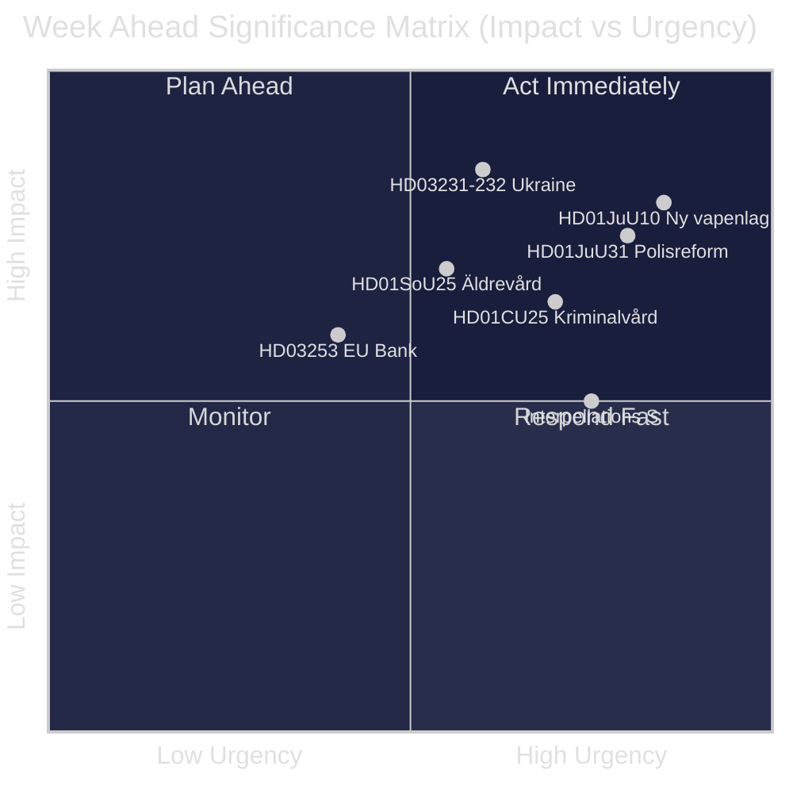
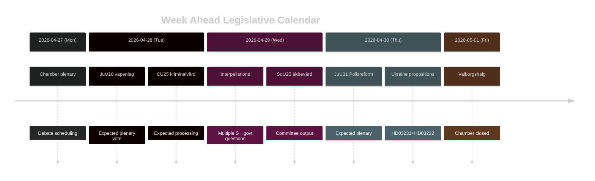

# Schweden Woche Voraus: Justizreformwelle, Ukraine-Solidarität und Soziale Wohlfahrtsanpassungen

**Autor**: James Pether Sörling | **Datum**: 2026-04-26 | **Zeitraum**: 2026-04-27 bis 2026-05-03

---

## 🎯 BLUF

Der Riksdag tritt in die Schlussphase des riksmöte 2025/26 mit einer dichten Gesetzgebungsagenda ein, die vom Justizreformprogramm der Tidö-Koalition dominiert wird. Die Woche vom 27. April bis 3. Mai 2026 ist geprägt von der bevorstehenden Verabschiedung eines neuen Waffengesetzes (HD01JuU10, Inkrafttreten 1. Juni 2026), der parlamentarischen Behandlung der kritischen Bewertung der Polizeireform 2015 durch Riksrevisionen (HD01JuU31) sowie dem formellen Beitritt Schwedens zu zwei ukrainischen Kriegsverantwortungsinstrumenten (HD03231, HD03232). Gleichzeitig führen die Sozialdemokraten eine anhaltende parlamentarische Druckkampagne durch mehrere Interpellationen zu sozialen Wohlfahrtskürzungen und Arbeitsmarktpolitik — ein Test der narrativen Kohäsion der Regierung vor der Parlamentswahl im September 2026. **Konfidenz: HIGH [B2]**

## 🧭 3 Entscheidungen, die dieser Bericht Unterstützt

1. **Medien-/Analyseplanung**: Priorisieren Sie die Debatte über das neue Waffengesetz (HD01JuU10) und den Polizeireformbericht (HD01JuU31) als die wichtigsten Gesetzgebungsmomente der Woche — beide verbinden politische Relevanz mit konkreter Politikänderung.
2. **Oppositionsbeobachtung**: Beobachten Sie die Interpellationsstrategie der Sozialdemokraten (HD10447, HD10444, HD10443, HD10446) als Frühindikator für die Angriffsvektoren der S-Partei gegen die Regierung im Vorfeld der Wahl.
3. **Geopolitische Beobachtung**: Schwedens Beitritt zum Ukraine-Tribunal (HD03231) und der Reparationskommission (HD03232) signalisiert vertiefte Kriegsverantwortungsverpflichtungen — verfolgen Sie Ministeraussagen von Maria Malmer Stenergard (UD).

## ⚡ 60-Sekunden-Nachrichtendienst

- 🔫 **Neues Waffengesetz** (HD01JuU10): JuU empfiehlt Ja zum Regierungsgesetzentwurf, der neue Genehmigungen für bestimmte halbautomatische Jagdgewehre verbietet. Inkrafttreten 1. Juni 2026. Jägerverbände dagegen; SD und M stimmen dafür.
- 👮 **Überprüfung der Polizeireform 2015** (HD01JuU31): JuU behandelt den Befund von Riksrevisionen, dass die Polismyndigheten **nicht ausreichend effektiv gearbeitet** hat, um die Reformziele zu erfüllen. JuU empfiehlt Archivierung des Berichts ohne neues Regierungsmandat — ein politisch bequemes Ergebnis für die Tidö-Parteien.
- 🏗️ **Gefängniskapazität** (HD01CU25): CU stimmt für vorübergehende Baugenehmigungen für Gefängnisse und Untersuchungshaftanstalten zur Behebung des strukturellen Mangels durch Strafverschärfungen. Inkrafttreten 1. Juli 2026.
- 🇺🇦 **Ukraine-Verantwortung** (HD03231 + HD03232): Zwei Vorlagen über Schwedens Beitritt zum Sondergerichtshof für Aggression und zur Internationalen Reparationskommission — festigt Schwedens post-NATO-transatlantische Positionierung.
- 👴 **Altenpflege** (HD01SoU25): Ausschussbericht über verstärkte Maßnahmen für ältere Menschen und informelle Pflegende — politisch sensibel vor der Wahl 2026.
- 🏦 **EU-Bankenpaket** (HD03253): Gesetzentwurf zur Umsetzung der EU-Kapitaladäquanzanforderungen — technisch, aber wesentlich für die Stabilität des schwedischen Bankensektors.
- ⚡ **Interpellationsdruck**: Die S-Partei stellt in einer Woche fünf Interpellationen (HD10447, HD10444–HD10446, HD10443) zu Beschäftigungskosten, Wohnrechten, sozialer Wohlfahrt und Gesundheitsversorgung.

## 🔭 Wichtigster Zukunftsauslöser

**Abstimmungszeitpunkt zum Waffengesetz** — der JuU10-Ausschussbericht schlägt das neue Vapenlag zum 1. Juni 2026 vor. Wenn die Opposition (C, MP, V) Verzögerungsanträge im Plenum stellt, wird dies zum Brennpunkt der Woche. Verfolgen Sie die Tagesordnung des Riksdag für die Abstimmungsplanung.

## 📊 Signifikanzranking (DIW)

| Rang | Dokument | DIW-Wert | Horizont |
|------|----------|-----------|---------|
| 1 | HD01JuU10 — Ny vapenlag | L2+ | Woche |
| 2 | HD01JuU31 — Polisreformen 2015 | L2+ | Woche |
| 3 | HD03231+HD03232 — Ukrainaansvar | L2 | 30 Tage |
| 4 | HD01CU25 — Kriminalvård fastigheter | L2 | Monat |
| 5 | HD01SoU25 — Äldrevård | L2 | Wahl |

<!-- source-sha: e799f2cf3c9c7f3ec4f6e9c9b91e6ad40f91af79 -->
