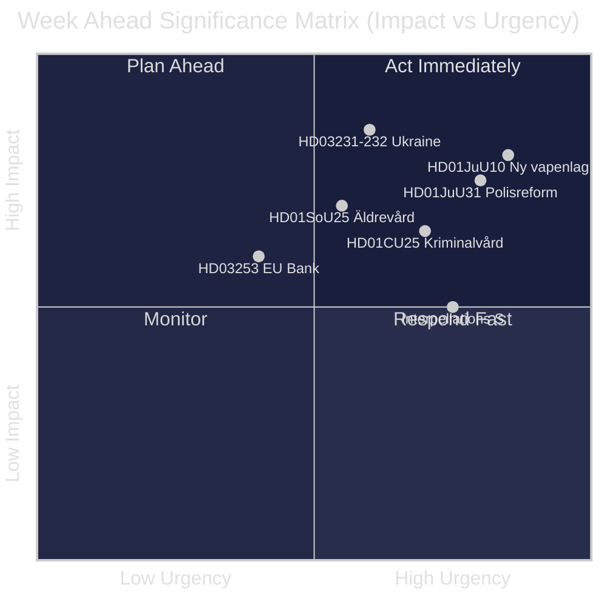
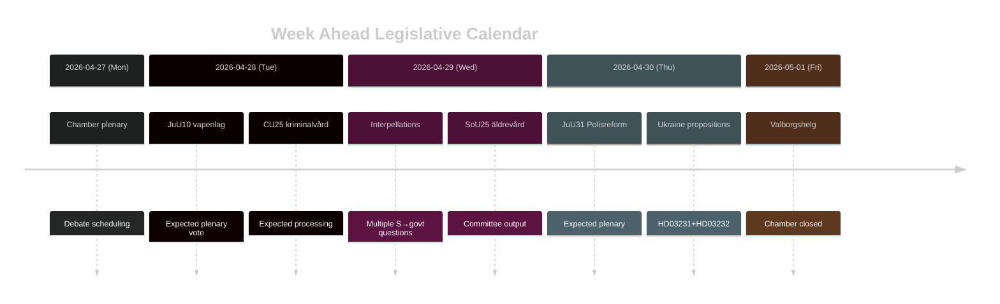

# Suecia Semana por Delante: Oleada de Reforma Judicial, Solidaridad con Ucrania y Ajustes de Bienestar Social

**Autor**: James Pether Sörling | **Fecha**: 2026-04-26 | **Período**: 2026-04-27 al 2026-05-03

---

## 🎯 BLUF

El Riksdag entra en la recta final del riksmöte 2025/26 con una densa agenda legislativa dominada por el programa de reforma judicial de la coalición Tidö. La semana del 27 de abril al 3 de mayo de 2026 está marcada por la inminente adopción de una nueva ley de armas (HD01JuU10, entrada en vigor el 1 de junio de 2026), el trámite parlamentario de la evaluación crítica de la Riksrevisionen sobre la reforma policial de 2015 (HD01JuU31) y la adhesión formal de Suecia a dos instrumentos de responsabilidad por la guerra de Ucrania (HD03231, HD03232). Al mismo tiempo, los Socialdemócratas llevan a cabo una sostenida campaña de presión parlamentaria a través de varias interpelaciones dirigidas a los recortes en las prestaciones sociales y la política del mercado laboral — una prueba de la cohesión narrativa del gobierno antes de las elecciones de septiembre de 2026. **Confianza: HIGH [B2]**

## 🧭 3 Decisiones que este Informe Apoya

1. **Planificación mediática/analítica**: Dar prioridad al debate sobre la nueva ley de armas (HD01JuU10) y el informe sobre la reforma policial (HD01JuU31) como los momentos legislativos más importantes de la semana — ambos combinan relevancia política con cambio de política concreto.
2. **Seguimiento de la oposición**: Vigilar la estrategia de interpelación de los Socialdemócratas (HD10447, HD10444, HD10443, HD10446) como indicador adelantado de los vectores de ataque preelectoral del partido S contra el gobierno.
3. **Vigilancia geopolítica**: La adhesión de Suecia al tribunal de Ucrania (HD03231) y a la comisión de reparaciones (HD03232) señala compromisos más profundos en materia de responsabilidad bélica — seguir las declaraciones ministeriales de Maria Malmer Stenergard (UD).

## ⚡ Inteligencia en 60 Segundos

- 🔫 **Nueva ley de armas** (HD01JuU10): JuU recomienda aprobar el proyecto de ley del gobierno que prohíbe nuevos permisos para ciertos rifles de caza semiautomáticos. Entrada en vigor el 1 de junio de 2026. Asociaciones de cazadores en contra; SD y M votan a favor.
- 👮 **Revisión de la reforma policial 2015** (HD01JuU31): JuU trata la conclusión de la Riksrevisionen de que la Polismyndigheten **no ha trabajado de manera suficientemente eficaz** para cumplir los objetivos de la reforma. JuU propone archivar el informe sin nuevo mandato gubernamental — una resolución políticamente conveniente para los partidos Tidö.
- 🏗️ **Capacidad penitenciaria** (HD01CU25): CU aprueba permisos de construcción temporales para prisiones y centros de detención preventiva para abordar la escasez estructural generada por las reformas penales. Entrada en vigor el 1 de julio de 2026.
- 🇺🇦 **Responsabilidad hacia Ucrania** (HD03231 + HD03232): Dos proposiciones sobre la adhesión de Suecia al Tribunal Especial para la agresión y a la Comisión Internacional de Reparaciones — consolidando el posicionamiento transatlántico post-OTAN de Suecia.
- 👴 **Atención a la tercera edad** (HD01SoU25): Informe de comisión sobre medidas reforzadas para personas mayores y cuidadores informales — políticamente sensible antes de las elecciones de 2026.
- 🏦 **Paquete bancario de la UE** (HD03253): Proposición que implementa los requisitos de adecuación de capital de la UE — técnico pero relevante para la estabilidad bancaria sueca.
- ⚡ **Presión de interpelaciones**: El partido S presenta cinco interpelaciones en una semana (HD10447, HD10444–HD10446, HD10443) sobre costes laborales, derechos de vivienda, bienestar social y atención sanitaria.

## 🔭 Principal Catalizador Futuro

**Calendario de votación sobre la ley de armas** — el informe del comité JuU10 propone la nueva vapenlag en vigor el 1 de junio de 2026. Si la oposición (C, MP, V) intenta mociones de retraso en el pleno, este será el punto de ignición de la semana. Consultar el orden del día de la cámara para la programación de votaciones.

## 📊 Clasificación por Relevancia (DIW)

| Rango | Documento | Puntuación DIW | Horizonte |
|------|----------|-----------|---------|
| 1 | HD01JuU10 — Ny vapenlag | L2+ | Semana |
| 2 | HD01JuU31 — Polisreformen 2015 | L2+ | Semana |
| 3 | HD03231+HD03232 — Ukrainaansvar | L2 | 30 días |
| 4 | HD01CU25 — Kriminalvård fastigheter | L2 | Mes |
| 5 | HD01SoU25 — Äldrevård | L2 | Elección |

<!-- source-sha: e799f2cf3c9c7f3ec4f6e9c9b91e6ad40f91af79 -->
