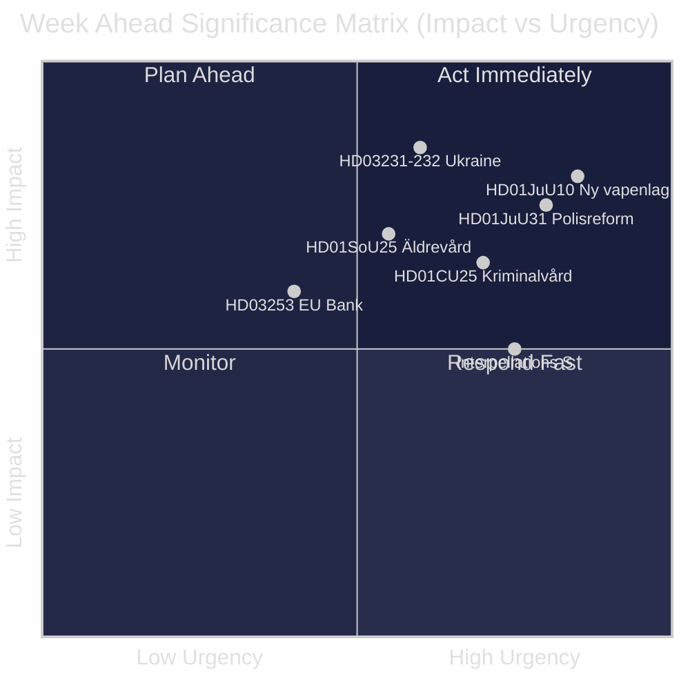
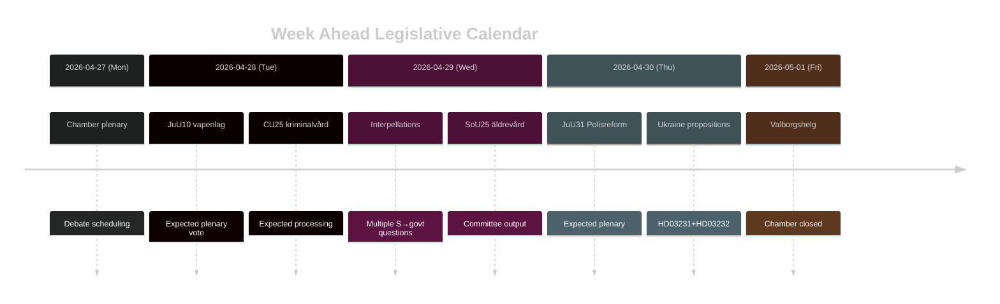

# Ruotsi Viikko Eteenpäin: Oikeusreformiaalto, Ukraina-solidaarisuus ja Sosiaaliturvan Mukautukset

**Tekijä**: James Pether Sörling | **Päivämäärä**: 2026-04-26 | **Kausi**: 2026-04-27–2026-05-03

---

## 🎯 BLUF

Riksdagen siirtyy riksmöte 2025/26:n loppusuoralle tiiviillä lainsäädäntöohjelmalla, jota hallitsee Tidö-koalition oikeusreformiohjelma. Viikko 27. huhtikuuta–3. toukokuuta 2026 on leimattu uuden aselain (HD01JuU10, voimaan 1.6.2026) odottavasta hyväksymisestä, Riksrevisionin kriittisen arvion parlamenttikäsittelystä Poliisin uudistuksesta 2015 (HD01JuU31) sekä Ruotsin virallisesta liittymisestä kahteen Ukrainan sotavastuuseen liittyvään instrumenttiin (HD03231, HD03232). Samaan aikaan Sosiaalidemokraatit harjoittavat jatkuvaa parlamentaarista painostuskampanjaa useiden interpellaatioiden kautta, jotka kohdistuvat sosiaalietuuksien leikkauksiin ja työmarkkinapolitiikkaan — testi hallituksen narratiivikohesiosta syyskuun 2026 vaalien alla. **Luottamus: HIGH [B2]**

## 🧭 3 Päätöstä, Joita Tämä Tiedustelutieto Tukee

1. **Media-/analyyttinen suunnittelu**: Aseta etusijalle uuden aselain (HD01JuU10) ja poliisireformiraportin (HD01JuU31) debatit viikon tärkeimpinä lainsäädäntöhetkinä — molemmat yhdistävät poliittisen merkittävyyden konkreettiseen politiikkamuutokseen.
2. **Oppositioseuranta**: Seuraa Sosiaalidemokraattien interpellaatiostrategiaa (HD10447, HD10444, HD10443, HD10446) johtavana indikaattorina S-puolueen ennakkovaalikampanjasta hallitusta vastaan.
3. **Geopoliittinen seuranta**: Ruotsin liittyminen Ukraina-tuomioistuimeen (HD03231) ja hyvityskomissioon (HD03232) merkitsee syvenevää sotavastuusitoutumista — seuraa ministereiden lausuntoja Maria Malmer Stenergardilta (UD).

## ⚡ 60 Sekunnin Tiedustelukatsaus

- 🔫 **Uusi aselaki** (HD01JuU10): JuU ehdottaa kyllä hallituksen lakiesitykselle, joka kieltää uudet luvat tietyille puoliautomaattisille metsästysaseille. Voimaan 1.6.2026. Metsästäjäjärjestöt vastaan; SD ja M äänestävät puolesta.
- 👮 **Poliisireformi 2015 -arviointi** (HD01JuU31): JuU käsittelee Riksrevisionin löydöksen, jonka mukaan Polismyndigheten **ei ole työskennellyt riittävän tehokkaasti** uudistustavoitteiden saavuttamiseksi. JuU ehdottaa raportin arkistoimista ilman uutta hallitusmandaattia — poliittisesti mukava ratkaisu Tidö-puolueille.
- 🏗️ **Vankilakapasiteetti** (HD01CU25): CU sanoo kyllä väliaikaisille rakennusluvalle vankiloille ja tutkintovankiloille rakenteellisen puutteen korjaamiseksi, jonka synnyttivät rangaistuksen tiukennukset. Voimaan 1.7.2026.
- 🇺🇦 **Ukraina-vastuu** (HD03231 + HD03232): Kaksi ehdotusta Ruotsin liittymisestä Aggression erityistuomioistuimeen ja Kansainväliseen hyvityskomissioon — vahvistaa Ruotsin post-NATO transatlanttista asemoitumista.
- 👴 **Vanhustenhoito** (HD01SoU25): Valiokuntaraportti vahvistetuista toimenpiteistä iäkkäille ja omaishoitajille — poliittisesti herkkä ennen vuoden 2026 vaaleja.
- 🏦 **EU-pankkipaketti** (HD03253): Ehdotus EU:n vakavaraisuusvaatimusten täytäntöönpanosta — tekninen mutta olennainen Ruotsin pankkivakauden kannalta.
- ⚡ **Interpellaatiopaine**: S-puolue jättää viisi interpellaatiota yhden viikon aikana (HD10447, HD10444–HD10446, HD10443) koskien työnantajakustannuksia, asumistukea, sosiaalietuuksia ja terveydenhuoltoa.

## 🔭 Tärkein Tulevaisuuslaukaisin

**Aselajiäänestyksen ajoitus** — JuU10-valiokuntaraportti ehdottaa uutta aselakia voimaan 1.6.2026. Jos oppositio (C, MP, V) yrittää viivästyttää täysistunnossa, tästä tulee viikon räjähdyspiste. Seuraa kammarens föredragningslista -asialistan äänestysaikataulua.

## 📊 Merkittävyysluokitus (DIW)

| Sija | Asiakirja | DIW-pisteet | Horisontti |
|------|----------|-----------|---------|
| 1 | HD01JuU10 — Ny vapenlag | L2+ | Viikko |
| 2 | HD01JuU31 — Polisreformen 2015 | L2+ | Viikko |
| 3 | HD03231+HD03232 — Ukrainaansvar | L2 | 30 päivää |
| 4 | HD01CU25 — Kriminalvård fastigheter | L2 | Kuukausi |
| 5 | HD01SoU25 — Äldrevård | L2 | Vaali |

<!-- source-sha: e799f2cf3c9c7f3ec4f6e9c9b91e6ad40f91af79 -->
