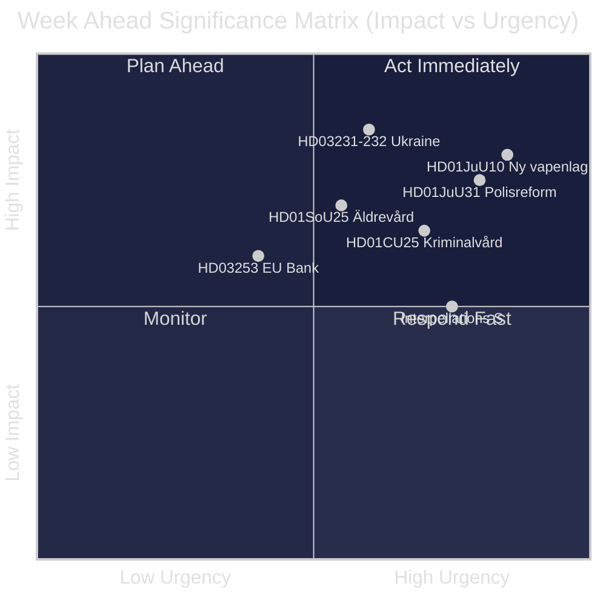
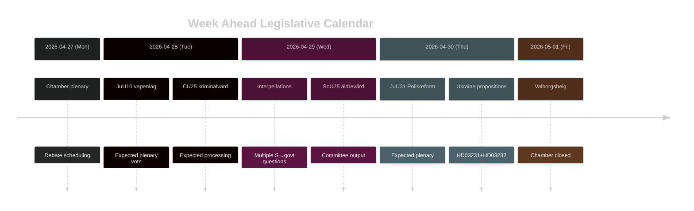

# Suède Semaine à Venir : Vague de Réforme Judiciaire, Solidarité avec l'Ukraine et Ajustements du Bien-être Social

**Auteur** : James Pether Sörling | **Date** : 2026-04-26 | **Période** : 2026-04-27 au 2026-05-03

---

## 🎯 BLUF

Le Riksdag entre dans la dernière ligne droite du riksmöte 2025/26 avec un agenda législatif dense dominé par le programme de réforme judiciaire de la coalition Tidö. La semaine du 27 avril au 3 mai 2026 est marquée par l'adoption prochaine d'une nouvelle loi sur les armes (HD01JuU10, entrée en vigueur le 1er juin 2026), le traitement parlementaire de l'évaluation critique de la Riksrevisionen sur la réforme de la police de 2015 (HD01JuU31) et l'adhésion formelle de la Suède à deux instruments de responsabilité pour la guerre en Ukraine (HD03231, HD03232). Parallèlement, les Sociaux-démocrates mènent une campagne de pression parlementaire soutenue par plusieurs interpellations ciblant les réductions des prestations sociales et la politique du marché du travail — un test de la cohérence narrative du gouvernement avant les élections de septembre 2026. **Confiance : HIGH [B2]**

## 🧭 3 Décisions que ce Rapport Soutient

1. **Planification médiatique/analytique** : Prioriser le débat sur la nouvelle loi sur les armes (HD01JuU10) et le rapport sur la réforme de la police (HD01JuU31) comme les moments législatifs les plus importants de la semaine — les deux combinent pertinence politique et changement de politique concret.
2. **Suivi de l'opposition** : Surveiller la stratégie d'interpellation des Sociaux-démocrates (HD10447, HD10444, HD10443, HD10446) comme indicateur avancé des vecteurs d'attaque pré-électoraux du parti S contre le gouvernement.
3. **Surveillance géopolitique** : L'adhésion de la Suède au tribunal ukrainien (HD03231) et à la commission des réparations (HD03232) signale un engagement renforcé en matière de responsabilité de guerre — suivre les déclarations ministérielles de Maria Malmer Stenergard (UD).

## ⚡ Renseignement en 60 Secondes

- 🔫 **Nouvelle loi sur les armes** (HD01JuU10) : JuU recommande d'approuver le projet de loi gouvernemental interdisant les nouveaux permis pour certains fusils de chasse semi-automatiques. Entrée en vigueur le 1er juin 2026. Associations de chasseurs opposées ; SD et M votent pour.
- 👮 **Révision de la réforme de la police 2015** (HD01JuU31) : JuU traite le constat de Riksrevisionen selon lequel la Polismyndigheten **n'a pas travaillé de manière suffisamment efficace** pour répondre aux intentions de la réforme. JuU propose d'archiver le rapport sans nouveau mandat gouvernemental — une résolution politiquement commode pour les partis Tidö.
- 🏗️ **Capacité pénitentiaire** (HD01CU25) : CU approuve les permis de construire temporaires pour les prisons et les maisons d'arrêt afin de remédier à la pénurie structurelle générée par les réformes des peines. Entrée en vigueur le 1er juillet 2026.
- 🇺🇦 **Responsabilité envers l'Ukraine** (HD03231 + HD03232) : Deux propositions sur l'adhésion de la Suède au Tribunal spécial pour agression et à la Commission internationale des réparations — consolidant le positionnement transatlantique post-OTAN de la Suède.
- 👴 **Soins aux personnes âgées** (HD01SoU25) : Rapport de commission sur les mesures renforcées pour les personnes âgées et les aidants informels — politiquement sensible avant les élections de 2026.
- 🏦 **Paquet bancaire de l'UE** (HD03253) : Proposition mettant en œuvre les exigences en matière d'adéquation des fonds propres de l'UE — technique mais important pour la stabilité bancaire suédoise.
- ⚡ **Pression des interpellations** : Le parti S dépose cinq interpellations en une semaine (HD10447, HD10444–HD10446, HD10443) sur les coûts d'emploi, les droits au logement, le bien-être social et les soins de santé.

## 🔭 Principal Déclencheur à Venir

**Calendrier du vote sur la loi sur les armes** — le rapport du comité JuU10 propose la nouvelle vapenlag en vigueur le 1er juin 2026. Si l'opposition (C, MP, V) tente des motions de retard en séance plénière, cela deviendra le point d'éclair de la semaine. Suivre l'ordre du jour de la chambre pour la planification du vote.

## 📊 Classement par Importance (DIW)

| Rang | Document | Score DIW | Horizon |
|------|----------|-----------|---------|
| 1 | HD01JuU10 — Ny vapenlag | L2+ | Semaine |
| 2 | HD01JuU31 — Polisreformen 2015 | L2+ | Semaine |
| 3 | HD03231+HD03232 — Ukrainaansvar | L2 | 30 jours |
| 4 | HD01CU25 — Kriminalvård fastigheter | L2 | Mois |
| 5 | HD01SoU25 — Äldrevård | L2 | Élection |

<!-- source-sha: e799f2cf3c9c7f3ec4f6e9c9b91e6ad40f91af79 -->
