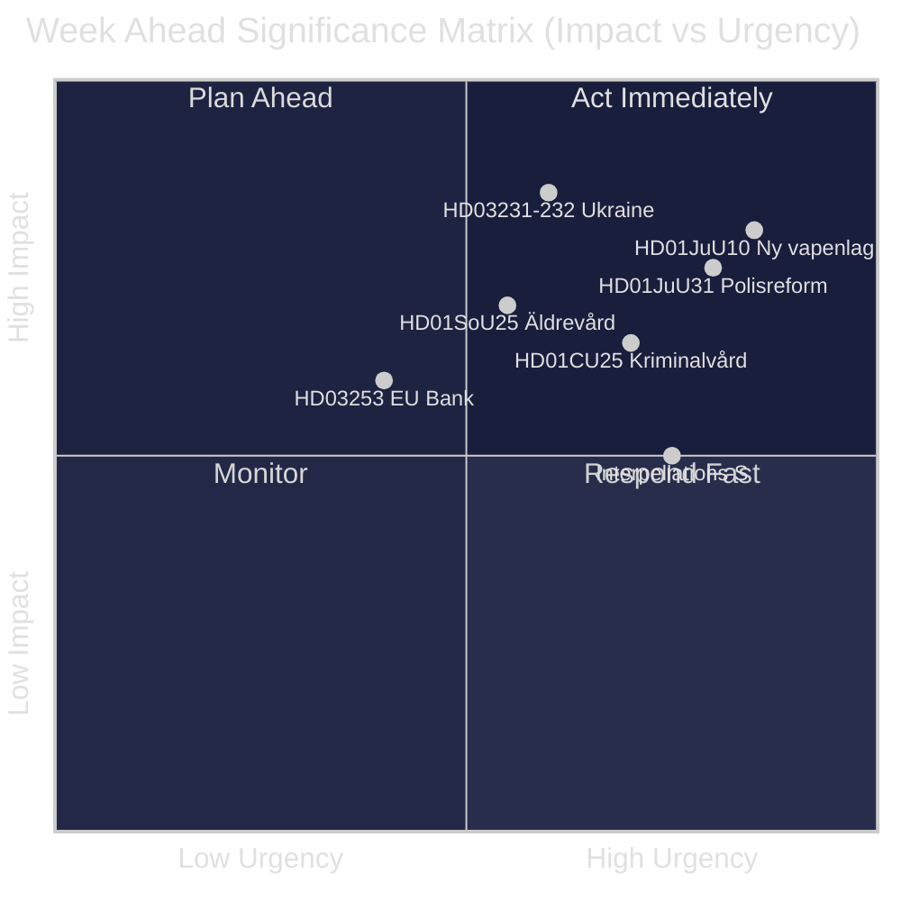
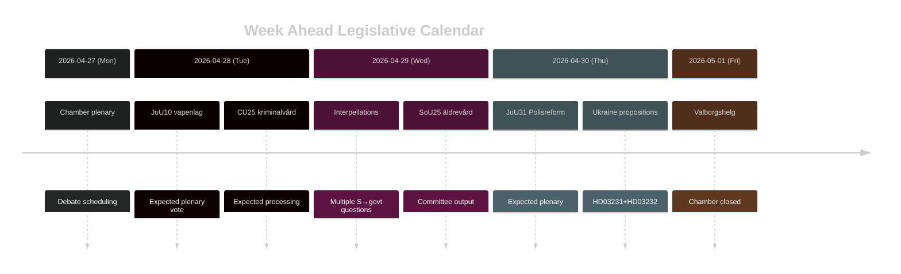

<!-- dir: rtl -->
---
title: "שבדיה — השבוע הקרוב: גל רפורמת המשפט, סולידריות עם אוקראינה והתאמות ברווחה החברתית — 2026-04-27 עד 2026-05-03"
author: James Pether Sörling
date: 2026-04-26
classification: PUBLIC
confidence: HIGH [B2]
---

# שבדיה — השבוע הקרוב: גל רפורמת המשפט, סולידריות עם אוקראינה והתאמות ברווחה החברתית

**מחבר**: James Pether Sörling | **תאריך**: 2026-04-26 | **תקופה**: 2026-04-27 עד 2026-05-03

---

## 🎯 BLUF

הריקסדאג נכנס לספרינט הסיומי של riksmöte 2025/26 עם סדר יום חקיקתי צפוף הנשלט על ידי תכנית רפורמת המשפט של קואליציית טידו. השבוע שבין 27 באפריל ל-3 במאי 2026 מתאפיין באימוץ הקרוב של חוק נשק חדש (HD01JuU10, ייכנס לתוקף ב-1 ביוני 2026), בטיפול הפרלמנטרי בהערכה הביקורתית של Riksrevisionen לרפורמת המשטרה 2015 (HD01JuU31), ובהצטרפותה הרשמית של שבדיה לשני כלים לאחריות מלחמת אוקראינה (HD03231, HD03232). במקביל מנהלים הסוציאל-דמוקרטים קמפיין לחץ פרלמנטרי מתמשך דרך שאילתות רבות המכוונות נגד קיצוצי הרווחה ומדיניות שוק העבודה — מבחן לאחידות הנרטיב הממשלתי לקראת בחירות ספטמבר 2026. **רמת ביטחון: HIGH [B2]**

## 🧭 3 החלטות שדוח זה תומך בהן

1. **תכנון תקשורתי/אנליטי**: לתת עדיפות לוויכוח על חוק הנשק החדש (HD01JuU10) ודוח רפורמת המשטרה (HD01JuU31) כרגעי החקיקה החשובים ביותר של השבוע — שניהם משלבים רלוונטיות פוליטית עם שינוי מדיניות קונקרטי.
2. **מעקב אחר האופוזיציה**: לעקוב אחר אסטרטגיית השאילתות של הסוציאל-דמוקרטים (HD10447, HD10444, HD10443, HD10446) כאינדיקטור מוביל לווקטורי ההתקפה הקדם-בחירתיים של מפלגת S נגד הממשלה.
3. **מעקב גיאופוליטי**: הצטרפות שבדיה לבית הדין האוקראיני (HD03231) ולוועדת הפיצויים (HD03232) מסמנת התעמקות בהתחייבויות אחריות המלחמה — לעקוב אחר הצהרות שרים של Maria Malmer Stenergard (UD).

## ⚡ מודיעין של 60 שניות

- 🔫 **חוק נשק חדש** (HD01JuU10): JuU ממליצה בעד הצעת החוק הממשלתית האוסרת רישיונות חדשים לרובי ציד חצי-אוטומטיים מסוימים. ייכנס לתוקף ב-1 ביוני 2026. ארגוני ציידים מתנגדים; SD ו-M מצביעים בעד.
- 👮 **סקירת רפורמת המשטרה 2015** (HD01JuU31): JuU מטפלת בממצא של Riksrevisionen לפיו Polismyndigheten **לא עבדה ביעילות מספקת** כדי לעמוד ביעדי הרפורמה. JuU מציעה לארכב את הדוח ללא מנדט ממשלתי חדש — פתרון נוח פוליטית למפלגות טידו.
- 🏗️ **כושר כלא** (HD01CU25): CU אומרת כן להיתרי בנייה זמניים לכלאות ומעצרים לטיפול במחסור המבני בעקבות חמרת עונשים. ייכנס לתוקף ב-1 ביולי 2026.
- 🇺🇦 **אחריות כלפי אוקראינה** (HD03231 + HD03232): שני הצעות חוק על הצטרפות שבדיה לבית הדין המיוחד לתוקפנות ולוועדת הפיצויים הבינלאומית — מחזקת את מיצוב שבדיה הטרנס-אטלנטי שלאחר נאט"ו.
- 👴 **טיפול בקשישים** (HD01SoU25): דוח ועדה על אמצעים מחוזקים לקשישים ולמטפלים בלתי-פורמליים — רגיש פוליטית לקראת בחירות 2026.
- 🏦 **חבילת הבנקים של האיחוד האירופי** (HD03253): הצעת חוק ליישום דרישות הלימות ההון של האיחוד האירופי — טכנית אך חשובה ליציבות הבנקאות השבדית.
- ⚡ **לחץ שאילתות**: מפלגת S מגישה חמש שאילתות בשבוע אחד (HD10447, HD10444–HD10446, HD10443) בנושא עלויות תעסוקה, זכויות דיור, רווחה חברתית ושירותי בריאות.

## 🔭 המניע החשוב ביותר לעתיד

**עיתוי ההצבעה על חוק הנשק** — דוח ועדת JuU10 מציע לחוק הנשק החדש vapenlag להיכנס לתוקף ב-1 ביוני 2026. אם האופוזיציה (C, MP, V) תנסה להגיש הצעות דחייה במליאה, זה יהפוך לנקודת ההצתה של השבוע. לעקוב אחר סדר היום של הקמרה לתזמון ההצבעה.

## 📊 דירוג חשיבות (DIW)

| דירוג | מסמך | ניקוד DIW | אופק |
|------|----------|-----------|---------|
| 1 | HD01JuU10 — Ny vapenlag | L2+ | שבוע |
| 2 | HD01JuU31 — Polisreformen 2015 | L2+ | שבוע |
| 3 | HD03231+HD03232 — Ukrainaansvar | L2 | 30 ימים |
| 4 | HD01CU25 — Kriminalvård fastigheter | L2 | חודש |
| 5 | HD01SoU25 — Äldrevård | L2 | בחירות |

<!-- source-sha: e799f2cf3c9c7f3ec4f6e9c9b91e6ad40f91af79 -->
