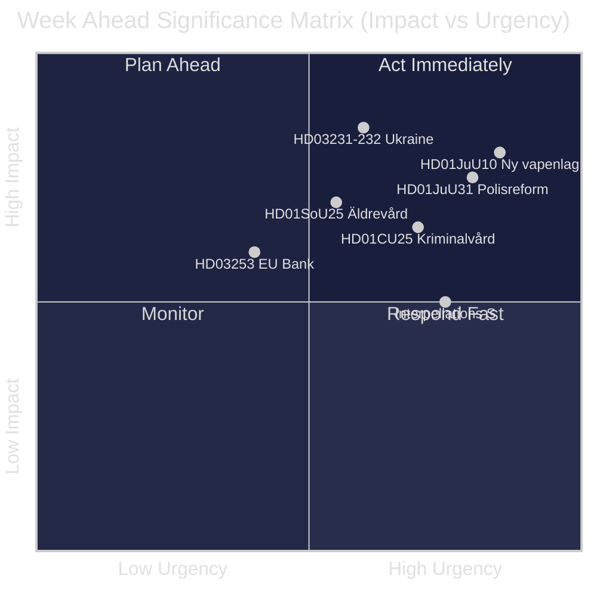
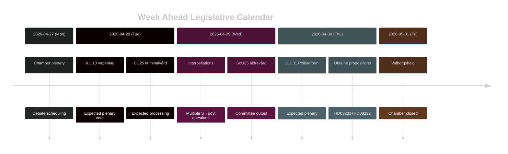

# スウェーデン 週間展望：司法改革の波、ウクライナ連帯、社会福祉の調整

**著者**：James Pether Sörling | **日付**：2026-04-26 | **期間**：2026-04-27〜2026-05-03

---

## 🎯 BLUF

リクスダーグ（Riksdag）はriksmöte 2025/26の最終スパートに入り、ティドー連立政権の司法改革プログラムを中心とした密度の高い立法スケジュールが展開される。2026年4月27日〜5月3日の週は、新武器法（HD01JuU10、2026年6月1日施行）の採択、2015年警察改革に関するRiksrevisionenの批判的評価の国会審議（HD01JuU31）、そしてウクライナ戦争責任に関する2つの国際文書へのスウェーデンの正式加盟（HD03231、HD03232）に彩られる。同時に社会民主党は、社会福祉削減や労働市場政策を標的とした複数の質問主意書を通じて議会圧力キャンペーンを展開し、2026年9月選挙を前に政府の政策一貫性を試している。**信頼度：HIGH [B2]**

## 🧭 このブリーフが支援する3つの意思決定

1. **メディア・分析計画**：新武器法（HD01JuU10）と警察改革報告（HD01JuU31）の審議を、今週最重要の立法イベントとして優先する——いずれも政治的重要性と具体的な政策変更を兼ね備えている。
2. **野党動向追跡**：社会民主党の質問主意書戦略（HD10447、HD10444、HD10443、HD10446）を、選挙前のS党対政府攻撃ベクターの先行指標として注視する。
3. **地政学的監視**：スウェーデンのウクライナ特別法廷（HD03231）および賠償委員会（HD03232）への加盟は、深化する戦争責任コミットメントを示す——Maria Malmer Stenergard（UD）外務大臣の発言を追跡する。

## ⚡ 60秒インテリジェンス

- 🔫 **新武器法**（HD01JuU10）：JuUは特定の半自動猟銃への新規許可を禁止する政府法案への賛成を勧告。2026年6月1日施行。猟師団体は反対；SDとMは賛成票。
- 👮 **2015年警察改革レビュー**（HD01JuU31）：JuUはPolismyndigheten（スウェーデン警察庁）が**改革目標達成に向けて十分に効果的に機能してこなかった**とするRiksrevisionenの指摘を審議。JuUは新たな政府指令なしに報告書の棚上げを提案——ティドー各党にとって政治的に都合の良い解決策。
- 🏗️ **刑務所収容能力**（HD01CU25）：CUは量刑厳格化による構造的不足に対処するため、刑務所・拘置所への臨時建設許可に賛成。2026年7月1日施行。
- 🇺🇦 **ウクライナ責任**（HD03231 + HD03232）：侵略犯罪特別法廷と国際賠償委員会へのスウェーデン加盟に関する2法案——スウェーデンのNATO後の大西洋横断的位置づけを強化。
- 👴 **高齢者ケア**（HD01SoU25）：高齢者および非公式介護者への強化措置に関する委員会報告——2026年選挙前に政治的に敏感な課題。
- 🏦 **EUバンキングパッケージ**（HD03253）：EUの自己資本比率規制を実施する法案——技術的だがスウェーデンの銀行安定に実質的影響。
- ⚡ **質問主意書攻勢**：S党は1週間に5件の質問主意書（HD10447、HD10444–HD10446、HD10443）を提出——雇用コスト、住宅権、社会福祉、医療をテーマに。

## 🔭 最重要トリガー

**武器法採決タイミング**——JuU10委員会報告は新vapenlagの2026年6月1日施行を提案。野党（C、MP、V）が本会議で遅延動議を試みた場合、これが今週の発火点となる。本会議の議事日程で採決スケジュールを確認のこと。

## 📊 重要度ランキング（DIW）

| 順位 | 文書 | DIWスコア | 時間軸 |
|------|----------|-----------|---------|
| 1 | HD01JuU10 — Ny vapenlag | L2+ | 週 |
| 2 | HD01JuU31 — Polisreformen 2015 | L2+ | 週 |
| 3 | HD03231+HD03232 — Ukrainaansvar | L2 | 30日 |
| 4 | HD01CU25 — Kriminalvård fastigheter | L2 | 月 |
| 5 | HD01SoU25 — Äldrevård | L2 | 選挙 |

<!-- source-sha: e799f2cf3c9c7f3ec4f6e9c9b91e6ad40f91af79 -->
