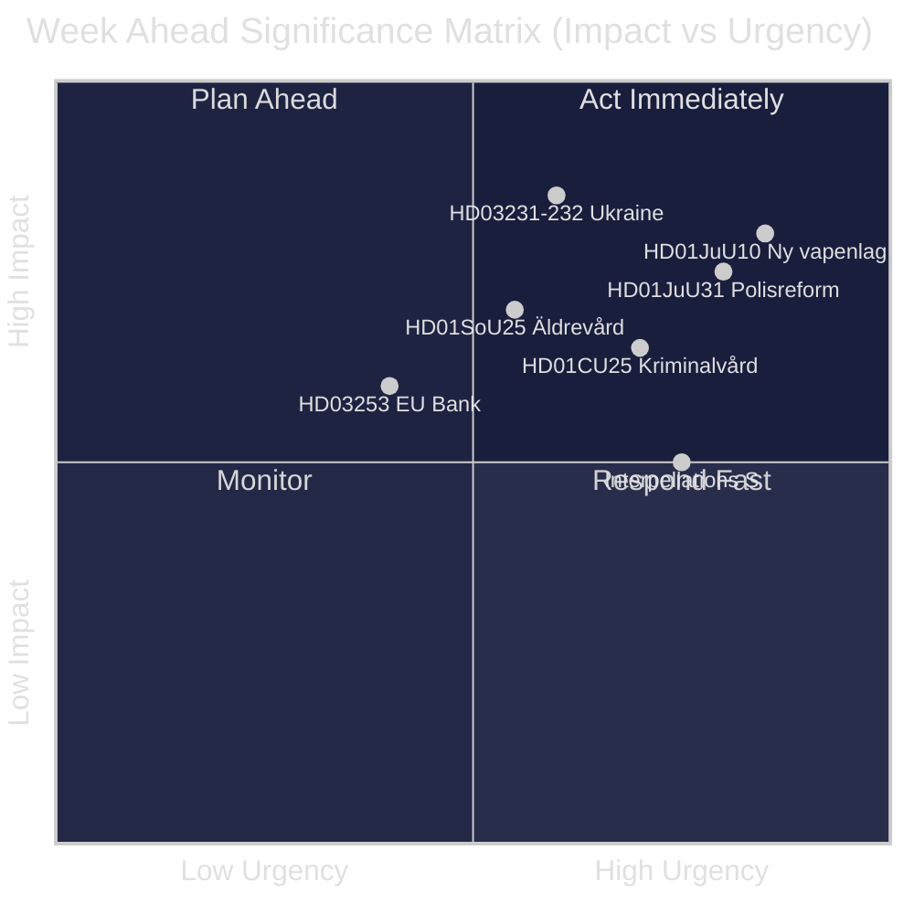
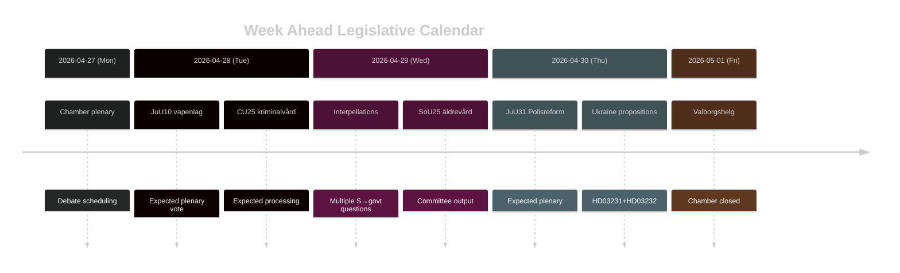

# 스웨덴 주간 전망: 사법 개혁의 물결, 우크라이나 연대, 사회복지 조정

**저자**: James Pether Sörling | **날짜**: 2026-04-26 | **기간**: 2026-04-27~2026-05-03

---

## 🎯 BLUF

리크스다겐(Riksdag)은 riksmöte 2025/26의 마지막 스퍼트에 접어들며, 티도 연립정권의 사법 개혁 프로그램을 중심으로 한 밀도 높은 입법 일정이 펼쳐진다. 2026년 4월 27일~5월 3일 주는 새 총기법(HD01JuU10, 2026년 6월 1일 시행)의 채택, 2015년 경찰 개혁에 대한 Riksrevisionen의 비판적 평가 의회 처리(HD01JuU31), 그리고 우크라이나 전쟁 책임 관련 두 가지 국제 문서에 스웨덴의 공식 가입(HD03231, HD03232)으로 특징지어진다. 동시에 사회민주당은 사회복지 삭감과 노동시장 정책을 겨냥한 복수의 대정부 질문을 통해 지속적인 의회 압박 캠페인을 전개하며 2026년 9월 선거를 앞둔 정부의 정책 일관성을 시험하고 있다. **신뢰도: HIGH [B2]**

## 🧭 이 브리핑이 지원하는 3가지 의사결정

1. **미디어·분석 계획**: 새 총기법(HD01JuU10) 토론과 경찰 개혁 보고서(HD01JuU31)를 이번 주 가장 중요한 입법 이벤트로 우선시한다 — 두 가지 모두 정치적 중요성과 구체적 정책 변화를 결합하고 있다.
2. **야당 동향 추적**: 사회민주당의 대정부 질문 전략(HD10447, HD10444, HD10443, HD10446)을 S당의 선거 전 대정부 공세 벡터의 선행 지표로 주시한다.
3. **지정학적 감시**: 스웨덴의 우크라이나 특별 법원(HD03231)과 배상 위원회(HD03232) 가입은 심화된 전쟁 책임 공약을 나타낸다 — Maria Malmer Stenergard(UD) 외교부 장관의 발언을 추적한다.

## ⚡ 60초 인텔리전스

- 🔫 **새 총기법** (HD01JuU10): JuU는 특정 반자동 사냥총에 대한 신규 허가를 금지하는 정부 법안에 찬성 권고. 2026년 6월 1일 시행. 사냥 단체 반대; SD와 M 찬성.
- 👮 **2015년 경찰 개혁 검토** (HD01JuU31): JuU는 Polismyndigheten이 **개혁 목표 달성에 충분히 효과적으로 기능하지 않았다**는 Riksrevisionen의 지적을 처리. JuU는 신규 정부 지시 없이 보고서 보류를 제안 — 티도 연립 각 당에 정치적으로 편리한 해결책.
- 🏗️ **교도소 수용 능력** (HD01CU25): CU는 양형 강화로 인한 구조적 부족을 해소하기 위한 교도소·구치소 임시 건설 허가에 찬성. 2026년 7월 1일 시행.
- 🇺🇦 **우크라이나 책임** (HD03231 + HD03232): 침략 범죄 특별 법원 및 국제 배상 위원회에 스웨덴 가입에 관한 두 법안 — 나토 이후 스웨덴의 대서양 횡단적 위상 강화.
- 👴 **노인 돌봄** (HD01SoU25): 노인 및 비공식 돌봄 제공자를 위한 강화 조치에 관한 위원회 보고서 — 2026년 선거 전 정치적으로 민감한 사안.
- 🏦 **EU 은행 패키지** (HD03253): EU 자기자본 적정성 요건 이행 법안 — 기술적이지만 스웨덴 은행 안정성에 실질적 영향.
- ⚡ **대정부 질문 공세**: S당, 1주일 동안 고용 비용·주거권·사회복지·의료를 주제로 5건의 대정부 질문(HD10447, HD10444–HD10446, HD10443) 제출.

## 🔭 가장 중요한 미래 촉발 요인

**총기법 표결 시기** — JuU10 위원회 보고서는 새 vapenlag의 2026년 6월 1일 시행을 제안. 야당(C, MP, V)이 본회의에서 지연 동의를 시도할 경우 이번 주의 뇌관이 된다. 표결 일정은 의회 의사 일정을 확인할 것.

## 📊 중요도 순위 (DIW)

| 순위 | 문서 | DIW 점수 | 시간 범위 |
|------|----------|-----------|---------|
| 1 | HD01JuU10 — Ny vapenlag | L2+ | 주간 |
| 2 | HD01JuU31 — Polisreformen 2015 | L2+ | 주간 |
| 3 | HD03231+HD03232 — Ukrainaansvar | L2 | 30일 |
| 4 | HD01CU25 — Kriminalvård fastigheter | L2 | 월간 |
| 5 | HD01SoU25 — Äldrevård | L2 | 선거 |

<!-- source-sha: e799f2cf3c9c7f3ec4f6e9c9b91e6ad40f91af79 -->
