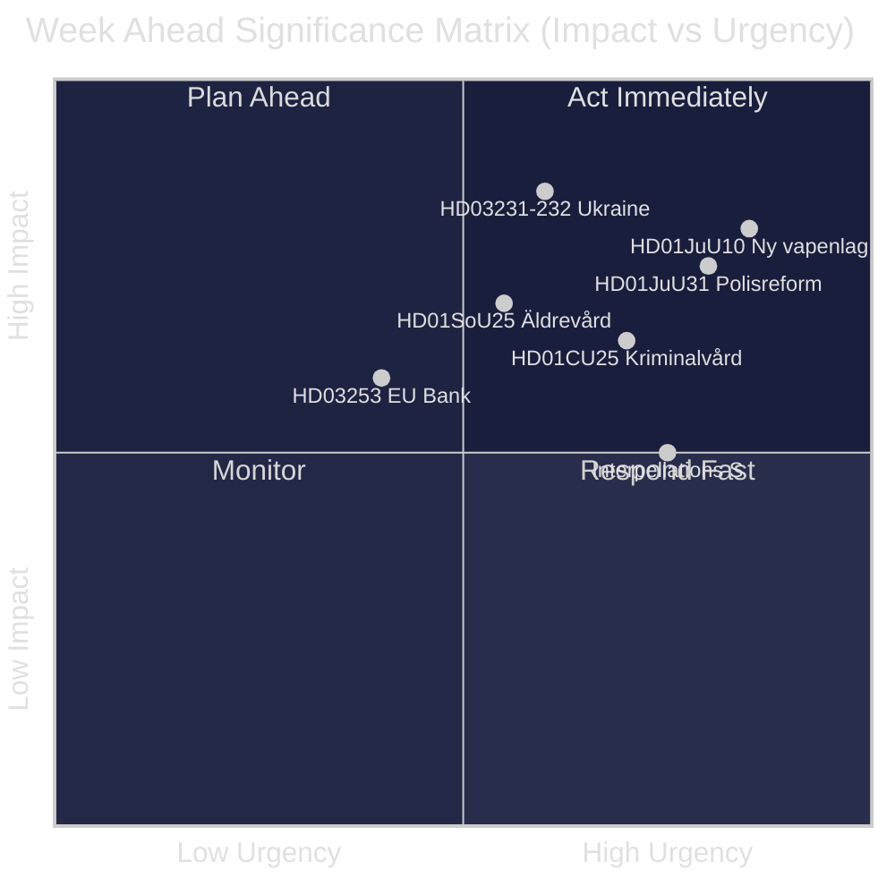
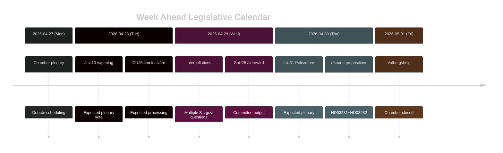

# Zweden Week Vooruit: Golf van Justitiehervormingen, Oekraïne-solidariteit en Sociale Welzijnsaanpassingen

**Auteur**: James Pether Sörling | **Datum**: 2026-04-26 | **Periode**: 2026-04-27 tot 2026-05-03

---

## 🎯 BLUF

De Riksdag treedt de eindsprint in van het riksmöte 2025/26 met een drukke wetgevingsagenda die wordt gedomineerd door het justitiehervormprogramma van de Tidö-coalitie. De week van 27 april tot 3 mei 2026 wordt gekenmerkt door de aanstaande aanneming van een nieuwe wapenwet (HD01JuU10, van kracht per 1 juni 2026), de parlementaire behandeling van de kritische beoordeling door de Riksrevisionen van de Politiehervorming 2015 (HD01JuU31) en de formele toetreding van Zweden tot twee Oekraïense oorlogsverantwoordingsinstrumenten (HD03231, HD03232). Tegelijkertijd voeren de Sociaal-democraten een aanhoudende parlementaire drukkcampagne via meerdere interpellaties gericht op bezuinigingen op sociale uitkeringen en arbeidsmarktbeleid — een test van de narratieve samenhang van de regering voor de verkiezingen van september 2026. **Vertrouwen: HIGH [B2]**

## 🧭 3 Beslissingen die dit Rapport Ondersteunt

1. **Media-/analytische planning**: Prioriteer het debat over de nieuwe wapenwet (HD01JuU10) en het rapport over de politiehervorming (HD01JuU31) als de belangrijkste wetgevingsmomenten van de week — beide combineren politieke relevantie met concrete beleidswijziging.
2. **Oppositievolging**: Bewaak de interpellatiestrategie van de Sociaal-democraten (HD10447, HD10444, HD10443, HD10446) als vroege indicator voor de pre-verkiezingsaanvalsvectoren van de S-partij tegen de regering.
3. **Geopolitieke observatie**: Zwedens toetreding tot het Oekraïne-tribunaal (HD03231) en de herstelcommissie (HD03232) signaleert diepere oorlogsverantwoordingsverplichtingen — volg ministeriele verklaringen van Maria Malmer Stenergard (UD).

## ⚡ 60-Seconden Inlichtingen

- 🔫 **Nieuwe wapenwet** (HD01JuU10): JuU adviseert ja op het regeringswetsvoorstel dat nieuwe vergunningen verbiedt voor bepaalde semi-automatische jachtgeweren. Van kracht per 1 juni 2026. Jagerorganisaties tegenstander; SD en M stemmen voor.
- 👮 **Evaluatie politiehervorming 2015** (HD01JuU31): JuU behandelt de bevinding van de Riksrevisionen dat de Polismyndigheten **niet voldoende effectief heeft gewerkt** om de hervormingsdoelen te bereiken. JuU stelt voor het rapport te archiveren zonder nieuw regeringsmandaat — een politiek handig resultaat voor de Tidö-partijen.
- 🏗️ **Gevangeniscapaciteit** (HD01CU25): CU stemt in met tijdelijke bouwvergunningen voor gevangenissen en huizen van bewaring om het structurele tekort aan te pakken veroorzaakt door strafverzwaringen. Van kracht per 1 juli 2026.
- 🇺🇦 **Oekraïne-verantwoording** (HD03231 + HD03232): Twee voorstellen over Zwedens toetreding tot het Speciaal Tribunaal voor Agressie en de Internationale Herstelcommissie — bevestigt Zwedens post-NAVO transatlantische positionering.
- 👴 **Ouderenzorg** (HD01SoU25): Commissierapport over versterkte maatregelen voor ouderen en mantelzorgers — politiek gevoelig voor de verkiezingen van 2026.
- 🏦 **EU-bankenpakket** (HD03253): Voorstel ter implementatie van de EU-kapitaaltoereikendheidseisen — technisch maar relevant voor de stabiliteit van de Zweedse banksector.
- ⚡ **Interpellatiedruk**: De S-partij dient vijf interpellaties in één week in (HD10447, HD10444–HD10446, HD10443) over werkgelegenheidskosten, woonrechten, sociale uitkeringen en gezondheidszorg.

## 🔭 Belangrijkste Toekomstige Trigger

**Stemtijdstip voor de wapenwet** — het JuU10-commissierapport stelt de nieuwe vapenlag voor per 1 juni 2026. Als de oppositie (C, MP, V) vertragingsmotties indient in de plenaire vergadering, wordt dit het brandpunt van de week. Volg de agenda van de Riksdag voor de stemmingsplanning.

## 📊 Significantieranking (DIW)

| Rang | Document | DIW-score | Horizon |
|------|----------|-----------|---------|
| 1 | HD01JuU10 — Ny vapenlag | L2+ | Week |
| 2 | HD01JuU31 — Polisreformen 2015 | L2+ | Week |
| 3 | HD03231+HD03232 — Ukrainaansvar | L2 | 30 dagen |
| 4 | HD01CU25 — Kriminalvård fastigheter | L2 | Maand |
| 5 | HD01SoU25 — Äldrevård | L2 | Verkiezing |

<!-- source-sha: e799f2cf3c9c7f3ec4f6e9c9b91e6ad40f91af79 -->
