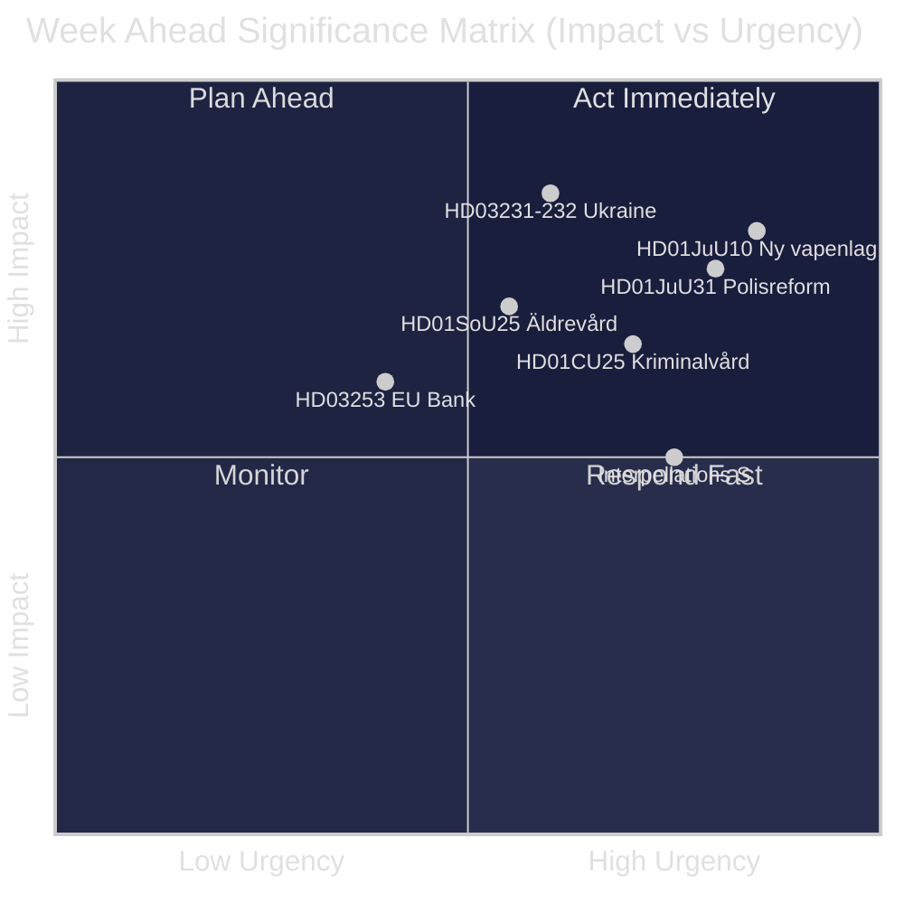
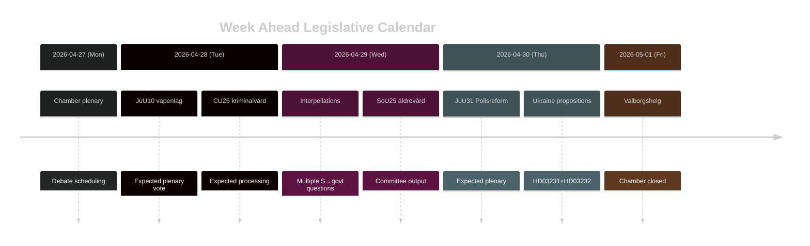

# Sverige Uken Fremover: Rettferdighetsreformbølge, Ukraina-solidaritet og Sosiale Velferdsendringer

**Forfatter**: James Pether Sörling | **Dato**: 2026-04-26 | **Periode**: 2026-04-27 til 2026-05-03

---

## 🎯 BLUF

Riksdagen går inn i sluttspurten av riksmöte 2025/26 med en tett lovgivningsagenda dominert av Tidö-koalisjonens rettferdighetsreformprogram. Uken 27. april–3. mai 2026 er preget av den forestående vedtakelsen av en ny våpenlov (HD01JuU10, ikrafttredelse 1. juni 2026), parlamentsbehandlingen av Riksrevisjonens kritiske vurdering av Politireformen 2015 (HD01JuU31) og Sveriges formelle tilslutning til to ukrainske krigsansvarsordninger (HD03231, HD03232). Samtidig fører Sosialdemokratene en vedvarende parlamentarisk pressekampanje gjennom flere interpellasjoner rettet mot sosiale velferdskutt og arbeidsmarkedspolitikk — en test av regjeringens narrativkohesjon foran valget i september 2026. **Konfidens: HIGH [B2]**

## 🧭 3 Beslutninger Dette Grunnlaget Støtter

1. **Medie-/analytisk planlegging**: Prioriter debatten om den nye våpenloven (HD01JuU10) og politireformrapporten (HD01JuU31) som ukens viktigste lovgivningsmomenter — begge kombinerer politisk relevans med konkret politikkendring.
2. **Opposisjonsovervåkning**: Følg Sosialdemokratenes interpellasjonsstrategi (HD10447, HD10444, HD10443, HD10446) som ledende indikator for S-partiets pre-valg-angrepsvektorer mot regjeringen.
3. **Geopolitisk overvåkning**: Sveriges tilslutning til Ukraina-tribunalen (HD03231) og erstatningskommisjonen (HD03232) signaliserer dypere krigsansvarsforpliktelser — følg ministeruttalelser fra Maria Malmer Stenergard (UD).

## ⚡ 60-Sekunders Etterretning

- 🔫 **Ny våpenlov** (HD01JuU10): JuU foreslår ja til regjeringspropositionen som forbyr nye tillatelser for visse halvautomatiske jaktvåpen. Ikrafttredelse 1. juni 2026. Jegerorganisasjoner imot; SD og M stemmer for.
- 👮 **Politireform 2015-gjennomgang** (HD01JuU31): JuU behandler Riksrevisjonens funn om at Polismyndigheten **ikke har arbeidet tilstrekkelig effektivt** for å oppfylle reformintensjonene. JuU foreslår å arkivere rapporten uten nytt regjeringsmandat — et politisk bekvemt utfall for Tidö-partiene.
- 🏗️ **Fengselskapasitet** (HD01CU25): CU sier ja til midlertidige byggetillatelser for fengsler og arresthus for å håndtere den strukturelle mangelen drevet av straffskjerpelser. Ikrafttredelse 1. juli 2026.
- 🇺🇦 **Ukraina-ansvar** (HD03231 + HD03232): To proposisjoner om Sveriges tilslutning til Spesialtribunalet for aggresjon og Den internasjonale erstatningskommisjonen — befester Sveriges post-NATO transatlantiske posisjonering.
- 👴 **Eldreomsorg** (HD01SoU25): Utvalgsrapport om styrkede tiltak for eldre og uformelle omsorgsgivere — politisk følsomt foran valget i 2026.
- 🏦 **EU-bankpakke** (HD03253): Proposisjon om gjennomføring av EUs kapitaldekningskrav — teknisk men materielt for norsk bankstabilitet.
- ⚡ **Interpellasjonspress**: S-partiet leverer fem interpellasjoner på én uke (HD10447, HD10444–HD10446, HD10443) om ansettelseskostnader, boligrettigheter, sosial velferd og helsevesen.

## 🔭 Viktigste Fremtidstrigger

**Tidspunkt for våpenlovsavstemning** — JuU10-utvalgsrapporten foreslår den nye vapenlag med ikrafttredelse 1. juni 2026. Hvis opposisjonen (C, MP, V) forsøker forsinskelsesforslag i plenum, blir dette ukens brennpunkt. Følg kammarets dagsorden for avstemningsplan.

## 📊 Signifikansrangering (DIW)

| Rang | Dokument | DIW-poeng | Horisont |
|------|----------|-----------|---------|
| 1 | HD01JuU10 — Ny vapenlag | L2+ | Uke |
| 2 | HD01JuU31 — Polisreformen 2015 | L2+ | Uke |
| 3 | HD03231+HD03232 — Ukrainaansvar | L2 | 30 dager |
| 4 | HD01CU25 — Kriminalvård fastigheter | L2 | Måned |
| 5 | HD01SoU25 — Äldrevård | L2 | Valg |

<!-- source-sha: e799f2cf3c9c7f3ec4f6e9c9b91e6ad40f91af79 -->
