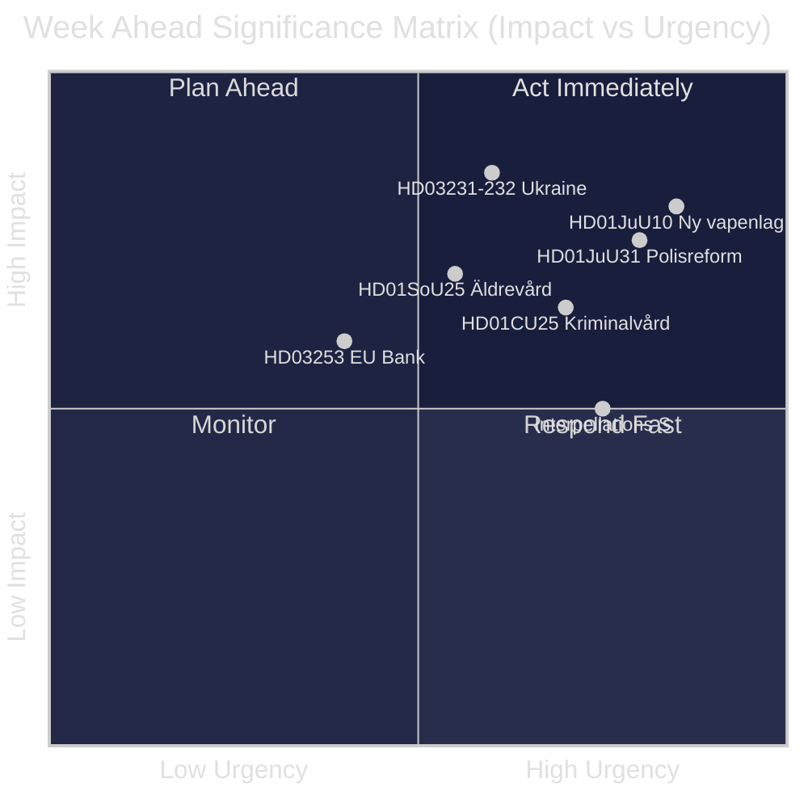
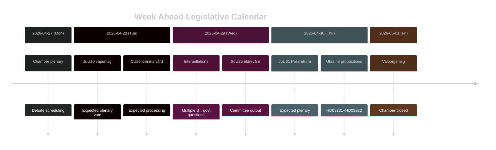

# Sverige Veckan Framåt: Rättviseformvåg, Ukrainasolidaritet och Sociala Välfärdsanpassningar

**Författare**: James Pether Sörling | **Datum**: 2026-04-26 | **Period**: 2026-04-27 till 2026-05-03

---

## 🎯 BLUF

Riksdagen går in i slutspurten av riksmöte 2025/26 med en intensiv lagstiftningsagenda dominerad av Tidökoalitionens rättviseformprogram. Veckan 27 april–3 maj 2026 präglas av det förestående antagandet av en ny vapenlags (HD01JuU10, träder i kraft 1 juni 2026), riksdagsbehandlingen av Riksrevisionens kritiska granskning av Polisreformen 2015 (HD01JuU31) och Sveriges formella anslutning till två ukrainska krigsansvarsindtrument (HD03231, HD03232). Samtidigt bedriver Socialdemokraterna en intensiv parlamentarisk tryckkampanj genom flera interpellationer riktade mot sociala välfärdsreduktioner och arbetsmarknadspolitik — ett test av regeringens narrativkohesion inför valet i september 2026. **Konfidens: HIGH [B2]**

## 🧭 3 Beslut Som Detta Underlag Stödjer

1. **Medie-/analytisk planering**: Prioritera debatten om nya vapenlagen (HD01JuU10) och polisreformrapporten (HD01JuU31) som veckans viktigaste lagstiftningsmoment — båda kombinerar politisk relevans med konkret policyförändring.
2. **Oppositionsbevakning**: Bevaka Socialdemokraternas interpellationsstrategi (HD10447, HD10444, HD10443, HD10446) som ledande indikator på S-partiets förvalangsfronter mot regeringen.
3. **Geopolitisk bevakning**: Sveriges anslutning till Ukrainatribunalen (HD03231) och skadeståndkommissionen (HD03232) signalerar fördjupade krigsansvarsåtaganden — följ ministerstatements från Maria Malmer Stenergard (UD).

## ⚡ 60-Sekundersintelligens

- 🔫 **Ny vapenlags** (HD01JuU10): JuU föreslår ja till regeringspropositionen som förbjuder nya tillstånd för vissa halvautomatiska jaktvapen. Träder i kraft 1 juni 2026. Jägarorganisationer mot; SD och M röstar för.
- 👮 **Polisreform 2015-granskning** (HD01JuU31): JuU behandlar Riksrevisionens slutsats att Polismyndigheten **inte arbetat tillräckligt effektivt** för att uppfylla reformintentionerna. JuU föreslår att lägga rapporten till handlingarna utan nytt regeringsuppdrag — ett politiskt bekvämt utfall för Tidöpartierna.
- 🏗️ **Fängelsekapacitet** (HD01CU25): CU säger ja till tillfälliga bygglov för fängelser och häkten för att hantera strukturbristen driven av straffskärpningar. Träder i kraft 1 juli 2026.
- 🇺🇦 **Ukrainaansvar** (HD03231 + HD03232): Två propositioner om Sveriges anslutning till den Särskilda tribunalen för aggression och den Internationella skadeståndkommissionen — befäster Sveriges post-NATO-transatlantiska positionering.
- 👴 **Äldreomsorg** (HD01SoU25): Betänkande om stärkta åtgärder för äldre och anhörigvårdare — politiskt känsligt inför 2026 års val.
- 🏦 **EU-bankpaket** (HD03253): Proposition om genomförandet av EU:s kapitaltäckningskrav — tekniskt men materiellt för svensk bankstabilitet.
- ⚡ **Interpellationstryck**: S-partiet lämnar in fem interpellationer under en vecka (HD10447, HD10444–HD10446, HD10443) om anställningskostnader, bostadsrättigheter, social välfärd och sjukvård.

## 🔭 Viktigaste Framåttrigger

**Tidpunkt för vapenlagens omröstning** — JuU10-betänkandet föreslår den nya vapenlagen träda i kraft 1 juni 2026. Om oppositionen (C, MP, V) försöker förseningsyrkanden i kammaren, blir detta veckans explosionspunkt. Följ kammarens föredragningslista för rösttidpunkter.

## 📊 Signifikansranking (DIW)

| Rang | Dokument | DIW-poäng | Horisont |
|------|----------|-----------|---------|
| 1 | HD01JuU10 — Ny vapenlag | L2+ | Vecka |
| 2 | HD01JuU31 — Polisreformen 2015 | L2+ | Vecka |
| 3 | HD03231+HD03232 — Ukrainaansvar | L2 | 30 dagar |
| 4 | HD01CU25 — Kriminalvård fastigheter | L2 | Månad |
| 5 | HD01SoU25 — Äldrevård | L2 | Val |

<!-- source-sha: e799f2cf3c9c7f3ec4f6e9c9b91e6ad40f91af79 -->
