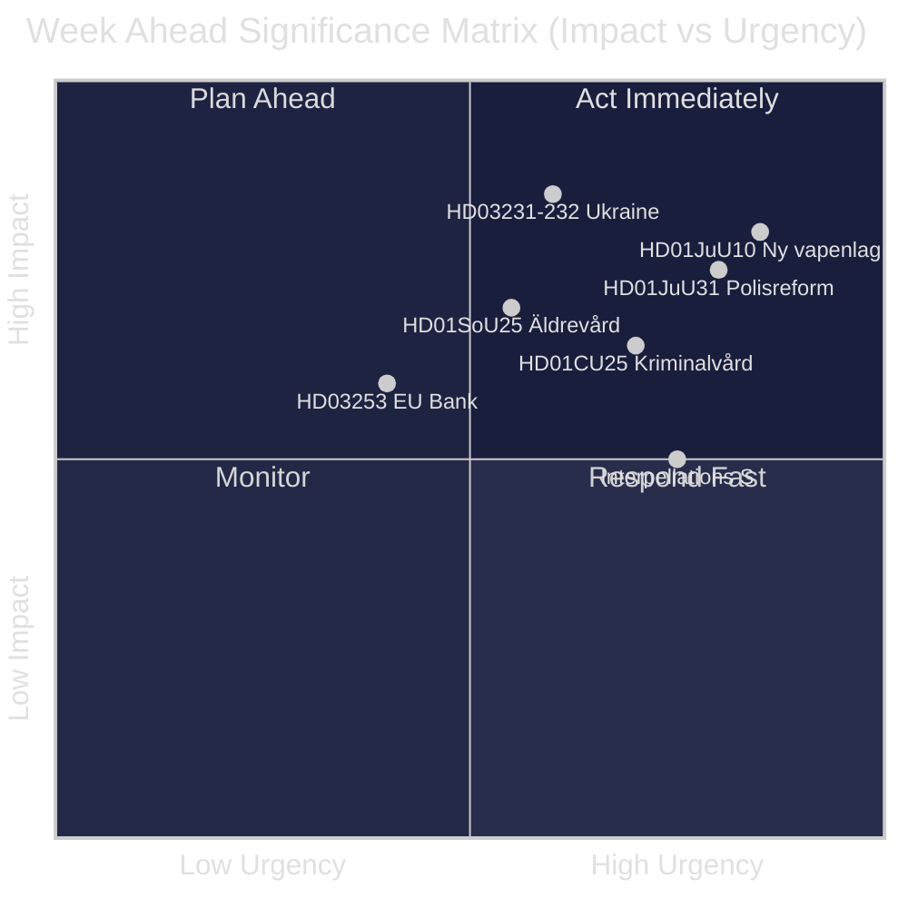
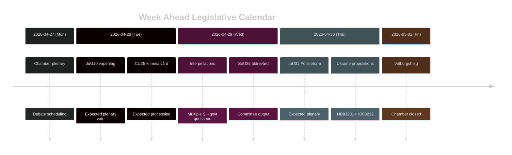

# 瑞典本周展望：司法改革浪潮、乌克兰团结与社会福利调整

**作者**：James Pether Sörling | **日期**：2026-04-26 | **时段**：2026-04-27 至 2026-05-03

---

## 🎯 BLUF

瑞典议会（Riksdag）进入riksmöte 2025/26的最后冲刺阶段，以蒂多联合政府司法改革计划为主导的密集立法议程全面展开。2026年4月27日至5月3日当周以新武器法（HD01JuU10，2026年6月1日生效）的即将通过、议会对Riksrevisionen关于2015年警察改革批评性评估的审理（HD01JuU31），以及瑞典正式加入两项乌克兰战争责任工具（HD03231、HD03232）为特征。与此同时，社会民主党通过多份质询，持续就社会福利削减和劳动力市场政策对政府施压，在2026年9月选举前检验政府政策叙事的一致性。**置信度：HIGH [B2]**

## 🧭 本简报支持的3项决策

1. **媒体/分析规划**：将新武器法（HD01JuU10）辩论与警察改革报告（HD01JuU31）列为本周最重要的立法事项——两者均将政治显著性与具体政策变化融为一体。
2. **反对党追踪**：关注社会民主党的质询策略（HD10447、HD10444、HD10443、HD10446），将其作为S党选前对政府攻势方向的领先指标。
3. **地缘政治监测**：瑞典加入乌克兰特别法庭（HD03231）与赔偿委员会（HD03232），标志着深化的战争问责承诺——追踪外交部长Maria Malmer Stenergard（UD）的部长声明。

## ⚡ 60秒情报速览

- 🔫 **新武器法**（HD01JuU10）：JuU建议支持政府法案，禁止对特定半自动猎枪发放新许可证。2026年6月1日生效。猎人协会反对；SD与M投票支持。
- 👮 **2015年警察改革评审**（HD01JuU31）：JuU审议Riksrevisionen关于Polismyndigheten**未能以足够高效的方式**实现改革目标的认定。JuU提议将报告存档而不赋予政府新任务——对蒂多各党而言是政治上便利的处理方式。
- 🏗️ **监狱容量**（HD01CU25）：CU同意为监狱和拘留所颁发临时建筑许可，以应对量刑改革带来的结构性短缺。2026年7月1日生效。
- 🇺🇦 **乌克兰问责**（HD03231 + HD03232）：两份关于瑞典加入侵略罪特别法庭与国际赔偿委员会的提案——巩固瑞典后北约时代的跨大西洋定位。
- 👴 **老年护理**（HD01SoU25）：有关加强老年人及非正式照护者措施的委员会报告——在2026年大选前政治敏感度高。
- 🏦 **欧盟银行业一揽子计划**（HD03253）：实施欧盟资本充足率要求的提案——专业性强，但对瑞典银行稳定性具有实质影响。
- ⚡ **质询攻势**：S党一周内提交五份质询（HD10447、HD10444–HD10446、HD10443），涉及就业成本、住房权、社会福利和医疗保健。

## 🔭 最重要的未来触发因素

**武器法表决时机**——JuU10委员会报告提议新vapenlag于2026年6月1日生效。如果反对党（C、MP、V）在全体会议上尝试提出拖延动议，这将成为本周的引爆点。请关注议会议程以了解投票安排。

## 📊 重要性排名（DIW）

| 排名 | 文件 | DIW评分 | 时间范围 |
|------|----------|-----------|---------|
| 1 | HD01JuU10 — Ny vapenlag | L2+ | 周 |
| 2 | HD01JuU31 — Polisreformen 2015 | L2+ | 周 |
| 3 | HD03231+HD03232 — Ukrainaansvar | L2 | 30天 |
| 4 | HD01CU25 — Kriminalvård fastigheter | L2 | 月 |
| 5 | HD01SoU25 — Äldrevård | L2 | 选举 |

<!-- source-sha: e799f2cf3c9c7f3ec4f6e9c9b91e6ad40f91af79 -->
