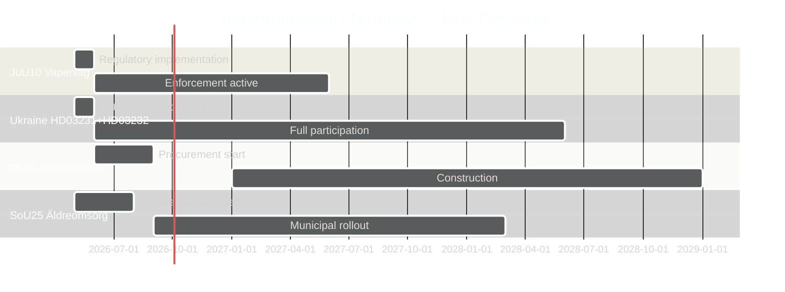

# Implementation Feasibility Analysis — Week Ahead 2026-04-27 to 2026-05-03

**Author**: James Pether Sörling | **Date**: 2026-04-26

## Feasibility Matrix

| Document | Implementation type | Lead agency | Feasibility | Risk |
|---------|-------------------|-------------|-------------|------|
| HD01JuU10 — Vapenlag | Regulatory registration enforcement | Polismyndigheten (vapenregistret) | HIGH — existing infrastructure | Backlog risk if high volume of transitions |
| HD01JuU31 — Polisreform | Riksrevisionen recommendation adoption | Polismyndigheten + JuU follow-up | MEDIUM — requires structural changes | Political resistance inside Polismyndigheten |
| HD03231 — Ukraine Tribunal | Treaty ratification + diplomatic instrument | UD (Utrikesdepartementet) + Riksdag | HIGH — administrative instrument | None material |
| HD03232 — Reparations Commission | Treaty ratification + financial contribution | UD + Finance Ministry | HIGH — established template | Budget impact if contribution required |
| HD01CU25 — Häktes/fängelsebygg | Construction procurement | Kriminalvården + municipalities | LOW-MEDIUM | Land acquisition, plan- och bygglagen, capacity constraints |
| HD01SoU25 — Äldreomsorg | Regulatory standard update | IVO (inspectorate) + kommuner | MEDIUM | Municipal capacity variation; staffing shortages |

## Delivery Risk Assessment

### High-Risk: HD01CU25 Prison Construction (CU)
Kriminalvården has a documented track record of construction delays. The plan- och bygglagen environmental requirements + municipal rezoning processes create a 3-5 year typical delivery timeline for new facilities. Current prison capacity deficit is acutely structural. The parliamentary decision (HD01CU25) authorises the legal framework but cannot accelerate construction delivery.
**Implementation risk**: HIGH
**Delay probability**: 70% for any specific facility being delayed >12 months beyond plan

### Medium-Risk: HD01SoU25 Äldreomsorg Standards
New äldreomsorg standards require implementation by municipalities (kommuner). Staffing shortages in elderly care are documented across both urban and rural kommuner. The financial transfer framework (statsbidrag) is a lever, but workforce availability is the binding constraint.
**Implementation risk**: MEDIUM
**Outcome variance**: HIGH — wide municipality-to-municipality variation expected

### Low-Risk: HD01JuU10 Vapenlag
Polismyndigheten's vapenregistret is operational and handles firearms permit administration. The ban on new semi-auto hunting rifle permits is a registration rule change — lower administrative burden than an active confiscation. Existing permits grandfathered (no immediate enforcement burden).
**Implementation risk**: LOW
**Note**: If Sweden's ban triggers EU-level challenge from other member states (lobbied by hunting federations), implementation could be suspended pending court proceedings — low probability but non-zero.

## Timeline Summary

