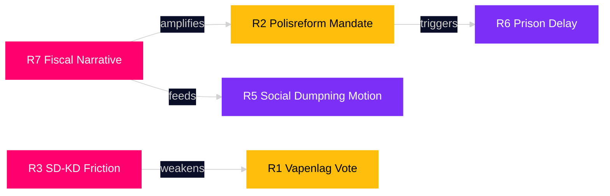

# Risk Assessment — Week Ahead 2026-04-27 to 2026-05-03

**Author**: James Pether Sörling | **Date**: 2026-04-26 | **Confidence**: HIGH [B2]

## Risk Register

| Risk ID | Risk | Likelihood (1-5) | Impact (1-5) | L×I | Category | Admiralty |
|---------|------|-----------------|-------------|-----|----------|-----------|
| R1 | Weapons law vote delayed or failed | 2 | 4 | 8 | Legislative | [B2] |
| R2 | Polisreform report triggers new govt mandate demand | 3 | 3 | 9 | Political | [B2] |
| R3 | SD-KD coalition friction escalates (HD10448) | 2 | 4 | 8 | Coalition | [B2] |
| R4 | Ukraine propositions blocked by V/MP | 1 | 3 | 3 | Foreign policy | [B3] |
| R5 | Social dumpning interpellation leads to govt motion | 2 | 3 | 6 | Social | [B2] |
| R6 | Prison capacity law delayed by municipal opposition | 2 | 4 | 8 | Administrative | [B2] |
| R7 | Pre-election fiscal tightening narrative crystallises | 3 | 4 | 12 | Electoral | [B2] |
| R8 | Riksbankens förvaltning report reveals 2025 losses | 1 | 4 | 4 | Financial | [B3] |

## Top Risks Detailed

### R7 — Pre-Election Fiscal Tightening Narrative (L×I = 12, HIGH)
**Description**: The combination of S interpellations targeting sjuklönekostnader (HD10447), arbetsgivaravgifter (HD10444), and social dumpning (HD10443) — all attacking the government's economic competence — may crystallise into a coherent "government abandons workers" narrative.
**Evidence**: Five interpellations in 3 days (2026-04-22–24) from S. Source: HD10447, HD10444, HD10443 riksdagen.se
**Cascade**: Narrative risk → poll decline → reduced coalition discipline → higher SD interpellation rate.
**Posterior probability after information**: 35% chance of sustained narrative damage within 2 weeks. [B2]

### R2 — Polisreform New Mandate Demand (L×I = 9, HIGH)
**Description**: Opposition parties (S, V, MP) may refuse JuU's "archive the report" resolution and push for new directives to government.
**Evidence**: JuU31 summary confirms "JuU proposes NO to 18 motions from allmänna motionstiden 2025." Source: HD01JuU31 riksdagen.se
**Cascade**: Mandate demand → government defensive → Strömmer communications pressure → 2026 election vulnerability.
**Posterior probability**: 30% chance of floor vote contest. [B2]

### R1 — Vapenlag Delayed (L×I = 8, MEDIUM)
**Description**: Hunters' associations and C-party members may attempt delay motions to push effective date beyond 1 June 2026.
**Evidence**: JuU10 summary notes semi-automatic hunting rifle ban as contested provision. Source: HD01JuU10 riksdagen.se
**Cascade**: Delay → rural constituency backlash → C and SD disagreement → Tidö unity test.
**Posterior probability**: 20% chance of material delay. [B2]

## Risk Cascade Chain

## Residual Risk Summary

Overall week-ahead risk level: **MEDIUM** (aggregate L×I 3–9 range). No R1 existential coalition threat identified. Primary vulnerability: narrative cohesion under multi-vector S attack.
