# Scenario Analysis — Week Ahead 2026-04-27 to 2026-05-03

**Author**: James Pether Sörling | **Date**: 2026-04-26 | **Confidence**: MEDIUM [B2]

## Scenario Framework

Three scenarios for the week of 27 April–3 May 2026, conditioned on legislative outcomes and coalition dynamics.

### Scenario 1: Smooth Execution (Probability: 55%)

**Description**: All committee-recommended legislation passes without significant floor contest. New weapons law adopted (HD01JuU10 effective 1 June 2026), polisreform report archived without new mandate (HD01JuU31), prison capacity law passes (HD01CU25), Ukraine propositions adopted (HD03231+HD03232).

**Key conditions**: SD supports JuU10 despite hunter lobby pressure; opposition S fails to force roll-call vote on polisreform; KD resists SD energy challenge.
**Leading indicator**: Chamber agenda (föredragningslista) for April 28–30 shows no extraordinary debate scheduled on vapenlag.
**Impact**: Government consolidates pre-election security narrative. S interpellation wave generates media coverage but no legislative setback.
**Sources**: HD01JuU10, HD01JuU31, HD01CU25 riksdagen.se [B2]

### Scenario 2: Contested Vapenlag (Probability: 30%)

**Description**: Opposition (C, MP, and possibly some SD members) force a procedural challenge on HD01JuU10. The semi-automatic rifle ban for hunting becomes a contentious floor debate. Vote passes but with a smaller-than-expected majority.

**Key conditions**: C-party leverages rural constituency concerns; SD signals ambivalence on hunting provision; government forced to issue clarifications.
**Leading indicator**: C or SD press releases critical of JuU10 in days before vote.
**Impact**: Coalition crack visible ahead of election; rural Sweden alienated; media narrative shifts from "law & order success" to "coalition disagreement."
**Sources**: HD01JuU10 semi-automatic provision, riksdagen.se [B2]

### Scenario 3: Polisreform Escalation (Probability: 15%)

**Description**: S, V, and MP refuse the "archive" resolution on HD01JuU31 and push for a vote on demanding new government directives for Polismyndigheten. The government narrowly survives the vote (SD saves it) but the Riksrevisionen findings dominate the week's news.

**Key conditions**: S coordinates joint motion with V and MP; SD prioritises coalition loyalty over policing critique.
**Leading indicator**: S press conference announcing joint motion with V/MP on HD01JuU31.
**Impact**: Justice Minister Strömmer under significant media pressure; government communications crisis for 48–72 hours.
**Sources**: HD01JuU31, riksdagen.se [B2]

## Probabilities Sum: 100% (55 + 30 + 15)

## Scenario Decision Matrix

| Scenario | Government impact | Opposition impact | Election relevance |
|----------|------------------|-------------------|-------------------|
| S1 Smooth | +2 narrative | -1 (frustrated) | +2 for M/KD/L |
| S2 Vapenlag contested | -1 rural | +1 narrative | -1 rural constituency |
| S3 Polisreform escalation | -3 credibility | +3 accountability | +2 for S |

```mermaid
%%{init: {'theme': 'dark', 'themeVariables': {'primaryColor': '#00d9ff', 'edgeLabelBackground': '#0a0e27'}}}%%
flowchart TD
    START[Week Start 2026-04-27] --> CHECK{Vapenlag Vote?}
    CHECK -->|Smooth passage| S1[Scenario 1: Smooth Execution 55%]
    CHECK -->|Contested| S2[Scenario 2: Contested Vapenlag 30%]
    S1 --> GATE2{Polisreform Archive Accepted?}
    GATE2 -->|Yes| S1F[Full Smooth Execution]
    GATE2 -->|No| S3[Scenario 3: Polisreform Escalation 15%]
    S1F --> OUT1[Government Pre-Election Boost]
    S2 --> OUT2[Rural Coalition Friction]
    S3 --> OUT3[Justice Communications Crisis]
    style S1 fill:#00d9ff,stroke:#00d9ff,color:#000
    style S2 fill:#ffbe0b,stroke:#ffbe0b,color:#000
    style S3 fill:#ff006e,stroke:#ff006e,color:#fff
    style S1F fill:#00d9ff,stroke:#00d9ff,color:#000
    style OUT1 fill:#1a1e3d,stroke:#00d9ff
    style OUT2 fill:#1a1e3d,stroke:#ffbe0b
    style OUT3 fill:#1a1e3d,stroke:#ff006e
```

